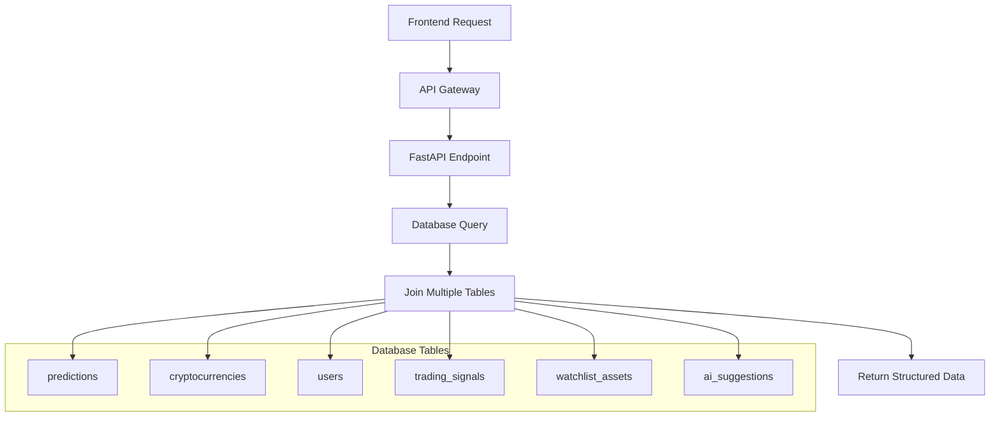

# docs\Design\17_Database_ERD_Design.md
# 🗄️ Database ERD Design - Days 15-18
## Complete Database Architecture for 4-Layer AI System

# 🗓️ **روز 18: Database Integration & API Planning**

## 🔗 **API Endpoints Planning (صبح - 4 ساعت)**

### **📡 Complete API Structure**

```python
# =============================================
# API ENDPOINTS MAPPING TO DATABASE
# FastAPI Endpoints for 4-Layer System
# =============================================

# Layer 1: Macro Analysis Endpoints
GET /api/v1/macro/regime                    # market_regime_analysis
GET /api/v1/macro/sentiment                 # market_sentiment_data  
GET /api/v1/macro/dominance                 # dominance_data
GET /api/v1/macro/indicators                # macro_indicators

# Layer 2: Sector Analysis Endpoints  
GET /api/v1/sectors                         # crypto_sectors
GET /api/v1/sectors/{id}/performance        # sector_performance
GET /api/v1/sectors/rotation                # sector_rotation_analysis
GET /api/v1/sectors/{id}/cryptos           # crypto_sector_mapping

# Layer 3: Asset Selection Endpoints
GET /api/v1/watchlists                      # watchlists
POST /api/v1/watchlists                     # watchlists
PUT /api/v1/watchlists/{id}                 # watchlists
DELETE /api/v1/watchlists/{id}              # watchlists

GET /api/v1/watchlists/{id}/items           # watchlist_assets
POST /api/v1/watchlists/{id}/items          # watchlist_assets
PUT /api/v1/watchlist-items/{id}            # watchlist_assets
DELETE /api/v1/watchlist-items/{id}         # watchlist_assets

GET /api/v1/suggestions                     # ai_suggestions
POST /api/v1/suggestions/{id}/review        # suggestion_reviews

# Layer 4: Timing Endpoints
GET /api/v1/signals                         # trading_signals
GET /api/v1/signals/{id}                    # trading_signals
POST /api/v1/signals/{id}/execute           # signal_executions
GET /api/v1/user/{id}/risk-profile          # risk_management

# Predictions Endpoints (Unified Table)
GET /api/v1/predictions                     # predictions
POST /api/v1/predictions                    # predictions  
PUT /api/v1/predictions/{id}                # predictions
GET /api/v1/predictions/{id}/accuracy       # predictions (evaluation)

# Dashboard Endpoints (Multiple Table Joins)
GET /api/v1/dashboard/admin                 # Multiple tables
GET /api/v1/dashboard/professional          # Multiple tables
GET /api/v1/dashboard/casual                # Multiple tables

# System Management Endpoints
GET /api/v1/system/health                   # system_health
GET /api/v1/system/models                   # ai_models
POST /api/v1/system/models/{id}/retrain     # ai_models
GET /api/v1/system/activities              # user_activities

# User Management
GET /api/v1/users/profile                   # users
PUT /api/v1/users/profile                   # users
GET /api/v1/users/notifications             # notifications
PUT /api/v1/notifications/{id}/read         # notifications
```

### **🔄 Database Integration Points**



---