```mermaid
graph TD
    subgraph "Layer 1 APIs"
        A1[GET /api/v1/macro/regime] --> D1[market_regime_analysis]
        A2[GET /api/v1/macro/sentiment] --> D2[market_sentiment_data]
        A3[GET /api/v1/macro/dominance] --> D3[dominance_data]
        A4[GET /api/v1/macro/indicators] --> D4[macro_indicators]
    end

    subgraph "Layer 2 APIs"
        B1[GET /api/v1/sectors] --> D5[crypto_sectors]
        B2[GET /api/v1/sectors/performance] --> D6[sector_performance]
        B3[GET /api/v1/sectors/rotation] --> D7[sector_rotation_analysis]
        B4[GET /api/v1/sectors/assets] --> D8[crypto_sector_mapping]
    end

    subgraph "Layer 3 APIs"
        C1[GET /api/v1/watchlists] --> D9[watchlists]
        C2[GET /api/v1/watchlists/assets] --> D10[watchlist_assets]
        C3[GET /api/v1/suggestions] --> D11[ai_suggestions]
        C4[GET /api/v1/assets/analysis] --> D12[cryptocurrencies]
    end

    subgraph "Layer 4 APIs"
        E1[GET /api/v1/signals] --> D13[trading_signals]
        E2[GET /api/v1/signals/alerts] --> D14[signal_alerts]
        E3[POST /api/v1/signals/execute] --> D15[signal_executions]
    end

    subgraph "User APIs"
        F1[GET /api/v1/users/profile] --> D16[users]
        F2[GET /api/v1/notifications] --> D17[notifications]
        F3[GET /api/v1/users/activity] --> D18[user_activities]
    end

    subgraph "Admin APIs"
        G1[GET /api/v1/admin/system] --> D19[system_health]
        G2[GET /api/v1/admin/models] --> D20[ai_models]
        G3[GET /api/v1/admin/analytics] --> D21[analytics_data]
    end
```

# docs\Design\17_2_Database_Integration_And_API_Planning.md
# 🗄️ Database Integration & API Planning - Day 18
## Complete API Architecture for 4-Layer AI System with Single UI Strategy

---

## 🎯 **API Design Philosophy**

### **🔄 Single UI API Strategy:**
```
Universal Access API Design:
├── 🌐 Open Endpoints: Full access for all users (Guest, Logged, Admin)
├── 🔐 Protected Endpoints: Personal operations requiring authentication
├── 👑 Admin Endpoints: System management operations
├── ⚡ Rate Limiting: Fair usage for Guest users
└── 📊 Context-Aware Responses: Data adapted based on user authentication state
```

---

## 📡 **Complete API Structure**

### **🌍 Layer 1: Macro Analysis Endpoints (Universal Access)**
```python
# All users can access macro analysis data
GET /api/v1/macro/regime
# Response: Current market regime with confidence scores
# Rate Limit: None (real-time data for all users)
# Auth: Not required

GET /api/v1/macro/sentiment
# Response: Multi-source sentiment analysis (Fear & Greed, Social, News)
# Rate Limit: None
# Auth: Not required

GET /api/v1/macro/dominance
# Response: BTC.D, ETH.D, ALT.D analysis
# Rate Limit: None
# Auth: Not required

GET /api/v1/macro/indicators
# Response: Volatility forecasts, correlations, trends
# Rate Limit: None
# Auth: Not required

GET /api/v1/macro/history
# Response: Historical regime changes and analysis
# Rate Limit: 100 requests/hour for guests, unlimited for logged users
# Auth: Optional (enhanced data for logged users)
```

### **📊 Layer 2: Sector Analysis Endpoints (Universal Access)**
```python
GET /api/v1/sectors
# Response: All 11 crypto sectors with performance metrics
# Rate Limit: None
# Auth: Not required

GET /api/v1/sectors/{sector_id}/performance
# Response: Detailed sector performance and rotation analysis
# Rate Limit: None
# Auth: Not required

GET /api/v1/sectors/rotation
# Response: Current sector rotation signals and money flow
# Rate Limit: None
# Auth: Not required

GET /api/v1/sectors/{sector_id}/assets
# Response: Assets in specific sector with sector context
# Rate Limit: None
# Auth: Not required

GET /api/v1/sectors/allocation
# Response: Optimal sector allocation recommendations
# Rate Limit: 50 requests/hour for guests, unlimited for logged users
# Auth: Optional (personalized for logged users)
```

### **💰 Layer 3: Asset Selection Endpoints (Mixed Access)**
```python
# UNIVERSAL ACCESS (Admin Default Watchlist)
GET /api/v1/watchlists/default
# Response: Admin-curated default watchlist (15 assets)
# Rate Limit: None
# Auth: Not required

GET /api/v1/assets/{asset_id}/analysis
# Response: Complete asset analysis for any supported cryptocurrency
# Rate Limit: None
# Auth: Not required

GET /api/v1/assets/search
# Response: Search and filter assets with AI suggestions
# Rate Limit: 200 requests/hour for guests, unlimited for logged users
# Auth: Not required

# PROTECTED ENDPOINTS (Personal Watchlists)
GET /api/v1/watchlists
# Response: User's personal watchlists
# Auth: Required (JWT token)

POST /api/v1/watchlists
# Request: {name, description, assets[], is_public}
# Response: Created watchlist with ID
# Auth: Required

PUT /api/v1/watchlists/{watchlist_id}
# Request: {name, description, assets[], is_public}
# Response: Updated watchlist
# Auth: Required (owner or admin)

DELETE /api/v1/watchlists/{watchlist_id}
# Response: Deletion confirmation
# Auth: Required (owner or admin)

POST /api/v1/watchlists/{watchlist_id}/assets
# Request: {asset_id, notes}
# Response: Added asset to watchlist
# Auth: Required

DELETE /api/v1/watchlists/{watchlist_id}/assets/{asset_id}
# Response: Removed asset from watchlist
# Auth: Required
```

### **⚡ Layer 4: Timing Signals Endpoints (Universal Access)**
```python
GET /api/v1/signals/current
# Response: Current timing signals for default watchlist
# Rate Limit: None
# Auth: Not required

GET /api/v1/signals/{asset_id}
# Response: Detailed timing analysis for specific asset
# Rate Limit: None
# Auth: Not required

GET /api/v1/signals/alerts
# Response: Active timing alerts and notifications
# Rate Limit: 100 requests/hour for guests, unlimited for logged users
# Auth: Optional (personal alerts for logged users)

# PROTECTED ENDPOINTS (Personal Signal Management)
POST /api/v1/signals/alerts
# Request: {asset_id, alert_type, threshold, notification_method}
# Response: Created alert with ID
# Auth: Required

PUT /api/v1/signals/alerts/{alert_id}
# Request: {threshold, is_active, notification_method}
# Response: Updated alert
# Auth: Required

DELETE /api/v1/signals/alerts/{alert_id}
# Response: Deletion confirmation
# Auth: Required
```

### **🤖 AI Suggestions Endpoints (Universal Access)**
```python
GET /api/v1/suggestions/current
# Response: Current AI suggestions for default watchlist
# Rate Limit: None
# Auth: Not required

GET /api/v1/suggestions/{asset_id}
# Response: AI suggestions for specific asset
# Rate Limit: None
# Auth: Not required

GET /api/v1/suggestions/personalized
# Response: Personalized AI suggestions based on user behavior
# Rate Limit: 50 requests/hour for guests, unlimited for logged users
# Auth: Optional (enhanced for logged users)

# PROTECTED ENDPOINTS (Suggestion Feedback)
POST /api/v1/suggestions/{suggestion_id}/feedback
# Request: {rating, feedback_text, action_taken}
# Response: Feedback recorded
# Auth: Required
```

### **📊 Dashboard Endpoints (Context-Aware)**
```python
GET /api/v1/dashboard/overview
# Response: Contextual dashboard based on user authentication state
# - Guest: Default watchlist + macro overview
# - Logged: Personal watchlists + macro overview + personal insights
# - Admin: System overview + admin metrics + performance data
# Rate Limit: None
# Auth: Optional (context-aware response)

GET /api/v1/dashboard/performance
# Response: Performance analytics
# - Guest: Default watchlist performance
# - Logged: Personal portfolio performance
# - Admin: System-wide performance metrics
# Rate Limit: 20 requests/hour for guests, unlimited for logged users
# Auth: Optional
```

### **👤 User Management Endpoints**
```python
# AUTHENTICATION
POST /api/v1/auth/register
# Request: {email, password, first_name, last_name}
# Response: {user_id, access_token, refresh_token}
# Rate Limit: 5 requests/hour per IP

POST /api/v1/auth/login
# Request: {email, password}
# Response: {user_id, access_token, refresh_token}
# Rate Limit: 10 requests/hour per IP

POST /api/v1/auth/refresh
# Request: {refresh_token}
# Response: {access_token}
# Rate Limit: 50 requests/hour per token

POST /api/v1/auth/logout
# Request: {refresh_token}
# Response: {message}
# Auth: Required

# USER PROFILE
GET /api/v1/users/profile
# Response: Complete user profile and preferences
# Auth: Required

PUT /api/v1/users/profile
# Request: {first_name, last_name, timezone, language, preferences}
# Response: Updated profile
# Auth: Required

GET /api/v1/users/activity
# Response: User activity history and engagement metrics
# Auth: Required

# NOTIFICATIONS
GET /api/v1/notifications
# Response: User notifications (unread + recent read)
# Auth: Required

PUT /api/v1/notifications/{notification_id}/read
# Response: Marked as read
# Auth: Required

POST /api/v1/notifications/preferences
# Request: {email_enabled, push_enabled, categories[]}
# Response: Updated notification preferences
# Auth: Required
```

### **👑 Admin Endpoints (Admin Only)**
```python
# SYSTEM MONITORING
GET /api/v1/admin/system/health
# Response: System health metrics, AI model performance, database status
# Auth: Required (admin role)

GET /api/v1/admin/system/metrics
# Response: Detailed system metrics, user engagement, API usage
# Auth: Required (admin role)

# USER MANAGEMENT
GET /api/v1/admin/users
# Response: Paginated user list with statistics
# Query: ?page=1&limit=50&role=all&active=true
# Auth: Required (admin role)

PUT /api/v1/admin/users/{user_id}/role
# Request: {role}
# Response: Updated user role
# Auth: Required (admin role)

PUT /api/v1/admin/users/{user_id}/status
# Request: {is_active, is_verified}
# Response: Updated user status
# Auth: Required (admin role)

# WATCHLIST MANAGEMENT
GET /api/v1/admin/watchlists/default
# Response: Current default watchlist configuration
# Auth: Required (admin role)

PUT /api/v1/admin/watchlists/default
# Request: {assets[], update_reason}
# Response: Updated default watchlist
# Auth: Required (admin role)

GET /api/v1/admin/watchlists/analytics
# Response: Analytics on watchlist usage and performance
# Auth: Required (admin role)

# AI MODEL MANAGEMENT
GET /api/v1/admin/models
# Response: All AI models with performance metrics
# Auth: Required (admin role)

POST /api/v1/admin/models/{model_id}/retrain
# Request: {training_parameters}
# Response: Training job initiated
# Auth: Required (admin role)

PUT /api/v1/admin/models/{model_id}/config
# Request: {parameters, thresholds, weights}
# Response: Updated model configuration
# Auth: Required (admin role)

# ANALYTICS
GET /api/v1/admin/analytics/usage
# Response: API usage statistics, user engagement metrics
# Query: ?period=7d&granularity=day
# Auth: Required (admin role)

GET /api/v1/admin/analytics/performance
# Response: System performance metrics, AI accuracy statistics
# Auth: Required (admin role)
```

---

## 🔗 **Database Integration Mapping**

### **📊 API-to-Database Table Mapping:**


---

## 🔐 **Authentication & Authorization Strategy**

### **🎯 JWT Token Implementation:**
```python
# Token Structure
{
    "user_id": 123,
    "email": "user@example.com",
    "role": "public|admin",
    "iat": 1640995200,  # Issued at
    "exp": 1640998800,  # Expiration (1 hour)
    "permissions": ["read:personal", "write:personal", "admin:system"]
}

# Token Validation Middleware
async def verify_token(token: str):
    try:
        payload = jwt.decode(token, SECRET_KEY, algorithms=["HS256"])
        user_id = payload.get("user_id")
        role = payload.get("role")
        return {"user_id": user_id, "role": role}
    except jwt.ExpiredSignatureError:
        raise HTTPException(401, "Token expired")
    except jwt.InvalidTokenError:
        raise HTTPException(401, "Invalid token")

# Role-based Access Control
def require_auth(required_role: str = None):
    def decorator(func):
        async def wrapper(request: Request):
            token = request.headers.get("Authorization")
            if not token:
                if required_role:
                    raise HTTPException(401, "Authentication required")
                return await func(request, user=None)
            
            user = await verify_token(token.replace("Bearer ", ""))
            if required_role and user["role"] != required_role:
                raise HTTPException(403, "Insufficient permissions")
            
            return await func(request, user=user)
        return wrapper
    return decorator
```

---

## ⚡ **Rate Limiting Strategy**

### **📊 Rate Limiting Rules:**
```python
# Rate Limiting Configuration
RATE_LIMITS = {
    "guest_users": {
        "global": "1000/hour",  # Global API calls
        "macro": "unlimited",   # Layer 1 endpoints
        "sector": "unlimited",  # Layer 2 endpoints
        "assets": "500/hour",   # Layer 3 searches
        "signals": "200/hour",  # Layer 4 analysis
        "heavy_analytics": "50/hour"  # Resource-intensive endpoints
    },
    "logged_users": {
        "global": "unlimited",
        "all_layers": "unlimited",
        "personal_operations": "unlimited"
    },
    "admin_users": {
        "all_operations": "unlimited"
    }
}

# Rate Limiting Implementation
from slowapi import Limiter, _rate_limit_exceeded_handler
from slowapi.util import get_remote_address
from slowapi.errors import RateLimitExceeded

limiter = Limiter(key_func=get_remote_address)

@app.middleware("http")
async def rate_limit_middleware(request: Request, call_next):
    user = await get_current_user(request)  # Extract from JWT
    
    if user and user.role == "admin":
        # No limits for admin users
        return await call_next(request)
    elif user:
        # Standard limits for logged users
        rate_limit = "10000/hour"
    else:
        # Restricted limits for guest users
        endpoint_category = categorize_endpoint(request.url.path)
        rate_limit = RATE_LIMITS["guest_users"].get(endpoint_category, "100/hour")
    
    # Apply rate limiting logic
    return await call_next(request)
```

---

## 📝 **Response Schema Standards**

### **✅ Success Response Format:**
```json
{
    "success": true,
    "data": {
        // Actual response data
    },
    "meta": {
        "timestamp": "2024-01-15T10:30:00Z",
        "user_context": "guest|logged|admin",
        "rate_limit": {
            "remaining": 450,
            "reset_at": "2024-01-15T11:00:00Z"
        },
        "pagination": {  // For paginated endpoints
            "page": 1,
            "limit": 50,
            "total": 150,
            "has_next": true
        }
    }
}
```

### **❌ Error Response Format:**
```json
{
    "success": false,
    "error": {
        "code": "VALIDATION_ERROR",
        "message": "Invalid request parameters",
        "details": {
            "field": "email",
            "issue": "Invalid email format"
        }
    },
    "meta": {
        "timestamp": "2024-01-15T10:30:00Z",
        "request_id": "uuid-here"
    }
}
```

### **📊 HTTP Status Codes:**
```python
# Standard HTTP Status Code Usage
STATUS_CODES = {
    200: "OK - Successful request",
    201: "Created - Resource created successfully", 
    204: "No Content - Successful deletion",
    400: "Bad Request - Invalid request parameters",
    401: "Unauthorized - Authentication required",
    403: "Forbidden - Insufficient permissions",
    404: "Not Found - Resource not found",
    409: "Conflict - Resource already exists",
    429: "Too Many Requests - Rate limit exceeded",
    500: "Internal Server Error - Server error",
    503: "Service Unavailable - Maintenance mode"
}
```

---

## 🚀 **Performance Optimization**

### **📈 Caching Strategy:**
```python
# Redis Caching Configuration
CACHE_STRATEGIES = {
    "macro_data": {
        "ttl": 300,  # 5 minutes
        "pattern": "macro:*",
        "description": "Market regime and macro indicators"
    },
    "sector_data": {
        "ttl": 600,  # 10 minutes  
        "pattern": "sector:*",
        "description": "Sector performance and rotation"
    },
    "asset_data": {
        "ttl": 180,  # 3 minutes
        "pattern": "asset:*",
        "description": "Individual asset analysis"
    },
    "signals_data": {
        "ttl": 60,   # 1 minute
        "pattern": "signals:*", 
        "description": "Timing signals and alerts"
    },
    "user_watchlists": {
        "ttl": 1800, # 30 minutes
        "pattern": "watchlist:*",
        "description": "User personal watchlists"
    }
}

# Database Query Optimization
QUERY_OPTIMIZATIONS = {
    "indexes": [
        "CREATE INDEX idx_crypto_symbol ON cryptocurrencies(symbol)",
        "CREATE INDEX idx_watchlist_user ON watchlists(user_id, created_at)",
        "CREATE INDEX idx_signals_asset ON trading_signals(asset_id, created_at)",
        "CREATE INDEX idx_user_activities ON user_activities(user_id, created_at)"
    ],
    "materialized_views": [
        "CREATE MATERIALIZED VIEW sector_performance_summary AS ...",
        "CREATE MATERIALIZED VIEW user_engagement_metrics AS ..."
    ]
}
```

---

## 🔄 **Real-time Updates Strategy**

### **📡 WebSocket Integration:**
```python
# WebSocket Endpoints for Real-time Data
WS_ENDPOINTS = {
    "/ws/macro": "Real-time macro analysis updates",
    "/ws/sectors": "Live sector rotation signals", 
    "/ws/assets/{asset_id}": "Individual asset updates",
    "/ws/signals": "Live timing signals and alerts",
    "/ws/portfolio": "Personal portfolio updates (auth required)"
}

# WebSocket Authentication
async def authenticate_websocket(websocket: WebSocket):
    token = websocket.query_params.get("token")
    if token:
        try:
            user = await verify_token(token)
            return user
        except:
            await websocket.close(code=1008, reason="Invalid token")
    return None  # Guest user
```

---

## 📊 **API Monitoring & Analytics**

### **📈 Monitoring Metrics:**
```python
# Key Metrics to Track
MONITORING_METRICS = {
    "api_performance": {
        "response_time": "Average response time per endpoint",
        "throughput": "Requests per second",
        "error_rate": "Percentage of failed requests",
        "availability": "Uptime percentage"
    },
    "user_engagement": {
        "daily_active_users": "Users per day",
        "api_usage_patterns": "Most used endpoints",
        "conversion_rate": "Guest to registered user conversion",
        "feature_adoption": "Feature usage statistics"
    },
    "system_health": {
        "database_performance": "Query execution times",
        "cache_hit_rate": "Redis cache effectiveness", 
        "ai_model_latency": "ML prediction response times",
        "external_api_status": "Third-party API availability"
    }
}
```

---

## ✅ **Testing Strategy**

### **🧪 API Testing Framework:**
```python
# Test Categories
TEST_COVERAGE = {
    "unit_tests": {
        "authentication": "JWT token validation",
        "rate_limiting": "Rate limit enforcement",
        "data_validation": "Input validation and sanitization",
        "business_logic": "Core functionality testing"
    },
    "integration_tests": {
        "database_integration": "Database CRUD operations",
        "external_apis": "Third-party API integration",
        "cache_integration": "Redis caching functionality",
        "websocket_integration": "Real-time updates"
    },
    "performance_tests": {
        "load_testing": "High concurrent user simulation",
        "stress_testing": "System breaking point identification",
        "endurance_testing": "Long-running stability",
        "spike_testing": "Sudden traffic surge handling"
    },
    "security_tests": {
        "authentication_bypass": "Security vulnerability testing",
        "injection_attacks": "SQL injection, XSS prevention",
        "rate_limit_bypass": "Rate limiting circumvention",
        "data_exposure": "Sensitive data leakage prevention"
    }
}
```

