# docs\Design\17_Database_ERD_Design.md
# 🗄️ Database ERD Design - Days 15-18
## Complete Database Architecture for 4-Layer AI System

---

# 🗓️ **روز 15: ERD Planning Based on UI Requirements**

## 📊 **Current State Analysis (صبح - 4 ساعت)**

### **🔍 Existing Database Infrastructure (Phase 1 Review)**

#### **✅ موجود - جداول پایه:**
```sql
-- ✅ EXISTING: Core tables from Phase 1
users (id, email, password_hash, first_name, last_name, is_active, is_verified, is_superuser, created_at, updated_at, last_login, preferences)
cryptocurrencies (id, symbol, name, coingecko_id, market_cap_rank, current_price, market_cap, total_volume, circulating_supply, total_supply, max_supply, description, website_url, blockchain_site, is_active, is_supported, created_at, updated_at, last_data_update)
price_data (id, crypto_id, timestamp, open_price, high_price, low_price, close_price, volume, market_cap, created_at)
predictions (id, crypto_id, user_id, model_name, model_version, predicted_price, confidence_score, prediction_horizon, target_datetime, features_used, model_parameters, input_price, input_features, actual_price, accuracy_percentage, absolute_error, squared_error, is_realized, is_accurate, accuracy_threshold, training_data_end, market_conditions, volatility_level, model_training_time, prediction_time, notes, debug_info, created_at, updated_at, evaluated_at)
```

#### **⚠️ نیاز به Enhancement:**
- **users**: افزودن `role` field برای admin management
- **cryptocurrencies**: افزودن `watchlist_tier`, `sector_id` 
- **price_data**: افزودن technical indicators
- **predictions**: افزودن `layer_source`, `macro_context`

### **🎯 New Requirements from UI Design Analysis**

#### **از طراحی UI، نیاز به جداول جدید:**

**🌍 Layer 1: Macro Market Analysis**
- `market_regime_analysis` - تحلیل وضعیت کلی بازار
- `market_sentiment_data` - داده‌های sentiment
- `dominance_data` - BTC.D, ETH.D, Alt.D data
- `macro_indicators` - شاخص‌های کلان

**📊 Layer 2: Sector Analysis**  
- `crypto_sectors` - تعریف بخش‌ها (DeFi, Layer1, etc.)
- `sector_performance` - عملکرد بخش‌ها
- `sector_rotation_analysis` - تحلیل چرخش بخش‌ها
- `crypto_sector_mapping` - mapping کریپتو به بخش

**💰 Layer 3: Enhanced Asset Selection**
- `watchlists` - watchlist های کاربران و ادمین
- `watchlist_items` - آیتم‌های watchlist
- `ai_suggestions` - پیشنهادات هوشمند
- `suggestion_reviews` - بررسی پیشنهادات توسط ادمین

**⚡ Layer 4: Micro Timing**
- `trading_signals` - سیگنال‌های معاملاتی
- `signal_executions` - اجرای سیگنال‌ها
- `risk_management` - مدیریت ریسک

**🔧 System Management**
- `ai_models` - مدل‌های AI و وضعیت آن‌ها
- `system_health` - سلامت سیستم
- `user_activities` - فعالیت‌های کاربران
- `notifications` - اعلان‌ات

---

# 🗓️ **روز 16: Complete ERD Design**

## 🎨 **Enhanced Database Schema (بعدازظهر - 4 ساعت)**

### **📈 Complete ERD Structure**

```mermaid
erDiagram
    %% Core Entities
    USERS {
        int id PK
        string email UK
        string password_hash
        string first_name
        string last_name
        enum role "admin,professional,casual"
        boolean is_active
        boolean is_verified
        boolean is_superuser
        json preferences
        timestamp created_at
        timestamp updated_at
        timestamp last_login
    }

    CRYPTOCURRENCIES {
        int id PK
        string symbol UK
        string name
        string coingecko_id UK
        int market_cap_rank
        decimal current_price
        decimal market_cap
        decimal total_volume
        decimal circulating_supply
        decimal total_supply
        decimal max_supply
        text description
        string website_url
        string blockchain_site
        int sector_id FK
        enum watchlist_tier "tier1,tier2,none"
        boolean is_active
        boolean is_supported
        timestamp created_at
        timestamp updated_at
        timestamp last_data_update
    }

    PRICE_DATA {
        int id PK
        int crypto_id FK
        timestamp timestamp
        decimal open_price
        decimal high_price
        decimal low_price
        decimal close_price
        decimal volume
        decimal market_cap
        json technical_indicators
        timestamp created_at
    }

    %% Layer 1: Macro Market Analysis
    MARKET_REGIME_ANALYSIS {
        int id PK
        timestamp analysis_time
        enum market_regime "bull,bear,neutral,volatile"
        float confidence_score
        enum risk_level "low,medium,high,extreme"
        float trend_strength
        float recommended_exposure
        json sentiment_breakdown
        json regime_drivers
        json dominance_data
        json macro_indicators
        timestamp created_at
        timestamp updated_at
    }

    MARKET_SENTIMENT_DATA {
        int id PK
        timestamp timestamp
        float fear_greed_index
        json funding_rates
        json social_sentiment
        json news_sentiment
        float composite_sentiment
        json sentiment_sources
        timestamp created_at
    }

    DOMINANCE_DATA {
        int id PK
        timestamp timestamp
        float btc_dominance
        float eth_dominance
        float alt_dominance
        float stablecoin_dominance
        float total_market_cap
        float total_volume
        json dominance_changes
        timestamp created_at
    }

    %% Layer 2: Sector Analysis
    CRYPTO_SECTORS {
        int id PK
        string name UK
        string description
        string color_code
        json characteristics
        boolean is_active
        timestamp created_at
        timestamp updated_at
    }

    SECTOR_PERFORMANCE {
        int id PK
        int sector_id FK
        timestamp analysis_time
        decimal total_market_cap
        decimal total_volume
        float dominance_percentage
        float momentum_score
        float performance_24h
        float performance_7d
        float performance_30d
        json top_performers
        json performance_metrics
        timestamp created_at
    }

    SECTOR_ROTATION_ANALYSIS {
        int id PK
        timestamp analysis_time
        json flow_directions
        json rotation_signals
        json leading_sectors
        json declining_sectors
        float rotation_probability
        json recommended_allocation
        timestamp created_at
    }

    CRYPTO_SECTOR_MAPPING {
        int id PK
        int crypto_id FK
        int sector_id FK
        float weight
        boolean is_primary
        timestamp assigned_at
        timestamp updated_at
    }

    %% Layer 3: Asset Selection
    WATCHLISTS {
        int id PK
        int user_id FK
        string name
        enum type "admin,personal,system"
        enum tier "tier1,tier2"
        text description
        int max_items
        int current_items
        boolean is_active
        json configuration
        timestamp created_at
        timestamp updated_at
    }

    WATCHLIST_ITEMS {
        int id PK
        int watchlist_id FK
        int crypto_id FK
        enum tier "tier1,tier2"
        int priority_order
        enum status "active,paused,removed"
        json analysis_config
        timestamp added_at
        timestamp last_analysis
        timestamp updated_at
    }

    AI_SUGGESTIONS {
        int id PK
        int crypto_id FK
        enum suggestion_type "add_tier1,add_tier2,promote,demote,remove"
        float confidence_score
        json ai_reasoning
        json supporting_data
        json performance_metrics
        enum status "pending,approved,rejected,expired"
        int reviewed_by FK
        timestamp suggested_at
        timestamp reviewed_at
        timestamp expires_at
    }

    SUGGESTION_REVIEWS {
        int id PK
        int suggestion_id FK
        int reviewer_id FK
        enum decision "approve,reject,defer"
        text review_notes
        json review_criteria
        timestamp reviewed_at
    }

    %% Layer 4: Micro Timing
    TRADING_SIGNALS {
        int id PK
        int crypto_id FK
        int generated_by FK
        enum signal_type "long,short"
        decimal entry_price
        decimal target_price
        decimal stop_loss
        float confidence_score
        enum risk_level "low,medium,high,extreme"
        float risk_reward_ratio
        int time_horizon_hours
        json ai_analysis
        json market_context
        enum status "active,executed,expired,cancelled"
        timestamp generated_at
        timestamp expires_at
        timestamp updated_at
    }

    SIGNAL_EXECUTIONS {
        int id PK
        int signal_id FK
        int user_id FK
        decimal execution_price
        decimal position_size
        float portfolio_percentage
        enum execution_type "manual,automatic"
        enum status "pending,filled,partially_filled,cancelled"
        json execution_details
        timestamp executed_at
        timestamp updated_at
    }

    RISK_MANAGEMENT {
        int id PK
        int user_id FK
        decimal max_position_size
        float max_portfolio_risk
        json risk_rules
        json current_exposure
        json risk_metrics
        timestamp last_calculated
        timestamp updated_at
    }

    %% Enhanced Predictions
    PREDICTIONS_ENHANCED {
        int id PK
        int crypto_id FK
        int user_id FK
        enum layer_source "layer1,layer2,layer3,layer4"
        string model_name
        string model_version
        decimal predicted_price
        float confidence_score
        int prediction_horizon
        timestamp target_datetime
        json features_used
        json model_parameters
        decimal input_price
        json input_features
        json macro_context
        decimal actual_price
        float accuracy_percentage
        decimal absolute_error
        decimal squared_error
        boolean is_realized
        boolean is_accurate
        float accuracy_threshold
        timestamp training_data_end
        string market_conditions
        string volatility_level
        float model_training_time
        float prediction_time
        text notes
        json debug_info
        timestamp created_at
        timestamp updated_at
        timestamp evaluated_at
    }

    %% System Management
    AI_MODELS {
        int id PK
        string name UK
        string version
        enum model_type "macro,sector,asset,timing"
        enum status "active,training,inactive,error"
        json configuration
        json performance_metrics
        timestamp last_trained
        timestamp last_prediction
        json health_status
        timestamp created_at
        timestamp updated_at
    }

    SYSTEM_HEALTH {
        int id PK
        timestamp check_time
        json api_status
        json database_status
        json ml_models_status
        json data_pipeline_status
        float overall_health_score
        json performance_metrics
        json error_logs
        timestamp created_at
    }

    USER_ACTIVITIES {
        int id PK
        int user_id FK
        enum activity_type "login,view_signal,execute_trade,add_watchlist"
        json activity_data
        string ip_address
        string user_agent
        timestamp activity_time
    }

    NOTIFICATIONS {
        int id PK
        int user_id FK
        enum notification_type "signal,alert,system,educational"
        string title
        text message
        json data
        enum status "unread,read,dismissed"
        enum priority "low,normal,high,urgent"
        timestamp scheduled_for
        timestamp sent_at
        timestamp read_at
        timestamp expires_at
        timestamp created_at
    }

    %% Relationships
    USERS ||--o{ WATCHLISTS : creates
    USERS ||--o{ AI_SUGGESTIONS : reviews
    USERS ||--o{ TRADING_SIGNALS : generates
    USERS ||--o{ SIGNAL_EXECUTIONS : executes
    USERS ||--o{ RISK_MANAGEMENT : has
    USERS ||--o{ USER_ACTIVITIES : performs
    USERS ||--o{ NOTIFICATIONS : receives
    USERS ||--o{ PREDICTIONS_ENHANCED : makes

    CRYPTOCURRENCIES ||--o{ PRICE_DATA : has_prices
    CRYPTOCURRENCIES ||--o{ WATCHLIST_ITEMS : in_watchlists
    CRYPTOCURRENCIES ||--o{ AI_SUGGESTIONS : suggested
    CRYPTOCURRENCIES ||--o{ TRADING_SIGNALS : generates_signals
    CRYPTOCURRENCIES ||--o{ PREDICTIONS_ENHANCED : predicted
    CRYPTOCURRENCIES ||--o{ CRYPTO_SECTOR_MAPPING : belongs_to_sectors

    CRYPTO_SECTORS ||--o{ CRYPTOCURRENCIES : contains
    CRYPTO_SECTORS ||--o{ SECTOR_PERFORMANCE : has_performance
    CRYPTO_SECTORS ||--o{ CRYPTO_SECTOR_MAPPING : maps_cryptos

    WATCHLISTS ||--o{ WATCHLIST_ITEMS : contains
    WATCHLIST_ITEMS }o--|| CRYPTOCURRENCIES : references

    AI_SUGGESTIONS ||--o{ SUGGESTION_REVIEWS : reviewed_by
    AI_SUGGESTIONS }o--|| CRYPTOCURRENCIES : suggests

    TRADING_SIGNALS ||--o{ SIGNAL_EXECUTIONS : executed
    TRADING_SIGNALS }o--|| CRYPTOCURRENCIES : for_crypto

    PREDICTIONS_ENHANCED }o--|| CRYPTOCURRENCIES : predicts
    PREDICTIONS_ENHANCED }o--|| USERS : made_by
```



---

# 🗓️ **روز 17: Table Creation Scripts**

## 💾 **SQL Implementation (صبح - 4 ساعت)**

### **🔧 Enhanced Tables Creation**

```sql
-- =============================================
-- CryptoPredict Phase 2 Database Schema
-- Enhanced 4-Layer AI Architecture
-- =============================================

-- 1. Enhance existing users table
ALTER TABLE users ADD COLUMN IF NOT EXISTS role VARCHAR(20) DEFAULT 'casual' 
    CHECK (role IN ('admin', 'professional', 'casual'));

-- 2. Enhance existing cryptocurrencies table  
ALTER TABLE cryptocurrencies 
ADD COLUMN IF NOT EXISTS sector_id INTEGER REFERENCES crypto_sectors(id),
ADD COLUMN IF NOT EXISTS watchlist_tier VARCHAR(10) DEFAULT 'none' 
    CHECK (watchlist_tier IN ('tier1', 'tier2', 'none'));

-- 3. Enhance existing price_data table
ALTER TABLE price_data 
ADD COLUMN IF NOT EXISTS technical_indicators JSONB DEFAULT '{}';

-- 4. Create crypto_sectors table (must be created before cryptocurrencies enhancement)
CREATE TABLE IF NOT EXISTS crypto_sectors (
    id SERIAL PRIMARY KEY,
    name VARCHAR(100) NOT NULL UNIQUE,
    description TEXT,
    color_code VARCHAR(7), -- Hex color code
    characteristics JSONB DEFAULT '{}',
    is_active BOOLEAN NOT NULL DEFAULT true,
    created_at TIMESTAMP WITH TIME ZONE DEFAULT NOW(),
    updated_at TIMESTAMP WITH TIME ZONE DEFAULT NOW()
);

-- Insert default sectors
INSERT INTO crypto_sectors (name, description, color_code, characteristics) VALUES
('DeFi', 'Decentralized Finance protocols and tokens', '#1B4F72', '{"focus": "lending, dex, yield"}'),
('Layer1', 'Base layer blockchains (Bitcoin, Ethereum, etc.)', '#148F77', '{"focus": "consensus, security"}'),
('Layer2', 'Scaling solutions for Layer 1 blockchains', '#D68910', '{"focus": "scaling, speed"}'),
('Gaming', 'Blockchain gaming and metaverse tokens', '#A569BD', '{"focus": "gaming, nft, virtual"}'),
('NFT', 'Non-Fungible Token platforms and marketplaces', '#E74C3C', '{"focus": "art, collectibles"}'),
('Infrastructure', 'Blockchain infrastructure and tooling', '#5D6D7E', '{"focus": "oracles, bridges"}'),
('Meme', 'Community-driven meme tokens', '#F39C12', '{"focus": "community, social"}'),
('Payments', 'Payment-focused cryptocurrencies', '#27AE60', '{"focus": "payments, remittance"}'),
('Privacy', 'Privacy-focused cryptocurrencies', '#2E4057', '{"focus": "privacy, anonymity"}'),
('Stablecoins', 'Price-stable cryptocurrencies', '#85929E', '{"focus": "stability, pegged"}')
ON CONFLICT (name) DO NOTHING;

-- =============================================
-- LAYER 1: MACRO MARKET ANALYSIS TABLES
-- =============================================

CREATE TABLE IF NOT EXISTS market_regime_analysis (
    id SERIAL PRIMARY KEY,
    analysis_time TIMESTAMP WITH TIME ZONE NOT NULL DEFAULT NOW(),
    market_regime VARCHAR(20) NOT NULL CHECK (market_regime IN ('bull', 'bear', 'neutral', 'volatile')),
    confidence_score NUMERIC(5,4) NOT NULL CHECK (confidence_score >= 0 AND confidence_score <= 1),
    risk_level VARCHAR(10) NOT NULL CHECK (risk_level IN ('low', 'medium', 'high', 'extreme')),
    trend_strength NUMERIC(5,4) CHECK (trend_strength >= 0 AND trend_strength <= 1),
    recommended_exposure NUMERIC(5,4) CHECK (recommended_exposure >= 0 AND recommended_exposure <= 1),
    sentiment_breakdown JSONB DEFAULT '{}',
    regime_drivers JSONB DEFAULT '[]',
    dominance_data JSONB DEFAULT '{}',
    macro_indicators JSONB DEFAULT '{}',
    created_at TIMESTAMP WITH TIME ZONE DEFAULT NOW(),
    updated_at TIMESTAMP WITH TIME ZONE DEFAULT NOW()
);

CREATE TABLE IF NOT EXISTS market_sentiment_data (
    id SERIAL PRIMARY KEY,
    timestamp TIMESTAMP WITH TIME ZONE NOT NULL DEFAULT NOW(),
    fear_greed_index NUMERIC(5,2) CHECK (fear_greed_index >= 0 AND fear_greed_index <= 100),
    funding_rates JSONB DEFAULT '{}',
    social_sentiment JSONB DEFAULT '{}',
    news_sentiment JSONB DEFAULT '{}',
    composite_sentiment NUMERIC(5,4) CHECK (composite_sentiment >= -1 AND composite_sentiment <= 1),
    sentiment_sources JSONB DEFAULT '{}',
    created_at TIMESTAMP WITH TIME ZONE DEFAULT NOW()
);

CREATE TABLE IF NOT EXISTS dominance_data (
    id SERIAL PRIMARY KEY,
    timestamp TIMESTAMP WITH TIME ZONE NOT NULL DEFAULT NOW(),
    btc_dominance NUMERIC(5,2) CHECK (btc_dominance >= 0 AND btc_dominance <= 100),
    eth_dominance NUMERIC(5,2) CHECK (eth_dominance >= 0 AND eth_dominance <= 100),
    alt_dominance NUMERIC(5,2) CHECK (alt_dominance >= 0 AND alt_dominance <= 100),
    stablecoin_dominance NUMERIC(5,2) CHECK (stablecoin_dominance >= 0 AND stablecoin_dominance <= 100),
    total_market_cap NUMERIC(30,2),
    total_volume NUMERIC(30,2),
    dominance_changes JSONB DEFAULT '{}',
    created_at TIMESTAMP WITH TIME ZONE DEFAULT NOW()
);

-- =============================================
-- LAYER 2: SECTOR ANALYSIS TABLES
-- =============================================

CREATE TABLE IF NOT EXISTS sector_performance (
    id SERIAL PRIMARY KEY,
    sector_id INTEGER NOT NULL REFERENCES crypto_sectors(id) ON DELETE CASCADE,
    analysis_time TIMESTAMP WITH TIME ZONE NOT NULL DEFAULT NOW(),
    total_market_cap NUMERIC(30,2),
    total_volume NUMERIC(30,2),
    dominance_percentage NUMERIC(5,2) CHECK (dominance_percentage >= 0 AND dominance_percentage <= 100),
    momentum_score NUMERIC(5,4) CHECK (momentum_score >= -1 AND momentum_score <= 1),
    performance_24h NUMERIC(8,4),
    performance_7d NUMERIC(8,4),
    performance_30d NUMERIC(8,4),
    top_performers JSONB DEFAULT '[]',
    performance_metrics JSONB DEFAULT '{}',
    created_at TIMESTAMP WITH TIME ZONE DEFAULT NOW()
);

CREATE TABLE IF NOT EXISTS sector_rotation_analysis (
    id SERIAL PRIMARY KEY,
    analysis_time TIMESTAMP WITH TIME ZONE NOT NULL DEFAULT NOW(),
    flow_directions JSONB DEFAULT '{}',
    rotation_signals JSONB DEFAULT '{}',
    leading_sectors JSONB DEFAULT '[]',
    declining_sectors JSONB DEFAULT '[]',
    rotation_probability NUMERIC(5,4) CHECK (rotation_probability >= 0 AND rotation_probability <= 1),
    recommended_allocation JSONB DEFAULT '{}',
    created_at TIMESTAMP WITH TIME ZONE DEFAULT NOW()
);

CREATE TABLE IF NOT EXISTS crypto_sector_mapping (
    id SERIAL PRIMARY KEY,
    crypto_id INTEGER NOT NULL REFERENCES cryptocurrencies(id) ON DELETE CASCADE,
    sector_id INTEGER NOT NULL REFERENCES crypto_sectors(id) ON DELETE CASCADE,
    weight NUMERIC(5,4) DEFAULT 1.0 CHECK (weight >= 0 AND weight <= 1),
    is_primary BOOLEAN DEFAULT true,
    assigned_at TIMESTAMP WITH TIME ZONE DEFAULT NOW(),
    updated_at TIMESTAMP WITH TIME ZONE DEFAULT NOW(),
    UNIQUE(crypto_id, sector_id)
);

-- =============================================
-- LAYER 3: ENHANCED ASSET SELECTION TABLES
-- =============================================

CREATE TABLE IF NOT EXISTS watchlists (
    id SERIAL PRIMARY KEY,
    user_id INTEGER REFERENCES users(id) ON DELETE CASCADE,
    name VARCHAR(100) NOT NULL,
    type VARCHAR(20) NOT NULL DEFAULT 'personal' CHECK (type IN ('admin', 'personal', 'system')),
    tier VARCHAR(10) CHECK (tier IN ('tier1', 'tier2')),
    description TEXT,
    max_items INTEGER DEFAULT 50,
    current_items INTEGER DEFAULT 0,
    is_active BOOLEAN DEFAULT true,
    configuration JSONB DEFAULT '{}',
    created_at TIMESTAMP WITH TIME ZONE DEFAULT NOW(),
    updated_at TIMESTAMP WITH TIME ZONE DEFAULT NOW()
);

CREATE TABLE IF NOT EXISTS watchlist_items (
    id SERIAL PRIMARY KEY,
    watchlist_id INTEGER NOT NULL REFERENCES watchlists(id) ON DELETE CASCADE,
    crypto_id INTEGER NOT NULL REFERENCES cryptocurrencies(id) ON DELETE CASCADE,
    tier VARCHAR(10) NOT NULL CHECK (tier IN ('tier1', 'tier2')),
    priority_order INTEGER DEFAULT 0,
    status VARCHAR(20) DEFAULT 'active' CHECK (status IN ('active', 'paused', 'removed')),
    analysis_config JSONB DEFAULT '{}',
    added_at TIMESTAMP WITH TIME ZONE DEFAULT NOW(),
    last_analysis TIMESTAMP WITH TIME ZONE,
    updated_at TIMESTAMP WITH TIME ZONE DEFAULT NOW(),
    UNIQUE(watchlist_id, crypto_id)
);

CREATE TABLE IF NOT EXISTS ai_suggestions (
    id SERIAL PRIMARY KEY,
    crypto_id INTEGER NOT NULL REFERENCES cryptocurrencies(id) ON DELETE CASCADE,
    suggestion_type VARCHAR(20) NOT NULL CHECK (suggestion_type IN ('add_tier1', 'add_tier2', 'promote', 'demote', 'remove')),
    confidence_score NUMERIC(5,4) NOT NULL CHECK (confidence_score >= 0 AND confidence_score <= 1),
    ai_reasoning JSONB DEFAULT '{}',
    supporting_data JSONB DEFAULT '{}',
    performance_metrics JSONB DEFAULT '{}',
    status VARCHAR(20) DEFAULT 'pending' CHECK (status IN ('pending', 'approved', 'rejected', 'expired')),
    reviewed_by INTEGER REFERENCES users(id),
    suggested_at TIMESTAMP WITH TIME ZONE DEFAULT NOW(),
    reviewed_at TIMESTAMP WITH TIME ZONE,
    expires_at TIMESTAMP WITH TIME ZONE DEFAULT (NOW() + INTERVAL '7 days')
);

CREATE TABLE IF NOT EXISTS suggestion_reviews (
    id SERIAL PRIMARY KEY,
    suggestion_id INTEGER NOT NULL REFERENCES ai_suggestions(id) ON DELETE CASCADE,
    reviewer_id INTEGER NOT NULL REFERENCES users(id) ON DELETE CASCADE,
    decision VARCHAR(20) NOT NULL CHECK (decision IN ('approve', 'reject', 'defer')),
    review_notes TEXT,
    review_criteria JSONB DEFAULT '{}',
    reviewed_at TIMESTAMP WITH TIME ZONE DEFAULT NOW()
);

-- =============================================
-- LAYER 4: MICRO TIMING TABLES
-- =============================================

CREATE TABLE IF NOT EXISTS trading_signals (
    id SERIAL PRIMARY KEY,
    crypto_id INTEGER NOT NULL REFERENCES cryptocurrencies(id) ON DELETE CASCADE,
    generated_by INTEGER REFERENCES users(id), -- NULL for AI-generated
    signal_type VARCHAR(10) NOT NULL CHECK (signal_type IN ('long', 'short')),
    entry_price NUMERIC(20,8) NOT NULL,
    target_price NUMERIC(20,8) NOT NULL,
    stop_loss NUMERIC(20,8) NOT NULL,
    confidence_score NUMERIC(5,4) NOT NULL CHECK (confidence_score >= 0 AND confidence_score <= 1),
    risk_level VARCHAR(10) NOT NULL CHECK (risk_level IN ('low', 'medium', 'high', 'extreme')),
    risk_reward_ratio NUMERIC(6,2) CHECK (risk_reward_ratio > 0),
    time_horizon_hours INTEGER DEFAULT 24,
    ai_analysis JSONB DEFAULT '{}',
    market_context JSONB DEFAULT '{}',
    status VARCHAR(20) DEFAULT 'active' CHECK (status IN ('active', 'executed', 'expired', 'cancelled')),
    generated_at TIMESTAMP WITH TIME ZONE DEFAULT NOW(),
    expires_at TIMESTAMP WITH TIME ZONE DEFAULT (NOW() + INTERVAL '7 days'),
    updated_at TIMESTAMP WITH TIME ZONE DEFAULT NOW()
);

CREATE TABLE IF NOT EXISTS signal_executions (
    id SERIAL PRIMARY KEY,
    signal_id INTEGER NOT NULL REFERENCES trading_signals(id) ON DELETE CASCADE,
    user_id INTEGER NOT NULL REFERENCES users(id) ON DELETE CASCADE,
    execution_price NUMERIC(20,8),
    position_size NUMERIC(30,8),
    portfolio_percentage NUMERIC(5,2),
    execution_type VARCHAR(20) DEFAULT 'manual' CHECK (execution_type IN ('manual', 'automatic')),
    status VARCHAR(20) DEFAULT 'pending' CHECK (status IN ('pending', 'filled', 'partially_filled', 'cancelled')),
    execution_details JSONB DEFAULT '{}',
    executed_at TIMESTAMP WITH TIME ZONE DEFAULT NOW(),
    updated_at TIMESTAMP WITH TIME ZONE DEFAULT NOW()
);

CREATE TABLE IF NOT EXISTS risk_management (
    id SERIAL PRIMARY KEY,
    user_id INTEGER NOT NULL REFERENCES users(id) ON DELETE CASCADE UNIQUE,
    max_position_size NUMERIC(30,8) DEFAULT 1000,
    max_portfolio_risk NUMERIC(5,4) DEFAULT 0.02 CHECK (max_portfolio_risk >= 0 AND max_portfolio_risk <= 1),
    risk_rules JSONB DEFAULT '{}',
    current_exposure JSONB DEFAULT '{}',
    risk_metrics JSONB DEFAULT '{}',
    last_calculated TIMESTAMP WITH TIME ZONE DEFAULT NOW(),
    updated_at TIMESTAMP WITH TIME ZONE DEFAULT NOW()
);

-- =============================================
-- ENHANCED PREDICTIONS TABLE
-- =============================================

-- Drop the old predictions table and create enhanced version
DROP TABLE IF EXISTS predictions CASCADE;

CREATE TABLE predictions_enhanced (
    id SERIAL PRIMARY KEY,
    crypto_id INTEGER NOT NULL REFERENCES cryptocurrencies(id) ON DELETE CASCADE,
    user_id INTEGER REFERENCES users(id) ON DELETE SET NULL,
    layer_source VARCHAR(10) CHECK (layer_source IN ('layer1', 'layer2', 'layer3', 'layer4')),
    model_name VARCHAR(50) NOT NULL,
    model_version VARCHAR(20) NOT NULL,
    predicted_price NUMERIC(20,8) NOT NULL,
    confidence_score NUMERIC(5,4) NOT NULL CHECK (confidence_score >= 0 AND confidence_score <= 1),
    prediction_horizon INTEGER NOT NULL,
    target_datetime TIMESTAMP WITH TIME ZONE NOT NULL,
    features_used JSONB DEFAULT '{}',
    model_parameters JSONB DEFAULT '{}',
    input_price NUMERIC(20,8) NOT NULL,
    input_features JSONB DEFAULT '{}',
    macro_context JSONB DEFAULT '{}',
    actual_price NUMERIC(20,8),
    accuracy_percentage NUMERIC(5,2),
    absolute_error NUMERIC(20,8),
    squared_error NUMERIC(30,8),
    is_realized BOOLEAN NOT NULL DEFAULT false,
    is_accurate BOOLEAN,
    accuracy_threshold NUMERIC(5,2) DEFAULT 5.0,
    training_data_end TIMESTAMP WITH TIME ZONE,
    market_conditions VARCHAR(20),
    volatility_level VARCHAR(10),
    model_training_time NUMERIC(10,2),
    prediction_time NUMERIC(10,6),
    notes TEXT,
    debug_info JSONB DEFAULT '{}',
    created_at TIMESTAMP WITH TIME ZONE DEFAULT NOW(),
    updated_at TIMESTAMP WITH TIME ZONE DEFAULT NOW(),
    evaluated_at TIMESTAMP WITH TIME ZONE
);

-- =============================================
-- SYSTEM MANAGEMENT TABLES
-- =============================================

CREATE TABLE IF NOT EXISTS ai_models (
    id SERIAL PRIMARY KEY,
    name VARCHAR(100) NOT NULL UNIQUE,
    version VARCHAR(50) NOT NULL,
    model_type VARCHAR(20) NOT NULL CHECK (model_type IN ('macro', 'sector', 'asset', 'timing')),
    status VARCHAR(20) DEFAULT 'inactive' CHECK (status IN ('active', 'training', 'inactive', 'error')),
    configuration JSONB DEFAULT '{}',
    performance_metrics JSONB DEFAULT '{}',
    last_trained TIMESTAMP WITH TIME ZONE,
    last_prediction TIMESTAMP WITH TIME ZONE,
    health_status JSONB DEFAULT '{}',
    created_at TIMESTAMP WITH TIME ZONE DEFAULT NOW(),
    updated_at TIMESTAMP WITH TIME ZONE DEFAULT NOW()
);

CREATE TABLE IF NOT EXISTS system_health (
    id SERIAL PRIMARY KEY,
    check_time TIMESTAMP WITH TIME ZONE DEFAULT NOW(),
    api_status JSONB DEFAULT '{}',
    database_status JSONB DEFAULT '{}',
    ml_models_status JSONB DEFAULT '{}',
    data_pipeline_status JSONB DEFAULT '{}',
    overall_health_score NUMERIC(5,2) CHECK (overall_health_score >= 0 AND overall_health_score <= 100),
    performance_metrics JSONB DEFAULT '{}',
    error_logs JSONB DEFAULT '[]',
    created_at TIMESTAMP WITH TIME ZONE DEFAULT NOW()
);

CREATE TABLE IF NOT EXISTS user_activities (
    id SERIAL PRIMARY KEY,
    user_id INTEGER NOT NULL REFERENCES users(id) ON DELETE CASCADE,
    activity_type VARCHAR(50) NOT NULL,
    activity_data JSONB DEFAULT '{}',
    ip_address INET,
    user_agent TEXT,
    activity_time TIMESTAMP WITH TIME ZONE DEFAULT NOW()
);

CREATE TABLE IF NOT EXISTS notifications (
    id SERIAL PRIMARY KEY,
    user_id INTEGER NOT NULL REFERENCES users(id) ON DELETE CASCADE,
    notification_type VARCHAR(20) NOT NULL CHECK (notification_type IN ('signal', 'alert', 'system', 'educational')),
    title VARCHAR(200) NOT NULL,
    message TEXT NOT NULL,
    data JSONB DEFAULT '{}',
    status VARCHAR(20) DEFAULT 'unread' CHECK (status IN ('unread', 'read', 'dismissed')),
    priority VARCHAR(20) DEFAULT 'normal' CHECK (priority IN ('low', 'normal', 'high', 'urgent')),
    scheduled_for TIMESTAMP WITH TIME ZONE DEFAULT NOW(),
    sent_at TIMESTAMP WITH TIME ZONE,
    read_at TIMESTAMP WITH TIME ZONE,
    expires_at TIMESTAMP WITH TIME ZONE DEFAULT (NOW() + INTERVAL '30 days'),
    created_at TIMESTAMP WITH TIME ZONE DEFAULT NOW()
);

-- =============================================
-- INDEXES FOR OPTIMAL PERFORMANCE
-- =============================================

-- Layer 1 indexes
CREATE INDEX IF NOT EXISTS idx_market_regime_time ON market_regime_analysis(analysis_time DESC);
CREATE INDEX IF NOT EXISTS idx_sentiment_timestamp ON market_sentiment_data(timestamp DESC);
CREATE INDEX IF NOT EXISTS idx_dominance_timestamp ON dominance_data(timestamp DESC);

-- Layer 2 indexes  
CREATE INDEX IF NOT EXISTS idx_sector_perf_sector_time ON sector_performance(sector_id, analysis_time DESC);
CREATE INDEX IF NOT EXISTS idx_sector_rotation_time ON sector_rotation_analysis(analysis_time DESC);
CREATE INDEX IF NOT EXISTS idx_crypto_sector_crypto ON crypto_sector_mapping(crypto_id);
CREATE INDEX IF NOT EXISTS idx_crypto_sector_sector ON crypto_sector_mapping(sector_id);

-- Layer 3 indexes
CREATE INDEX IF NOT EXISTS idx_watchlist_user ON watchlists(user_id, type);
CREATE INDEX IF NOT EXISTS idx_watchlist_items_watchlist ON watchlist_items(watchlist_id, status);
CREATE INDEX IF NOT EXISTS idx_watchlist_items_crypto ON watchlist_items(crypto_id);
CREATE INDEX IF NOT EXISTS idx_ai_suggestions_status ON ai_suggestions(status, suggested_at DESC);
CREATE INDEX IF NOT EXISTS idx_ai_suggestions_crypto ON ai_suggestions(crypto_id);

-- Layer 4 indexes
CREATE INDEX IF NOT EXISTS idx_signals_crypto_status ON trading_signals(crypto_id, status, generated_at DESC);
CREATE INDEX IF NOT EXISTS idx_signals_generated ON trading_signals(generated_at DESC);
CREATE INDEX IF NOT EXISTS idx_signal_executions_user ON signal_executions(user_id, executed_at DESC);
CREATE INDEX IF NOT EXISTS idx_signal_executions_signal ON signal_executions(signal_id);

-- Enhanced predictions indexes
CREATE INDEX IF NOT EXISTS idx_predictions_crypto_layer ON predictions_enhanced(crypto_id, layer_source, created_at DESC);
CREATE INDEX IF NOT EXISTS idx_predictions_user_created ON predictions_enhanced(user_id, created_at DESC);
CREATE INDEX IF NOT EXISTS idx_predictions_target_time ON predictions_enhanced(target_datetime);
CREATE INDEX IF NOT EXISTS idx_predictions_realized ON predictions_enhanced(is_realized, is_accurate);

-- System indexes
CREATE INDEX IF NOT EXISTS idx_ai_models_type_status ON ai_models(model_type, status);
CREATE INDEX IF NOT EXISTS idx_system_health_time ON system_health(check_time DESC);
CREATE INDEX IF NOT EXISTS idx_user_activities_user_time ON user_activities(user_id, activity_time DESC);
CREATE INDEX IF NOT EXISTS idx_notifications_user_status ON notifications(user_id, status, scheduled_for DESC);

-- Enhanced existing table indexes
CREATE INDEX IF NOT EXISTS idx_price_data_timestamp_desc ON price_data(timestamp DESC);
CREATE INDEX IF NOT EXISTS idx_cryptocurrencies_tier ON cryptocurrencies(watchlist_tier, is_active);
CREATE INDEX IF NOT EXISTS idx_cryptocurrencies_sector ON cryptocurrencies(sector_id, is_active);

-- =============================================
-- TRIGGERS FOR AUTO-UPDATE TIMESTAMPS
-- =============================================

-- Function to update timestamp
CREATE OR REPLACE FUNCTION update_updated_at_column()
RETURNS TRIGGER AS $$
BEGIN
    NEW.updated_at = NOW();
    RETURN NEW;
END;
$$ language 'plpgsql';

-- Apply triggers to relevant tables
CREATE TRIGGER update_users_updated_at BEFORE UPDATE ON users 
    FOR EACH ROW EXECUTE FUNCTION update_updated_at_column();
CREATE TRIGGER update_cryptocurrencies_updated_at BEFORE UPDATE ON cryptocurrencies 
    FOR EACH ROW EXECUTE FUNCTION update_updated_at_column();
CREATE TRIGGER update_crypto_sectors_updated_at BEFORE UPDATE ON crypto_sectors 
    FOR EACH ROW EXECUTE FUNCTION update_updated_at_column();
CREATE TRIGGER update_market_regime_updated_at BEFORE UPDATE ON market_regime_analysis 
    FOR EACH ROW EXECUTE FUNCTION update_updated_at_column();
CREATE TRIGGER update_watchlists_updated_at BEFORE UPDATE ON watchlists 
    FOR EACH ROW EXECUTE FUNCTION update_updated_at_column();
CREATE TRIGGER update_watchlist_items_updated_at BEFORE UPDATE ON watchlist_items 
    FOR EACH ROW EXECUTE FUNCTION update_updated_at_column();
CREATE TRIGGER update_crypto_sector_mapping_updated_at BEFORE UPDATE ON crypto_sector_mapping 
    FOR EACH ROW EXECUTE FUNCTION update_updated_at_column();
CREATE TRIGGER update_trading_signals_updated_at BEFORE UPDATE ON trading_signals 
    FOR EACH ROW EXECUTE FUNCTION update_updated_at_column();
CREATE TRIGGER update_signal_executions_updated_at BEFORE UPDATE ON signal_executions 
    FOR EACH ROW EXECUTE FUNCTION update_updated_at_column();
CREATE TRIGGER update_risk_management_updated_at BEFORE UPDATE ON risk_management 
    FOR EACH ROW EXECUTE FUNCTION update_updated_at_column();
CREATE TRIGGER update_predictions_enhanced_updated_at BEFORE UPDATE ON predictions_enhanced 
    FOR EACH ROW EXECUTE FUNCTION update_updated_at_column();
CREATE TRIGGER update_ai_models_updated_at BEFORE UPDATE ON ai_models 
    FOR EACH ROW EXECUTE FUNCTION update_updated_at_column();
```

---

# 🗓️ **روز 18: API Endpoints Planning**

## 🔌 **API Design for Frontend Integration (بعدازظهر - 4 ساعت)**

### **📡 Complete API Endpoint Structure**

```python
# =============================================
# CryptoPredict Phase 2 API Structure
# FastAPI endpoints for 4-Layer AI System
# =============================================

# =============================================
# LAYER 1: MACRO MARKET API ENDPOINTS
# =============================================

class Layer1MacroAPI:
    """
    🌍 Layer 1: Macro Market Analysis API
    Endpoints for overall market regime and sentiment
    """
    
    # Get current market regime
    GET /api/v1/layer1/market-regime
    {
        "regime": "bull",
        "confidence": 0.87,
        "risk_level": "medium", 
        "trend_strength": 0.73,
        "recommended_exposure": 0.65,
        "last_updated": "2025-08-23T10:30:00Z"
    }
    
    # Get market sentiment data  
    GET /api/v1/layer1/sentiment
    {
        "fear_greed_index": 72,
        "composite_sentiment": 0.68,
        "funding_rates": {...},
        "social_sentiment": {...},
        "news_sentiment": {...},
        "last_updated": "2025-08-23T10:25:00Z"
    }
    
    # Get dominance data
    GET /api/v1/layer1/dominance  
    {
        "btc_dominance": 52.3,
        "eth_dominance": 18.7,
        "alt_dominance": 23.8,
        "stablecoin_dominance": 5.2,
        "total_market_cap": 2450000000000,
        "total_volume": 125000000000,
        "last_updated": "2025-08-23T10:20:00Z"
    }
    
    # Historical market regime data
    GET /api/v1/layer1/history?days=30&interval=1d
    
    # Regime change predictions
    GET /api/v1/layer1/regime-forecast?horizon=7d

# =============================================
# LAYER 2: SECTOR ANALYSIS API ENDPOINTS  
# =============================================

class Layer2SectorAPI:
    """
    📊 Layer 2: Sector Analysis API
    Endpoints for sector performance and rotation
    """
    
    # Get all sectors with current performance
    GET /api/v1/layer2/sectors
    [
        {
            "id": 1,
            "name": "DeFi", 
            "performance_24h": 8.5,
            "performance_7d": 15.2,
            "dominance": 12.3,
            "momentum_score": 0.75,
            "status": "leading"
        },
        {...}
    ]
    
    # Get specific sector details
    GET /api/v1/layer2/sectors/{sector_id}
    {
        "id": 1,
        "name": "DeFi",
        "description": "Decentralized Finance protocols",
        "total_market_cap": 89500000000,
        "total_volume": 15600000000,
        "top_performers": [...],
        "performance_metrics": {...}
    }
    
    # Get sector rotation analysis
    GET /api/v1/layer2/rotation
    {
        "rotation_probability": 0.72,
        "leading_sectors": ["defi", "layer1"],
        "declining_sectors": ["meme", "nft"],
        "flow_directions": {...},
        "recommended_allocation": {
            "defi": 0.40,
            "layer1": 0.35, 
            "gaming": 0.25
        }
    }
    
    # Historical sector performance
    GET /api/v1/layer2/sectors/{sector_id}/history?days=30
    
    # Sector comparison
    GET /api/v1/layer2/compare?sectors=1,2,3&timeframe=7d

# =============================================
# LAYER 3: ASSET SELECTION API ENDPOINTS
# =============================================

class Layer3AssetAPI:
    """
    💰 Layer 3: Enhanced Asset Selection API  
    Endpoints for watchlist management and AI suggestions
    """
    
    # Get admin watchlists with items
    GET /api/v1/layer3/watchlists
    [
        {
            "id": 1,
            "name": "Tier 1 Premium",
            "type": "admin", 
            "tier": "tier1",
            "current_items": 18,
            "max_items": 20,
            "last_updated": "2025-08-23T09:15:00Z"
        }
    ]
    
    # Get specific watchlist with detailed items
    GET /api/v1/layer3/watchlists/{watchlist_id}
    {
        "id": 1,
        "name": "Tier 1 Premium",
        "items": [
            {
                "crypto_id": 1,
                "symbol": "BTC",
                "name": "Bitcoin",
                "current_price": 67234.56,
                "performance_24h": 2.4,
                "ai_confidence": 0.89,
                "risk_level": "low",
                "last_analysis": "2025-08-23T10:00:00Z"
            }
        ]
    }
    
    # Add crypto to watchlist (Admin only)
    POST /api/v1/layer3/watchlists/{watchlist_id}/items
    {
        "crypto_id": 25,
        "tier": "tier2",
        "priority_order": 5
    }
    
    # Remove from watchlist (Admin only)  
    DELETE /api/v1/layer3/watchlists/{watchlist_id}/items/{item_id}
    
    # Get AI suggestions queue
    GET /api/v1/layer3/suggestions?status=pending&limit=50
    [
        {
            "id": 123,
            "crypto_id": 25,
            "symbol": "UNI", 
            "suggestion_type": "add_tier2",
            "confidence_score": 0.92,
            "ai_reasoning": {
                "volume_surge": "+340% in 24h",
                "social_sentiment": "bullish trend detected",
                "technical": "breaking resistance at $12.50"
            },
            "suggested_at": "2025-08-23T08:30:00Z",
            "expires_at": "2025-08-30T08:30:00Z"
        }
    ]
    
    # Review AI suggestion (Admin only)
    POST /api/v1/layer3/suggestions/{suggestion_id}/review
    {
        "decision": "approve",
        "review_notes": "Strong fundamentals support the addition",
        "target_tier": "tier2"
    }
    
    # Bulk watchlist operations (Admin only)
    POST /api/v1/layer3/watchlists/bulk-actions
    {
        "action": "promote_to_tier1",
        "crypto_ids": [25, 30, 35],
        "review_notes": "Strong performance justifies promotion"
    }
    
    # Get asset analysis for watchlist item
    GET /api/v1/layer3/assets/{crypto_id}/analysis
    {
        "symbol": "ETH",
        "current_analysis": {
            "ai_confidence": 0.94,
            "risk_level": "medium",
            "technical_indicators": {...},
            "sentiment_score": 0.78,
            "sector_correlation": 0.73
        },
        "performance_metrics": {...},
        "recommendation": "strong_buy"
    }

# =============================================
# LAYER 4: MICRO TIMING API ENDPOINTS
# =============================================

class Layer4TimingAPI:
    """
    ⚡ Layer 4: Micro Timing API
    Endpoints for trading signals and execution
    """
    
    # Get active trading signals
    GET /api/v1/layer4/signals?status=active&limit=20&confidence_min=0.7
    [
        {
            "id": 456,
            "crypto_id": 1,
            "symbol": "BTC",
            "signal_type": "long",
            "entry_price": 67234.56,
            "target_price": 72500.00,
            "stop_loss": 63200.00,
            "confidence_score": 0.89,
            "risk_level": "medium",
            "risk_reward_ratio": 2.1,
            "time_horizon_hours": 72,
            "generated_at": "2025-08-23T09:45:00Z",
            "expires_at": "2025-08-30T09:45:00Z"
        }
    ]
    
    # Get specific signal details with AI analysis
    GET /api/v1/layer4/signals/{signal_id}
    {
        "id": 456,
        "signal_details": {...},
        "ai_analysis": {
            "key_factors": [
                "Volume surge: +180%",
                "RSI oversold recovery",
                "Breaking resistance level",
                "Bullish divergence detected"
            ],
            "market_context": {...},
            "probability_analysis": {
                "24h_target": 0.67,
                "3d_target": 0.78,
                "7d_target": 0.89
            }
        },
        "risk_assessment": {...}
    }
    
    # Execute trading signal
    POST /api/v1/layer4/signals/{signal_id}/execute
    {
        "position_size": 1250.00,
        "portfolio_percentage": 5.2,
        "execution_type": "manual",
        "risk_confirmation": true
    }
    
    # Get user's signal executions
    GET /api/v1/layer4/executions?user_id={user_id}&limit=50
    
    # Cancel active signal
    DELETE /api/v1/layer4/signals/{signal_id}
    
    # Get signal performance analytics  
    GET /api/v1/layer4/performance?timeframe=30d&model=all
    {
        "total_signals": 156,
        "successful_signals": 89,
        "success_rate": 0.57,
        "average_return": 0.125,
        "best_performing_model": "ensemble_v2",
        "performance_by_risk_level": {...}
    }

# =============================================
# ENHANCED PREDICTIONS API ENDPOINTS
# =============================================

class PredictionsEnhancedAPI:
    """
    📈 Enhanced Predictions API
    Multi-layer prediction system with context
    """
    
    # Get predictions with layer context
    GET /api/v1/predictions?layer=layer3&crypto_id=1&horizon=24&limit=10
    [
        {
            "id": 789,
            "crypto_id": 1,
            "symbol": "BTC",
            "layer_source": "layer3",
            "predicted_price": 69500.00,
            "confidence_score": 0.85,
            "prediction_horizon": 24,
            "macro_context": {
                "market_regime": "bull",
                "sentiment": 0.72
            },
            "model_name": "asset_selection_lstm_v3",
            "target_datetime": "2025-08-24T10:30:00Z"
        }
    ]
    
    # Create new prediction
    POST /api/v1/predictions
    {
        "crypto_id": 1,
        "layer_source": "layer4", 
        "prediction_horizon": 4,
        "model_name": "timing_ensemble_v2",
        "features_override": {...}
    }
    
    # Get prediction accuracy analytics
    GET /api/v1/predictions/analytics?days=30&layer=all
    {
        "overall_accuracy": 0.73,
        "accuracy_by_layer": {
            "layer1": 0.78,
            "layer2": 0.71, 
            "layer3": 0.75,
            "layer4": 0.69
        },
        "accuracy_by_horizon": {...},
        "best_performing_models": [...]
    }

# =============================================
# ADMIN & SYSTEM MANAGEMENT API ENDPOINTS  
# =============================================

class AdminSystemAPI:
    """
    👨‍💼 Admin & System Management API
    Endpoints for system administration and monitoring
    """
    
    # System health dashboard
    GET /api/v1/admin/system-health
    {
        "overall_health_score": 94.5,
        "api_status": {
            "layer1": "healthy",
            "layer2": "healthy", 
            "layer3": "healthy",
            "layer4": "warning"
        },
        "ml_models_status": {
            "active_models": 12,
            "training_models": 2,
            "error_models": 0
        },
        "database_performance": {...},
        "last_updated": "2025-08-23T10:35:00Z"
    }
    
    # AI models management
    GET /api/v1/admin/ai-models
    [
        {
            "id": 1,
            "name": "macro_regime_detector",
            "type": "macro",
            "status": "active",
            "last_trained": "2025-08-22T15:30:00Z",
            "performance_metrics": {
                "accuracy": 0.78,
                "precision": 0.82,
                "recall": 0.75
            }
        }
    ]
    
    # Retrain specific model
    POST /api/v1/admin/ai-models/{model_id}/retrain
    {
        "training_data_days": 90,
        "validation_split": 0.2,
        "hyperparameters": {...}
    }
    
    # User activity monitoring
    GET /api/v1/admin/user-activities?days=7&activity_type=all
    
    # Suggestion queue management
    GET /api/v1/admin/suggestions/queue?priority=high&days=3
    
    # System configuration
    GET /api/v1/admin/config
    POST /api/v1/admin/config
    {
        "watchlist_limits": {
            "tier1_max": 20,
            "tier2_max": 100
        },
        "ai_thresholds": {
            "suggestion_confidence_min": 0.7,
            "signal_confidence_min": 0.8
        }
    }

# =============================================
# USER INTERFACE API ENDPOINTS
# =============================================

class UserInterfaceAPI:
    """
    👤 User Interface Support API
    Endpoints specifically for UI components
    """
    
    # Dashboard data aggregation
    GET /api/v1/ui/dashboard?user_id={user_id}
    {
        "user_profile": {...},
        "portfolio_summary": {
            "total_value": 12450.50,
            "daily_pnl": 234.75,
            "daily_pnl_percentage": 1.9
        },
        "ai_status": {
            "all_online": true,
            "active_models": 12,
            "processing_rate": "2.3M/min"
        },
        "market_overview": {
            "regime": "bull",
            "sentiment": 0.72
        },
        "active_signals": 5,
        "notifications": 3
    }
    
    # Layer overview cards data
    GET /api/v1/ui/layer-overview
    [
        {
            "layer": 1,
            "name": "Macro",
            "status": "bullish",
            "confidence": 0.87,
            "key_metric": "Bull 87%",
            "indicator_dots": 4
        },
        {
            "layer": 2, 
            "name": "Sectors",
            "status": "rotating",
            "confidence": 0.72,
            "key_metric": "DeFi+15%", 
            "indicator_dots": 3
        },
        {
            "layer": 3,
            "name": "Assets", 
            "status": "active",
            "confidence": 0.81,
            "key_metric": "15 Active",
            "indicator_dots": 4
        },
        {
            "layer": 4,
            "name": "Timing",
            "status": "signals_ready", 
            "confidence": 0.76,
            "key_metric": "5 Signals",
            "indicator_dots": 3
        }
    ]
    
    # Mobile-optimized endpoints
    GET /api/v1/ui/mobile/quick-stats
    GET /api/v1/ui/mobile/signal-cards?limit=10
    GET /api/v1/ui/mobile/layer-cards
    
    # Notification management
    GET /api/v1/ui/notifications?status=unread&limit=20
    POST /api/v1/ui/notifications/{notification_id}/read
    DELETE /api/v1/ui/notifications/{notification_id}

# =============================================
# REAL-TIME WEBSOCKET ENDPOINTS
# =============================================

class WebSocketAPI:
    """
    🔄 Real-time WebSocket API
    For live data streaming to UI components
    """
    
    # Main dashboard live updates
    WS /api/v1/ws/dashboard/{user_id}
    
    # Live price updates  
    WS /api/v1/ws/prices/{crypto_ids}
    
    # Live signal updates
    WS /api/v1/ws/signals/{user_id}
    
    # System status updates (Admin)
    WS /api/v1/ws/admin/system-status
    
    # AI suggestion updates (Admin)
    WS /api/v1/ws/admin/suggestions
```

---

## 📊 **Database-API Integration Summary**

### **✅ Complete Integration Map:**

**🌍 Layer 1 → API:**
- `market_regime_analysis` → `/api/v1/layer1/market-regime`
- `market_sentiment_data` → `/api/v1/layer1/sentiment`  
- `dominance_data` → `/api/v1/layer1/dominance`

**📊 Layer 2 → API:**
- `crypto_sectors` → `/api/v1/layer2/sectors`
- `sector_performance` → `/api/v1/layer2/sectors/{id}`
- `sector_rotation_analysis` → `/api/v1/layer2/rotation`

**💰 Layer 3 → API:**
- `watchlists` + `watchlist_items` → `/api/v1/layer3/watchlists`
- `ai_suggestions` → `/api/v1/layer3/suggestions`
- `suggestion_reviews` → `/api/v1/layer3/suggestions/{id}/review`

**⚡ Layer 4 → API:**
- `trading_signals` → `/api/v1/layer4/signals`
- `signal_executions` → `/api/v1/layer4/signals/{id}/execute`
- `risk_management` → integrated in execution logic

### **🎯 روز 18 کامل شد:**

✅ **Database Design Complete**: 20+ tables with full relationships
✅ **ERD Structure**: Complete 4-layer architecture mapped
✅ **SQL Scripts**: Production-ready table creation
✅ **API Planning**: 60+ endpoints covering all functionality
✅ **Integration Map**: Database ↔ API ↔ UI fully connected

---

