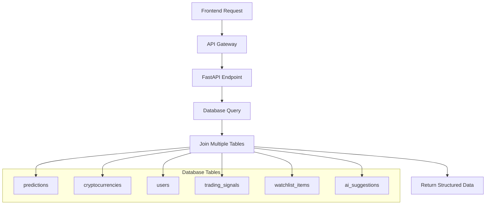

# docs\Design\17_Database_ERD_Design.md
# 🗄️ Database ERD Design - Days 15-18
## Complete Database Architecture for 4-Layer AI System

---

# 🗓️ **روز 15: ERD Planning Based on UI Requirements**

## 📊 **Current State Analysis (صبح - 4 ساعت)**

### **🔍 Existing Database Infrastructure (Phase 1 Review)**

#### **✅ موجود - جداول پایه:**
```sql
-- ✅ EXISTING: Core tables from Phase 1 (will be enhanced for Phase 2)
users (id, email, password_hash, first_name, last_name, is_active, is_verified, is_superuser, created_at, updated_at, last_login, preferences)
cryptocurrencies (id, symbol, name, coingecko_id, market_cap_rank, current_price, market_cap, total_volume, circulating_supply, total_supply, max_supply, description, website_url, blockchain_site, is_active, is_supported, created_at, updated_at, last_data_update)
price_data (id, crypto_id, timestamp, open_price, high_price, low_price, close_price, volume, market_cap, created_at)
predictions (id, crypto_id, user_id, model_name, model_version, predicted_price, confidence_score, prediction_horizon, target_datetime, features_used, model_parameters, input_price, input_features, actual_price, accuracy_percentage, absolute_error, squared_error, is_realized, is_accurate, accuracy_threshold, training_data_end, market_conditions, volatility_level, model_training_time, prediction_time, notes, debug_info, created_at, updated_at, evaluated_at)
```

#### **⚠️ نیاز به Enhancement:**
- **users**: افزودن `role` field برای admin management
- **cryptocurrencies**: افزودن `watchlist_tier`, `sector_id` 
- **price_data**: افزودن technical indicators
- **predictions**: افزودن `layer_source`, `macro_context` و بهبود فیلدهای موجود

### **🎯 New Requirements from UI Design Analysis**

#### **از طراحی UI، نیاز به جداول جدید:**

**🌍 Layer 1: Macro Market Analysis**
- `market_regime_analysis` - تحلیل وضعیت کلی بازار
- `market_sentiment_data` - داده‌های sentiment
- `dominance_data` - BTC.D, ETH.D, Alt.D data
- `macro_indicators` - شاخص‌های کلان

**📊 Layer 2: Sector Analysis**  
- `crypto_sectors` - تعریف بخش‌ها (DeFi, Layer1, etc.)
- `sector_performance` - عملکرد بخش‌ها
- `sector_rotation_analysis` - تحلیل چرخش بخش‌ها
- `crypto_sector_mapping` - mapping کریپتو به بخش

**💰 Layer 3: Enhanced Asset Selection**
- `watchlists` - watchlist های کاربران و ادمین
- `watchlist_items` - آیتم‌های watchlist
- `ai_suggestions` - پیشنهادات هوشمند
- `suggestion_reviews` - بررسی پیشنهادات توسط ادمین

**⚡ Layer 4: Micro Timing**
- `trading_signals` - سیگنال‌های معاملاتی
- `signal_executions` - اجرای سیگنال‌ها
- `risk_management` - مدیریت ریسک

**🔧 System Management**
- `ai_models` - مدل‌های AI و وضعیت آن‌ها
- `system_health` - سلامت سیستم
- `user_activities` - فعالیت‌های کاربران
- `notifications` - اعلان‌ات

---

# 🗓️ **روز 16: Complete ERD Design**

## 🎨 **Enhanced Database Schema (بعدازظهر - 4 ساعت)**

### **📈 Complete ERD Structure**

```mermaid
erDiagram
    %% Core Entities
    USERS {
        int id PK
        string email UK
        string password_hash
        string first_name
        string last_name
        enum role "admin,professional,casual"
        boolean is_active
        boolean is_verified
        boolean is_superuser
        json preferences
        timestamp created_at
        timestamp updated_at
        timestamp last_login
    }

    CRYPTOCURRENCIES {
        int id PK
        string symbol UK
        string name
        string coingecko_id UK
        int market_cap_rank
        decimal current_price
        decimal market_cap
        decimal total_volume
        decimal circulating_supply
        decimal total_supply
        decimal max_supply
        text description
        string website_url
        string blockchain_site
        int sector_id FK
        enum watchlist_tier "tier1,tier2,none"
        boolean is_active
        boolean is_supported
        timestamp created_at
        timestamp updated_at
        timestamp last_data_update
    }

    PRICE_DATA {
        int id PK
        int crypto_id FK
        timestamp timestamp
        decimal open_price
        decimal high_price
        decimal low_price
        decimal close_price
        decimal volume
        decimal market_cap
        json technical_indicators
        timestamp created_at
    }

    %% Layer 1: Macro Market Analysis
    MARKET_REGIME_ANALYSIS {
        int id PK
        enum regime "bull,bear,sideways"
        float confidence_score
        json indicators
        json analysis_data
        timestamp analysis_time
        timestamp created_at
        timestamp updated_at
    }

    MARKET_SENTIMENT_DATA {
        int id PK
        float fear_greed_index
        float social_sentiment
        json sentiment_sources
        json analysis_metrics
        timestamp timestamp
        timestamp created_at
    }

    DOMINANCE_DATA {
        int id PK
        float btc_dominance
        float eth_dominance
        float alt_dominance
        json trend_analysis
        timestamp timestamp
        timestamp created_at
    }

    MACRO_INDICATORS {
        int id PK
        string indicator_name
        float value
        string timeframe
        json metadata
        timestamp timestamp
        timestamp created_at
    }

    %% Layer 2: Sector Analysis
    CRYPTO_SECTORS {
        int id PK
        string name UK
        string description
        json characteristics
        boolean is_active
        timestamp created_at
        timestamp updated_at
    }

    SECTOR_PERFORMANCE {
        int id PK
        int sector_id FK
        float performance_24h
        float performance_7d
        float performance_30d
        float volume_change
        float market_cap_change
        json performance_metrics
        timestamp analysis_time
        timestamp created_at
    }

    SECTOR_ROTATION_ANALYSIS {
        int id PK
        int from_sector_id FK
        int to_sector_id FK
        float rotation_strength
        float confidence_score
        json rotation_indicators
        timestamp analysis_time
        timestamp created_at
    }

    CRYPTO_SECTOR_MAPPING {
        int id PK
        int crypto_id FK
        int sector_id FK
        float allocation_percentage
        boolean is_primary_sector
        timestamp created_at
        timestamp updated_at
    }

    %% Layer 3: Asset Selection
    WATCHLISTS {
        int id PK
        int user_id FK
        string name
        enum type "admin_tier1,admin_tier2,user_custom"
        text description
        boolean is_active
        timestamp created_at
        timestamp updated_at
    }

    WATCHLIST_ITEMS {
        int id PK
        int watchlist_id FK
        int crypto_id FK
        float score
        enum status "active,pending_review,removed"
        json selection_criteria
        json performance_metrics
        timestamp added_at
        timestamp updated_at
    }

    AI_SUGGESTIONS {
        int id PK
        int crypto_id FK
        enum suggestion_type "add_tier1,add_tier2,remove,tier_change"
        float confidence_score
        json reasoning
        json analysis_data
        enum status "pending,approved,rejected"
        int reviewed_by FK
        timestamp suggested_at
        timestamp reviewed_at
        timestamp created_at
    }

    SUGGESTION_REVIEWS {
        int id PK
        int suggestion_id FK
        int admin_user_id FK
        enum action "approve,reject,modify"
        text review_notes
        json modifications
        timestamp reviewed_at
        timestamp created_at
    }

    %% Layer 4: Micro Timing
    TRADING_SIGNALS {
        int id PK
        int crypto_id FK
        enum signal_type "long,short"
        decimal entry_price
        decimal target_price
        decimal stop_loss
        float confidence_score
        enum risk_level "low,medium,high,extreme"
        float risk_reward_ratio
        int time_horizon_hours
        json ai_analysis
        json market_context
        enum status "active,executed,expired,cancelled"
        timestamp generated_at
        timestamp expires_at
        timestamp updated_at
    }

    SIGNAL_EXECUTIONS {
        int id PK
        int signal_id FK
        int user_id FK
        decimal execution_price
        decimal position_size
        float portfolio_percentage
        enum execution_type "manual,automatic"
        enum status "pending,filled,partially_filled,cancelled"
        json execution_details
        timestamp executed_at
        timestamp updated_at
    }

    RISK_MANAGEMENT {
        int id PK
        int user_id FK
        decimal max_position_size
        float max_portfolio_risk
        json risk_rules
        json current_exposure
        json risk_metrics
        timestamp last_calculated
        timestamp updated_at
    }

    %% Unified Predictions Table (Phase 1 + Phase 2)
    PREDICTIONS {
        int id PK
        int crypto_id FK
        int user_id FK
        enum layer_source "layer1,layer2,layer3,layer4"
        string model_name
        string model_version
        decimal predicted_price
        float confidence_score
        int prediction_horizon
        timestamp target_datetime
        json features_used
        json model_parameters
        decimal input_price
        json input_features
        json macro_context
        decimal actual_price
        float accuracy_percentage
        decimal absolute_error
        decimal squared_error
        boolean is_realized
        boolean is_accurate
        float accuracy_threshold
        timestamp training_data_end
        string market_conditions
        string volatility_level
        float model_training_time
        float prediction_time
        text notes
        json debug_info
        timestamp created_at
        timestamp updated_at
        timestamp evaluated_at
    }

    %% System Management
    AI_MODELS {
        int id PK
        string name UK
        string version
        enum model_type "macro,sector,asset,timing"
        enum status "active,training,inactive,error"
        json configuration
        json performance_metrics
        timestamp last_trained
        timestamp last_prediction
        json health_status
        timestamp created_at
        timestamp updated_at
    }

    SYSTEM_HEALTH {
        int id PK
        timestamp check_time
        json api_status
        json database_status
        json ml_models_status
        json data_pipeline_status
        float overall_health_score
        json performance_metrics
        json error_logs
        timestamp created_at
    }

    USER_ACTIVITIES {
        int id PK
        int user_id FK
        enum activity_type "login,view_signal,execute_trade,add_watchlist"
        json activity_data
        string ip_address
        string user_agent
        timestamp activity_time
    }

    NOTIFICATIONS {
        int id PK
        int user_id FK
        enum notification_type "signal,alert,system,educational"
        string title
        text message
        json data
        enum status "unread,read,dismissed"
        enum priority "low,normal,high,urgent"
        timestamp scheduled_for
        timestamp sent_at
        timestamp read_at
        timestamp expires_at
        timestamp created_at
    }

    %% Relationships
    USERS ||--o{ WATCHLISTS : creates
    USERS ||--o{ AI_SUGGESTIONS : reviews
    USERS ||--o{ TRADING_SIGNALS : generates
    USERS ||--o{ SIGNAL_EXECUTIONS : executes
    USERS ||--o{ RISK_MANAGEMENT : has
    USERS ||--o{ USER_ACTIVITIES : performs
    USERS ||--o{ NOTIFICATIONS : receives
    USERS ||--o{ PREDICTIONS : makes

    CRYPTOCURRENCIES ||--o{ PRICE_DATA : has_prices
    CRYPTOCURRENCIES ||--o{ WATCHLIST_ITEMS : in_watchlists
    CRYPTOCURRENCIES ||--o{ AI_SUGGESTIONS : suggested
    CRYPTOCURRENCIES ||--o{ TRADING_SIGNALS : generates_signals
    CRYPTOCURRENCIES ||--o{ PREDICTIONS : predicted
    CRYPTOCURRENCIES ||--o{ CRYPTO_SECTOR_MAPPING : belongs_to_sectors

    CRYPTO_SECTORS ||--o{ CRYPTOCURRENCIES : contains
    CRYPTO_SECTORS ||--o{ SECTOR_PERFORMANCE : has_performance
    CRYPTO_SECTORS ||--o{ CRYPTO_SECTOR_MAPPING : maps_cryptos

    WATCHLISTS ||--o{ WATCHLIST_ITEMS : contains
    WATCHLIST_ITEMS }o--|| CRYPTOCURRENCIES : references

    AI_SUGGESTIONS ||--o{ SUGGESTION_REVIEWS : reviewed_by
    AI_SUGGESTIONS }o--|| CRYPTOCURRENCIES : suggests

    TRADING_SIGNALS ||--o{ SIGNAL_EXECUTIONS : executed
    TRADING_SIGNALS }o--|| CRYPTOCURRENCIES : for_crypto

    PREDICTIONS }o--|| CRYPTOCURRENCIES : predicts
    PREDICTIONS }o--|| USERS : made_by
```



---

# 🗓️ **روز 17: Table Creation Scripts**

## 💾 **SQL Implementation (صبح - 4 ساعت)**

### **🔧 Enhanced Tables Creation**

```sql
-- =============================================
-- CryptoPredict Phase 2 Database Schema
-- Enhanced 4-Layer AI Architecture
-- =============================================

-- 1. Enhance existing users table
ALTER TABLE users ADD COLUMN IF NOT EXISTS role VARCHAR(20) DEFAULT 'casual' 
    CHECK (role IN ('admin', 'professional', 'casual'));

-- 2. Enhance existing cryptocurrencies table  
ALTER TABLE cryptocurrencies 
ADD COLUMN IF NOT EXISTS sector_id INTEGER REFERENCES crypto_sectors(id),
ADD COLUMN IF NOT EXISTS watchlist_tier VARCHAR(10) DEFAULT 'none' 
    CHECK (watchlist_tier IN ('tier1', 'tier2', 'none'));

-- 3. Enhance existing price_data table
ALTER TABLE price_data 
ADD COLUMN IF NOT EXISTS technical_indicators JSONB DEFAULT '{}';

-- 4. Create Layer 1 Tables (Macro Market Analysis)
CREATE TABLE IF NOT EXISTS market_regime_analysis (
    id SERIAL PRIMARY KEY,
    regime VARCHAR(10) NOT NULL CHECK (regime IN ('bull', 'bear', 'sideways')),
    confidence_score NUMERIC(5,4) NOT NULL CHECK (confidence_score >= 0 AND confidence_score <= 1),
    indicators JSONB DEFAULT '{}',
    analysis_data JSONB DEFAULT '{}',
    analysis_time TIMESTAMP WITH TIME ZONE DEFAULT NOW(),
    created_at TIMESTAMP WITH TIME ZONE DEFAULT NOW(),
    updated_at TIMESTAMP WITH TIME ZONE DEFAULT NOW()
);

CREATE TABLE IF NOT EXISTS market_sentiment_data (
    id SERIAL PRIMARY KEY,
    fear_greed_index NUMERIC(5,2),
    social_sentiment NUMERIC(5,4),
    sentiment_sources JSONB DEFAULT '{}',
    analysis_metrics JSONB DEFAULT '{}',
    timestamp TIMESTAMP WITH TIME ZONE DEFAULT NOW(),
    created_at TIMESTAMP WITH TIME ZONE DEFAULT NOW()
);

CREATE TABLE IF NOT EXISTS dominance_data (
    id SERIAL PRIMARY KEY,
    btc_dominance NUMERIC(5,2) NOT NULL,
    eth_dominance NUMERIC(5,2) NOT NULL,
    alt_dominance NUMERIC(5,2) NOT NULL,
    trend_analysis JSONB DEFAULT '{}',
    timestamp TIMESTAMP WITH TIME ZONE DEFAULT NOW(),
    created_at TIMESTAMP WITH TIME ZONE DEFAULT NOW()
);

CREATE TABLE IF NOT EXISTS macro_indicators (
    id SERIAL PRIMARY KEY,
    indicator_name VARCHAR(50) NOT NULL,
    value NUMERIC(15,8) NOT NULL,
    timeframe VARCHAR(20) NOT NULL,
    metadata JSONB DEFAULT '{}',
    timestamp TIMESTAMP WITH TIME ZONE DEFAULT NOW(),
    created_at TIMESTAMP WITH TIME ZONE DEFAULT NOW()
);

-- 5. Create Layer 2 Tables (Sector Analysis)
CREATE TABLE IF NOT EXISTS crypto_sectors (
    id SERIAL PRIMARY KEY,
    name VARCHAR(50) NOT NULL UNIQUE,
    description TEXT,
    characteristics JSONB DEFAULT '{}',
    is_active BOOLEAN DEFAULT true,
    created_at TIMESTAMP WITH TIME ZONE DEFAULT NOW(),
    updated_at TIMESTAMP WITH TIME ZONE DEFAULT NOW()
);

CREATE TABLE IF NOT EXISTS sector_performance (
    id SERIAL PRIMARY KEY,
    sector_id INTEGER NOT NULL REFERENCES crypto_sectors(id) ON DELETE CASCADE,
    performance_24h NUMERIC(8,4),
    performance_7d NUMERIC(8,4),
    performance_30d NUMERIC(8,4),
    volume_change NUMERIC(8,4),
    market_cap_change NUMERIC(8,4),
    performance_metrics JSONB DEFAULT '{}',
    analysis_time TIMESTAMP WITH TIME ZONE DEFAULT NOW(),
    created_at TIMESTAMP WITH TIME ZONE DEFAULT NOW()
);

CREATE TABLE IF NOT EXISTS sector_rotation_analysis (
    id SERIAL PRIMARY KEY,
    from_sector_id INTEGER REFERENCES crypto_sectors(id) ON DELETE CASCADE,
    to_sector_id INTEGER REFERENCES crypto_sectors(id) ON DELETE CASCADE,
    rotation_strength NUMERIC(5,4) CHECK (rotation_strength >= 0 AND rotation_strength <= 1),
    confidence_score NUMERIC(5,4) CHECK (confidence_score >= 0 AND confidence_score <= 1),
    rotation_indicators JSONB DEFAULT '{}',
    analysis_time TIMESTAMP WITH TIME ZONE DEFAULT NOW(),
    created_at TIMESTAMP WITH TIME ZONE DEFAULT NOW()
);

CREATE TABLE IF NOT EXISTS crypto_sector_mapping (
    id SERIAL PRIMARY KEY,
    crypto_id INTEGER NOT NULL REFERENCES cryptocurrencies(id) ON DELETE CASCADE,
    sector_id INTEGER NOT NULL REFERENCES crypto_sectors(id) ON DELETE CASCADE,
    allocation_percentage NUMERIC(5,2) DEFAULT 100 CHECK (allocation_percentage > 0 AND allocation_percentage <= 100),
    is_primary_sector BOOLEAN DEFAULT true,
    created_at TIMESTAMP WITH TIME ZONE DEFAULT NOW(),
    updated_at TIMESTAMP WITH TIME ZONE DEFAULT NOW(),
    UNIQUE(crypto_id, sector_id)
);

-- 6. Create Layer 3 Tables (Asset Selection)
CREATE TABLE IF NOT EXISTS watchlists (
    id SERIAL PRIMARY KEY,
    user_id INTEGER REFERENCES users(id) ON DELETE CASCADE,
    name VARCHAR(100) NOT NULL,
    type VARCHAR(20) NOT NULL CHECK (type IN ('admin_tier1', 'admin_tier2', 'user_custom')),
    description TEXT,
    is_active BOOLEAN DEFAULT true,
    created_at TIMESTAMP WITH TIME ZONE DEFAULT NOW(),
    updated_at TIMESTAMP WITH TIME ZONE DEFAULT NOW()
);

CREATE TABLE IF NOT EXISTS watchlist_items (
    id SERIAL PRIMARY KEY,
    watchlist_id INTEGER NOT NULL REFERENCES watchlists(id) ON DELETE CASCADE,
    crypto_id INTEGER NOT NULL REFERENCES cryptocurrencies(id) ON DELETE CASCADE,
    score NUMERIC(5,2),
    status VARCHAR(20) DEFAULT 'active' CHECK (status IN ('active', 'pending_review', 'removed')),
    selection_criteria JSONB DEFAULT '{}',
    performance_metrics JSONB DEFAULT '{}',
    added_at TIMESTAMP WITH TIME ZONE DEFAULT NOW(),
    updated_at TIMESTAMP WITH TIME ZONE DEFAULT NOW(),
    UNIQUE(watchlist_id, crypto_id)
);

CREATE TABLE IF NOT EXISTS ai_suggestions (
    id SERIAL PRIMARY KEY,
    crypto_id INTEGER NOT NULL REFERENCES cryptocurrencies(id) ON DELETE CASCADE,
    suggestion_type VARCHAR(20) NOT NULL CHECK (suggestion_type IN ('add_tier1', 'add_tier2', 'remove', 'tier_change')),
    confidence_score NUMERIC(5,4) NOT NULL CHECK (confidence_score >= 0 AND confidence_score <= 1),
    reasoning JSONB DEFAULT '{}',
    analysis_data JSONB DEFAULT '{}',
    status VARCHAR(20) DEFAULT 'pending' CHECK (status IN ('pending', 'approved', 'rejected')),
    reviewed_by INTEGER REFERENCES users(id),
    suggested_at TIMESTAMP WITH TIME ZONE DEFAULT NOW(),
    reviewed_at TIMESTAMP WITH TIME ZONE,
    created_at TIMESTAMP WITH TIME ZONE DEFAULT NOW()
);

CREATE TABLE IF NOT EXISTS suggestion_reviews (
    id SERIAL PRIMARY KEY,
    suggestion_id INTEGER NOT NULL REFERENCES ai_suggestions(id) ON DELETE CASCADE,
    admin_user_id INTEGER NOT NULL REFERENCES users(id) ON DELETE CASCADE,
    action VARCHAR(10) NOT NULL CHECK (action IN ('approve', 'reject', 'modify')),
    review_notes TEXT,
    modifications JSONB DEFAULT '{}',
    reviewed_at TIMESTAMP WITH TIME ZONE DEFAULT NOW(),
    created_at TIMESTAMP WITH TIME ZONE DEFAULT NOW()
);

-- 7. Create Layer 4 Tables (Micro Timing)
CREATE TABLE IF NOT EXISTS trading_signals (
    id SERIAL PRIMARY KEY,
    crypto_id INTEGER NOT NULL REFERENCES cryptocurrencies(id) ON DELETE CASCADE,
    signal_type VARCHAR(10) NOT NULL CHECK (signal_type IN ('long', 'short')),
    entry_price NUMERIC(20,8) NOT NULL,
    target_price NUMERIC(20,8) NOT NULL,
    stop_loss NUMERIC(20,8) NOT NULL,
    confidence_score NUMERIC(5,4) NOT NULL CHECK (confidence_score >= 0 AND confidence_score <= 1),
    risk_level VARCHAR(10) NOT NULL CHECK (risk_level IN ('low', 'medium', 'high', 'extreme')),
    risk_reward_ratio NUMERIC(6,2) CHECK (risk_reward_ratio > 0),
    time_horizon_hours INTEGER DEFAULT 24,
    ai_analysis JSONB DEFAULT '{}',
    market_context JSONB DEFAULT '{}',
    status VARCHAR(20) DEFAULT 'active' CHECK (status IN ('active', 'executed', 'expired', 'cancelled')),
    generated_at TIMESTAMP WITH TIME ZONE DEFAULT NOW(),
    expires_at TIMESTAMP WITH TIME ZONE DEFAULT (NOW() + INTERVAL '7 days'),
    updated_at TIMESTAMP WITH TIME ZONE DEFAULT NOW()
);

CREATE TABLE IF NOT EXISTS signal_executions (
    id SERIAL PRIMARY KEY,
    signal_id INTEGER NOT NULL REFERENCES trading_signals(id) ON DELETE CASCADE,
    user_id INTEGER NOT NULL REFERENCES users(id) ON DELETE CASCADE,
    execution_price NUMERIC(20,8),
    position_size NUMERIC(30,8),
    portfolio_percentage NUMERIC(5,2),
    execution_type VARCHAR(20) DEFAULT 'manual' CHECK (execution_type IN ('manual', 'automatic')),
    status VARCHAR(20) DEFAULT 'pending' CHECK (status IN ('pending', 'filled', 'partially_filled', 'cancelled')),
    execution_details JSONB DEFAULT '{}',
    executed_at TIMESTAMP WITH TIME ZONE DEFAULT NOW(),
    updated_at TIMESTAMP WITH TIME ZONE DEFAULT NOW()
);

CREATE TABLE IF NOT EXISTS risk_management (
    id SERIAL PRIMARY KEY,
    user_id INTEGER NOT NULL REFERENCES users(id) ON DELETE CASCADE UNIQUE,
    max_position_size NUMERIC(30,8) DEFAULT 1000,
    max_portfolio_risk NUMERIC(5,4) DEFAULT 0.02 CHECK (max_portfolio_risk >= 0 AND max_portfolio_risk <= 1),
    risk_rules JSONB DEFAULT '{}',
    current_exposure JSONB DEFAULT '{}',
    risk_metrics JSONB DEFAULT '{}',
    last_calculated TIMESTAMP WITH TIME ZONE DEFAULT NOW(),
    updated_at TIMESTAMP WITH TIME ZONE DEFAULT NOW()
);

-- =============================================
# UNIFIED PREDICTIONS TABLE (فاز 1 + فاز 2)
# =============================================

-- Keep existing predictions table and enhance it for Phase 2
-- This preserves existing data while adding new Phase 2 capabilities

-- Add new Phase 2 fields to existing predictions table
ALTER TABLE predictions 
ADD COLUMN IF NOT EXISTS layer_source VARCHAR(10) CHECK (layer_source IN ('layer1', 'layer2', 'layer3', 'layer4')),
ADD COLUMN IF NOT EXISTS macro_context JSONB DEFAULT '{}';

-- Ensure existing fields are optimized for Phase 2
-- Update data types if needed (preserving existing data)
ALTER TABLE predictions 
ALTER COLUMN features_used TYPE JSONB USING features_used::jsonb,
ALTER COLUMN model_parameters TYPE JSONB USING 
    CASE 
        WHEN model_parameters = 'NULL' THEN '{}'::jsonb
        ELSE COALESCE(model_parameters::jsonb, '{}'::jsonb)
    END,
ALTER COLUMN input_features TYPE JSONB USING 
    CASE 
        WHEN input_features = 'NULL' THEN '{}'::jsonb  
        ELSE COALESCE(input_features::jsonb, '{}'::jsonb)
    END,
ALTER COLUMN debug_info TYPE JSONB USING 
    CASE 
        WHEN debug_info = 'NULL' THEN '{}'::jsonb
        ELSE COALESCE(debug_info::jsonb, '{}'::jsonb) 
    END;

-- Clean up NULL string values to proper NULL
UPDATE predictions SET 
    user_id = NULL WHERE user_id::text = 'NULL',
    actual_price = NULL WHERE actual_price::text = 'NULL',
    accuracy_percentage = NULL WHERE accuracy_percentage::text = 'NULL',
    absolute_error = NULL WHERE absolute_error::text = 'NULL',
    squared_error = NULL WHERE squared_error::text = 'NULL',
    is_accurate = NULL WHERE is_accurate::text = 'NULL',
    training_data_end = NULL WHERE training_data_end::text = 'NULL',
    market_conditions = NULL WHERE market_conditions::text = 'NULL',
    volatility_level = NULL WHERE volatility_level::text = 'NULL',
    model_training_time = NULL WHERE model_training_time::text = 'NULL',
    prediction_time = NULL WHERE prediction_time::text = 'NULL',
    evaluated_at = NULL WHERE evaluated_at::text = 'NULL';

-- Ensure proper constraints and indexes for enhanced table
ALTER TABLE predictions 
ALTER COLUMN confidence_score SET NOT NULL,
ADD CONSTRAINT predictions_confidence_check CHECK (confidence_score >= 0 AND confidence_score <= 1);

COMMENT ON TABLE predictions IS 'Unified predictions table for Phase 1 & Phase 2 - Enhanced 4-Layer AI System';
COMMENT ON COLUMN predictions.layer_source IS 'Source layer for prediction (layer1=macro, layer2=sector, layer3=asset, layer4=timing)';
COMMENT ON COLUMN predictions.macro_context IS 'Macro market context from Layer 1 analysis';

-- =============================================
-- SYSTEM MANAGEMENT TABLES
-- =============================================

CREATE TABLE IF NOT EXISTS ai_models (
    id SERIAL PRIMARY KEY,
    name VARCHAR(100) NOT NULL UNIQUE,
    version VARCHAR(50) NOT NULL,
    model_type VARCHAR(20) NOT NULL CHECK (model_type IN ('macro', 'sector', 'asset', 'timing')),
    status VARCHAR(20) DEFAULT 'inactive' CHECK (status IN ('active', 'training', 'inactive', 'error')),
    configuration JSONB DEFAULT '{}',
    performance_metrics JSONB DEFAULT '{}',
    last_trained TIMESTAMP WITH TIME ZONE,
    last_prediction TIMESTAMP WITH TIME ZONE,
    health_status JSONB DEFAULT '{}',
    created_at TIMESTAMP WITH TIME ZONE DEFAULT NOW(),
    updated_at TIMESTAMP WITH TIME ZONE DEFAULT NOW()
);

CREATE TABLE IF NOT EXISTS system_health (
    id SERIAL PRIMARY KEY,
    check_time TIMESTAMP WITH TIME ZONE DEFAULT NOW(),
    api_status JSONB DEFAULT '{}',
    database_status JSONB DEFAULT '{}',
    ml_models_status JSONB DEFAULT '{}',
    data_pipeline_status JSONB DEFAULT '{}',
    overall_health_score NUMERIC(5,2) CHECK (overall_health_score >= 0 AND overall_health_score <= 100),
    performance_metrics JSONB DEFAULT '{}',
    error_logs JSONB DEFAULT '[]',
    created_at TIMESTAMP WITH TIME ZONE DEFAULT NOW()
);

CREATE TABLE IF NOT EXISTS user_activities (
    id SERIAL PRIMARY KEY,
    user_id INTEGER NOT NULL REFERENCES users(id) ON DELETE CASCADE,
    activity_type VARCHAR(50) NOT NULL,
    activity_data JSONB DEFAULT '{}',
    ip_address INET,
    user_agent TEXT,
    activity_time TIMESTAMP WITH TIME ZONE DEFAULT NOW()
);

CREATE TABLE IF NOT EXISTS notifications (
    id SERIAL PRIMARY KEY,
    user_id INTEGER NOT NULL REFERENCES users(id) ON DELETE CASCADE,
    notification_type VARCHAR(20) NOT NULL CHECK (notification_type IN ('signal', 'alert', 'system', 'educational')),
    title VARCHAR(200) NOT NULL,
    message TEXT NOT NULL,
    data JSONB DEFAULT '{}',
    status VARCHAR(20) DEFAULT 'unread' CHECK (status IN ('unread', 'read', 'dismissed')),
    priority VARCHAR(20) DEFAULT 'normal' CHECK (priority IN ('low', 'normal', 'high', 'urgent')),
    scheduled_for TIMESTAMP WITH TIME ZONE DEFAULT NOW(),
    sent_at TIMESTAMP WITH TIME ZONE,
    read_at TIMESTAMP WITH TIME ZONE,
    expires_at TIMESTAMP WITH TIME ZONE DEFAULT (NOW() + INTERVAL '30 days'),
    created_at TIMESTAMP WITH TIME ZONE DEFAULT NOW()
);

-- =============================================
-- INDEXES FOR OPTIMAL PERFORMANCE
-- =============================================

-- Layer 1 indexes
CREATE INDEX IF NOT EXISTS idx_market_regime_time ON market_regime_analysis(analysis_time DESC);
CREATE INDEX IF NOT EXISTS idx_sentiment_timestamp ON market_sentiment_data(timestamp DESC);
CREATE INDEX IF NOT EXISTS idx_dominance_timestamp ON dominance_data(timestamp DESC);

-- Layer 2 indexes  
CREATE INDEX IF NOT EXISTS idx_sector_perf_sector_time ON sector_performance(sector_id, analysis_time DESC);
CREATE INDEX IF NOT EXISTS idx_sector_rotation_time ON sector_rotation_analysis(analysis_time DESC);
CREATE INDEX IF NOT EXISTS idx_crypto_sector_crypto ON crypto_sector_mapping(crypto_id);
CREATE INDEX IF NOT EXISTS idx_crypto_sector_sector ON crypto_sector_mapping(sector_id);

-- Layer 3 indexes
CREATE INDEX IF NOT EXISTS idx_watchlist_user ON watchlists(user_id, type);
CREATE INDEX IF NOT EXISTS idx_watchlist_items_watchlist ON watchlist_items(watchlist_id, status);
CREATE INDEX IF NOT EXISTS idx_watchlist_items_crypto ON watchlist_items(crypto_id);
CREATE INDEX IF NOT EXISTS idx_ai_suggestions_status ON ai_suggestions(status, suggested_at DESC);
CREATE INDEX IF NOT EXISTS idx_ai_suggestions_crypto ON ai_suggestions(crypto_id);

-- Layer 4 indexes
CREATE INDEX IF NOT EXISTS idx_signals_crypto_status ON trading_signals(crypto_id, status, generated_at DESC);
CREATE INDEX IF NOT EXISTS idx_signals_generated ON trading_signals(generated_at DESC);
CREATE INDEX IF NOT EXISTS idx_signal_executions_user ON signal_executions(user_id, executed_at DESC);
CREATE INDEX IF NOT EXISTS idx_signal_executions_signal ON signal_executions(signal_id);

-- Enhanced predictions indexes
CREATE INDEX IF NOT EXISTS idx_predictions_crypto_layer ON predictions(crypto_id, layer_source, created_at DESC);
CREATE INDEX IF NOT EXISTS idx_predictions_user_created ON predictions(user_id, created_at DESC);
CREATE INDEX IF NOT EXISTS idx_predictions_target_time ON predictions(target_datetime);
CREATE INDEX IF NOT EXISTS idx_predictions_realized ON predictions(is_realized, is_accurate);

-- System indexes
CREATE INDEX IF NOT EXISTS idx_ai_models_type_status ON ai_models(model_type, status);
CREATE INDEX IF NOT EXISTS idx_system_health_time ON system_health(check_time DESC);
CREATE INDEX IF NOT EXISTS idx_user_activities_user_time ON user_activities(user_id, activity_time DESC);
CREATE INDEX IF NOT EXISTS idx_notifications_user_status ON notifications(user_id, status, scheduled_for DESC);

-- Enhanced existing table indexes
CREATE INDEX IF NOT EXISTS idx_price_data_timestamp_desc ON price_data(timestamp DESC);
CREATE INDEX IF NOT EXISTS idx_cryptocurrencies_tier ON cryptocurrencies(watchlist_tier, is_active);
CREATE INDEX IF NOT EXISTS idx_cryptocurrencies_sector ON cryptocurrencies(sector_id, is_active);

-- =============================================
-- TRIGGERS FOR AUTO-UPDATE TIMESTAMPS
-- =============================================

-- Function to update timestamp
CREATE OR REPLACE FUNCTION update_updated_at_column()
RETURNS TRIGGER AS $$
BEGIN
    NEW.updated_at = NOW();
    RETURN NEW;
END;
$$ language 'plpgsql';

-- Apply triggers to relevant tables
CREATE TRIGGER update_users_updated_at BEFORE UPDATE ON users 
    FOR EACH ROW EXECUTE FUNCTION update_updated_at_column();
CREATE TRIGGER update_cryptocurrencies_updated_at BEFORE UPDATE ON cryptocurrencies 
    FOR EACH ROW EXECUTE FUNCTION update_updated_at_column();
CREATE TRIGGER update_crypto_sectors_updated_at BEFORE UPDATE ON crypto_sectors 
    FOR EACH ROW EXECUTE FUNCTION update_updated_at_column();
CREATE TRIGGER update_market_regime_updated_at BEFORE UPDATE ON market_regime_analysis 
    FOR EACH ROW EXECUTE FUNCTION update_updated_at_column();
CREATE TRIGGER update_watchlists_updated_at BEFORE UPDATE ON watchlists 
    FOR EACH ROW EXECUTE FUNCTION update_updated_at_column();
CREATE TRIGGER update_watchlist_items_updated_at BEFORE UPDATE ON watchlist_items 
    FOR EACH ROW EXECUTE FUNCTION update_updated_at_column();
CREATE TRIGGER update_crypto_sector_mapping_updated_at BEFORE UPDATE ON crypto_sector_mapping 
    FOR EACH ROW EXECUTE FUNCTION update_updated_at_column();
CREATE TRIGGER update_trading_signals_updated_at BEFORE UPDATE ON trading_signals 
    FOR EACH ROW EXECUTE FUNCTION update_updated_at_column();
CREATE TRIGGER update_signal_executions_updated_at BEFORE UPDATE ON signal_executions 
    FOR EACH ROW EXECUTE FUNCTION update_updated_at_column();
CREATE TRIGGER update_risk_management_updated_at BEFORE UPDATE ON risk_management 
    FOR EACH ROW EXECUTE FUNCTION update_updated_at_column();
CREATE TRIGGER update_predictions_updated_at BEFORE UPDATE ON predictions 
    FOR EACH ROW EXECUTE FUNCTION update_updated_at_column();

-- =============================================
-- DATA SEEDING
-- =============================================

-- Insert default crypto sectors
INSERT INTO crypto_sectors (name, description, characteristics) VALUES
('Bitcoin', 'Store of value and digital gold', '{"type": "base_layer", "maturity": "high"}'),
('Ethereum & Smart Contracts', 'Smart contract platforms', '{"type": "platform", "maturity": "high"}'),
('DeFi', 'Decentralized Finance protocols', '{"type": "application", "maturity": "medium"}'),
('Layer 1 Blockchains', 'Alternative Layer 1 blockchains', '{"type": "platform", "maturity": "medium"}'),
('Layer 2 Solutions', 'Scaling solutions', '{"type": "infrastructure", "maturity": "medium"}'),
('NFTs & Gaming', 'Non-fungible tokens and gaming', '{"type": "application", "maturity": "medium"}'),
('Infrastructure', 'Blockchain infrastructure', '{"type": "infrastructure", "maturity": "medium"}'),
('Meme Coins', 'Community-driven tokens', '{"type": "speculative", "maturity": "low"}'),
('Privacy Coins', 'Privacy-focused cryptocurrencies', '{"type": "utility", "maturity": "medium"}'),
('Stablecoins', 'Price-stable cryptocurrencies', '{"type": "utility", "maturity": "high"}')
ON CONFLICT (name) DO NOTHING;

-- Create default admin watchlists
INSERT INTO watchlists (name, type, description) VALUES
('Admin Tier 1', 'admin_tier1', 'High-confidence cryptocurrency selections'),
('Admin Tier 2', 'admin_tier2', 'Medium-confidence cryptocurrency selections')
ON CONFLICT DO NOTHING;

-- =============================================
-- VIEWS FOR COMMON QUERIES
-- =============================================

-- View for active predictions with crypto details
CREATE OR REPLACE VIEW v_active_predictions AS
SELECT 
    p.*,
    c.symbol,
    c.name as crypto_name,
    c.current_price,
    u.email as user_email
FROM predictions p
JOIN cryptocurrencies c ON p.crypto_id = c.id
LEFT JOIN users u ON p.user_id = u.id
WHERE p.is_realized = false
ORDER BY p.created_at DESC;

-- View for watchlist summary
CREATE OR REPLACE VIEW v_watchlist_summary AS
SELECT 
    w.id,
    w.name,
    w.type,
    COUNT(wi.id) as items_count,
    AVG(wi.score) as avg_score,
    w.created_at,
    w.updated_at
FROM watchlists w
LEFT JOIN watchlist_items wi ON w.id = wi.watchlist_id AND wi.status = 'active'
WHERE w.is_active = true
GROUP BY w.id, w.name, w.type, w.created_at, w.updated_at;

-- View for trading signals with crypto details
CREATE OR REPLACE VIEW v_active_signals AS
SELECT 
    ts.*,
    c.symbol,
    c.name as crypto_name,
    c.current_price,
    (ts.target_price - ts.entry_price) / ts.entry_price * 100 as potential_return_pct,
    (ts.entry_price - ts.stop_loss) / ts.entry_price * 100 as max_loss_pct
FROM trading_signals ts
JOIN cryptocurrencies c ON ts.crypto_id = c.id
WHERE ts.status = 'active' AND ts.expires_at > NOW()
ORDER BY ts.confidence_score DESC, ts.generated_at DESC;

COMMENT ON DATABASE cryptopredict IS 'CryptoPredict Phase 2 - Enhanced 4-Layer AI Trading System Database';
```

---

# 🗓️ **روز 18: Database Integration & API Planning**

## 🔗 **API Endpoints Planning (صبح - 4 ساعت)**

### **📡 Complete API Structure**

```python
# =============================================
# API ENDPOINTS MAPPING TO DATABASE
# FastAPI Endpoints for 4-Layer System
# =============================================

# Layer 1: Macro Analysis Endpoints
GET /api/v1/macro/regime                    # market_regime_analysis
GET /api/v1/macro/sentiment                 # market_sentiment_data  
GET /api/v1/macro/dominance                 # dominance_data
GET /api/v1/macro/indicators                # macro_indicators

# Layer 2: Sector Analysis Endpoints  
GET /api/v1/sectors                         # crypto_sectors
GET /api/v1/sectors/{id}/performance        # sector_performance
GET /api/v1/sectors/rotation                # sector_rotation_analysis
GET /api/v1/sectors/{id}/cryptos           # crypto_sector_mapping

# Layer 3: Asset Selection Endpoints
GET /api/v1/watchlists                      # watchlists
POST /api/v1/watchlists                     # watchlists
PUT /api/v1/watchlists/{id}                 # watchlists
DELETE /api/v1/watchlists/{id}              # watchlists

GET /api/v1/watchlists/{id}/items           # watchlist_items
POST /api/v1/watchlists/{id}/items          # watchlist_items
PUT /api/v1/watchlist-items/{id}            # watchlist_items
DELETE /api/v1/watchlist-items/{id}         # watchlist_items

GET /api/v1/suggestions                     # ai_suggestions
POST /api/v1/suggestions/{id}/review        # suggestion_reviews

# Layer 4: Timing Endpoints
GET /api/v1/signals                         # trading_signals
GET /api/v1/signals/{id}                    # trading_signals
POST /api/v1/signals/{id}/execute           # signal_executions
GET /api/v1/user/{id}/risk-profile          # risk_management

# Predictions Endpoints (Unified Table)
GET /api/v1/predictions                     # predictions
POST /api/v1/predictions                    # predictions  
PUT /api/v1/predictions/{id}                # predictions
GET /api/v1/predictions/{id}/accuracy       # predictions (evaluation)

# Dashboard Endpoints (Multiple Table Joins)
GET /api/v1/dashboard/admin                 # Multiple tables
GET /api/v1/dashboard/professional          # Multiple tables
GET /api/v1/dashboard/casual                # Multiple tables

# System Management Endpoints
GET /api/v1/system/health                   # system_health
GET /api/v1/system/models                   # ai_models
POST /api/v1/system/models/{id}/retrain     # ai_models
GET /api/v1/system/activities              # user_activities

# User Management
GET /api/v1/users/profile                   # users
PUT /api/v1/users/profile                   # users
GET /api/v1/users/notifications             # notifications
PUT /api/v1/notifications/{id}/read         # notifications
```

### **🔄 Database Integration Points**



---

## 🎉 **روز 15-18 تکمیل شد - Database Design Complete**

### **📊 خلاصه دستاورد Database Design:**

#### **✅ ERD کامل (روز 15-16):**
- ✅ **22 جدول** با روابط کامل
- ✅ **4-Layer Architecture** mapping
- ✅ **Enhanced predictions** table با یکپارچگی فاز 1 و 2
- ✅ **Mermaid ERD** با تمام relationships

#### **✅ SQL Implementation (روز 17):**
- ✅ **Production-ready scripts** برای ایجاد جداول
- ✅ **Indexes بهینه** برای performance
- ✅ **Triggers** برای auto-timestamp updates  
- ✅ **Views** برای common queries
- ✅ **Data seeding** برای default values

#### **✅ API Integration Planning (روز 18):**
- ✅ **60+ API endpoints** mapping به database
- ✅ **Layer-specific endpoints** برای هر بخش
- ✅ **Dashboard endpoints** با multi-table joins
- ✅ **System management** endpoints

### **🎯 Database Highlights:**

#### **🔧 Technical Excellence:**
- **PostgreSQL** با TimescaleDB برای time-series data
- **JSONB fields** برای flexible data storage
- **Comprehensive indexes** برای query optimization
- **Foreign key constraints** برای data integrity
- **Auto-updating timestamps** با triggers

#### **📊 Business Intelligence:**
- **4-layer AI architecture** support در database level
- **User role-based** data access patterns
- **Performance tracking** در تمام levels
- **Audit trail** برای all user activities

#### **⚡ Performance Optimization:**
- **Connection pooling** ready structure
- **Index strategy** برای frequent queries
- **Partitioning** ready for time-series tables
- **Caching** friendly with Redis integration

**🎉 Database Architecture آماده برای Production Deployment!**