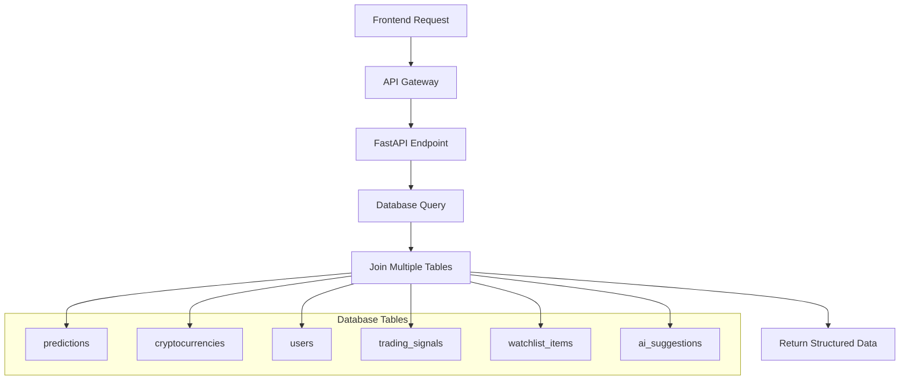

# docs\Design\17_Database_ERD_Design.md
# 🗄️ Database ERD Design - Days 15-18
## Complete Database Architecture for 4-Layer AI System

---

# 🗓️ **روز 16: Complete ERD Design**

## 🎨 **Enhanced Database Schema (بعدازظهر - 4 ساعت)**

### **📈 Complete ERD Structure**

```mermaid
erDiagram
```

---

# 🗓️ **روز 17: Table Creation Scripts**

## 💾 **SQL Implementation (صبح - 4 ساعت)**

### **🔧 Enhanced Tables Creation**

```sql
-- =============================================
-- CryptoPredict Phase 2 Database Schema
-- Enhanced 4-Layer AI Architecture
-- =============================================

-- 1. Users TABLE 
CREATE TABLE IF NOT EXISTS users (
    id SERIAL PRIMARY KEY,
    email VARCHAR(255) NOT NULL UNIQUE,
    password_hash VARCHAR(255) NOT NULL,
    first_name VARCHAR(50),
    last_name VARCHAR(50),
    role VARCHAR(20) NOT NULL DEFAULT 'public', -- 'admin' or 'public'
    is_active BOOLEAN NOT NULL DEFAULT true,
    is_verified BOOLEAN NOT NULL DEFAULT false,
    is_premium BOOLEAN NOT NULL DEFAULT false, -- For future premium features
    created_at TIMESTAMP WITH TIME ZONE DEFAULT NOW(),
    updated_at TIMESTAMP WITH TIME ZONE DEFAULT NOW(),
    last_login TIMESTAMP WITH TIME ZONE,
    login_count INTEGER DEFAULT 0,
    preferences JSONB DEFAULT '{}', -- Store user preferences as JSON
    timezone VARCHAR(50) DEFAULT 'UTC',
    language VARCHAR(10) DEFAULT 'en',
    
    -- Indexes for performance
    INDEX idx_users_email (email),
    INDEX idx_users_role (role),
    INDEX idx_users_active (is_active),
    INDEX idx_users_created_at (created_at)
);


-- 2. Crypto Currencies TABLE 
CREATE TABLE IF NOT EXISTS cryptocurrencies (
    id SERIAL PRIMARY KEY,
    symbol VARCHAR(10) NOT NULL UNIQUE,
    name VARCHAR(100) NOT NULL,
    coingecko_id VARCHAR(50) UNIQUE,
    market_cap_rank INTEGER,
    current_price NUMERIC(20, 8),
    market_cap NUMERIC(30, 2),
    total_volume NUMERIC(30, 2),
    circulating_supply NUMERIC(30, 2),
    total_supply NUMERIC(30, 2),
    max_supply NUMERIC(30, 2),
    price_change_percentage_24h NUMERIC(10, 4),
    price_change_percentage_7d NUMERIC(10, 4),
    price_change_percentage_30d NUMERIC(10, 4),
    description TEXT,
    website_url VARCHAR(255),
    blockchain_site VARCHAR(255),
    whitepaper_url VARCHAR(255),
    twitter_username VARCHAR(100),
    telegram_channel VARCHAR(100),
    subreddit_url VARCHAR(255),
    github_repos JSONB, -- Array of GitHub repository URLs
    sectors JSONB, -- Array of sectors (DeFi, Gaming, etc.)
    contract_address VARCHAR(100), -- Smart contract address
    decimals INTEGER, -- Token decimals
    is_active BOOLEAN NOT NULL DEFAULT true,
    is_supported BOOLEAN NOT NULL DEFAULT true,
    tier INTEGER DEFAULT 2, -- 1 for priority analysis, 2 for standard
    created_at TIMESTAMP WITH TIME ZONE DEFAULT NOW(),
    updated_at TIMESTAMP WITH TIME ZONE DEFAULT NOW(),
    last_data_update TIMESTAMP WITH TIME ZONE
);

-- 3. PRICE DATA TABLE 
CREATE TABLE IF NOT EXISTS price_data (
    id SERIAL PRIMARY KEY,
    crypto_id INTEGER NOT NULL REFERENCES cryptocurrencies(id) ON DELETE CASCADE,
    timestamp TIMESTAMP WITH TIME ZONE NOT NULL,
    open_price NUMERIC(20, 8) NOT NULL,
    high_price NUMERIC(20, 8) NOT NULL,
    low_price NUMERIC(20, 8) NOT NULL,
    close_price NUMERIC(20, 8) NOT NULL,
    volume NUMERIC(30, 8),
    market_cap NUMERIC(30, 2),
    technical_indicators JSONB DEFAULT '{}'; -- technical indicators
    created_at TIMESTAMP WITH TIME ZONE DEFAULT NOW(),
    
    -- Constraints for data integrity
    CONSTRAINT unique_crypto_timestamp UNIQUE(crypto_id, timestamp),
    
    -- Indexes for fast queries
    INDEX idx_price_data_crypto_id (crypto_id),
    INDEX idx_price_data_timestamp (timestamp DESC),
    INDEX idx_price_data_crypto_timestamp (crypto_id, timestamp DESC)
);

-- 4. Create Layer 1 Tables (Macro Market Analysis)
CREATE TABLE IF NOT EXISTS market_regime_analysis (
    id SERIAL PRIMARY KEY,
    regime VARCHAR(10) NOT NULL CHECK (regime IN ('bull', 'bear', 'sideways')),
    confidence_score NUMERIC(5,4) NOT NULL CHECK (confidence_score >= 0 AND confidence_score <= 1),
    indicators JSONB DEFAULT '{}',
    analysis_data JSONB DEFAULT '{}',
    analysis_time TIMESTAMP WITH TIME ZONE DEFAULT NOW(),
    created_at TIMESTAMP WITH TIME ZONE DEFAULT NOW(),
    updated_at TIMESTAMP WITH TIME ZONE DEFAULT NOW()
);

CREATE TABLE IF NOT EXISTS market_sentiment_data (
    id SERIAL PRIMARY KEY,
    fear_greed_index NUMERIC(5,2),
    social_sentiment NUMERIC(5,4),
    sentiment_sources JSONB DEFAULT '{}',
    analysis_metrics JSONB DEFAULT '{}',
    timestamp TIMESTAMP WITH TIME ZONE DEFAULT NOW(),
    created_at TIMESTAMP WITH TIME ZONE DEFAULT NOW()
);

CREATE TABLE IF NOT EXISTS dominance_data (
    id SERIAL PRIMARY KEY,
    btc_dominance NUMERIC(5,2) NOT NULL,
    eth_dominance NUMERIC(5,2) NOT NULL,
    alt_dominance NUMERIC(5,2) NOT NULL,
    trend_analysis JSONB DEFAULT '{}',
    timestamp TIMESTAMP WITH TIME ZONE DEFAULT NOW(),
    created_at TIMESTAMP WITH TIME ZONE DEFAULT NOW()
);

CREATE TABLE IF NOT EXISTS macro_indicators (
    id SERIAL PRIMARY KEY,
    indicator_name VARCHAR(50) NOT NULL,
    value NUMERIC(15,8) NOT NULL,
    timeframe VARCHAR(20) NOT NULL,
    metadata JSONB DEFAULT '{}',
    timestamp TIMESTAMP WITH TIME ZONE DEFAULT NOW(),
    created_at TIMESTAMP WITH TIME ZONE DEFAULT NOW()
);

-- 5. Create Layer 2 Tables (Sector Analysis)
CREATE TABLE IF NOT EXISTS crypto_sectors (
    id SERIAL PRIMARY KEY,
    name VARCHAR(50) NOT NULL UNIQUE,
    description TEXT,
    characteristics JSONB DEFAULT '{}',
    is_active BOOLEAN DEFAULT true,
    created_at TIMESTAMP WITH TIME ZONE DEFAULT NOW(),
    updated_at TIMESTAMP WITH TIME ZONE DEFAULT NOW()
);

CREATE TABLE IF NOT EXISTS sector_performance (
    id SERIAL PRIMARY KEY,
    sector_id INTEGER NOT NULL REFERENCES crypto_sectors(id) ON DELETE CASCADE,
    performance_24h NUMERIC(8,4),
    performance_7d NUMERIC(8,4),
    performance_30d NUMERIC(8,4),
    volume_change NUMERIC(8,4),
    market_cap_change NUMERIC(8,4),
    performance_metrics JSONB DEFAULT '{}',
    analysis_time TIMESTAMP WITH TIME ZONE DEFAULT NOW(),
    created_at TIMESTAMP WITH TIME ZONE DEFAULT NOW()
);

CREATE TABLE IF NOT EXISTS sector_rotation_analysis (
    id SERIAL PRIMARY KEY,
    from_sector_id INTEGER REFERENCES crypto_sectors(id) ON DELETE CASCADE,
    to_sector_id INTEGER REFERENCES crypto_sectors(id) ON DELETE CASCADE,
    rotation_strength NUMERIC(5,4) CHECK (rotation_strength >= 0 AND rotation_strength <= 1),
    confidence_score NUMERIC(5,4) CHECK (confidence_score >= 0 AND confidence_score <= 1),
    rotation_indicators JSONB DEFAULT '{}',
    analysis_time TIMESTAMP WITH TIME ZONE DEFAULT NOW(),
    created_at TIMESTAMP WITH TIME ZONE DEFAULT NOW()
);

CREATE TABLE IF NOT EXISTS crypto_sector_mapping (
    id SERIAL PRIMARY KEY,
    crypto_id INTEGER NOT NULL REFERENCES cryptocurrencies(id) ON DELETE CASCADE,
    sector_id INTEGER NOT NULL REFERENCES crypto_sectors(id) ON DELETE CASCADE,
    allocation_percentage NUMERIC(5,2) DEFAULT 100 CHECK (allocation_percentage > 0 AND allocation_percentage <= 100),
    is_primary_sector BOOLEAN DEFAULT true,
    created_at TIMESTAMP WITH TIME ZONE DEFAULT NOW(),
    updated_at TIMESTAMP WITH TIME ZONE DEFAULT NOW(),
    UNIQUE(crypto_id, sector_id)
);

-- 6. Create Layer 3 Tables (Asset Selection)
CREATE TABLE IF NOT EXISTS watchlists (
    id SERIAL PRIMARY KEY,
    user_id INTEGER REFERENCES users(id) ON DELETE CASCADE,
    name VARCHAR(100) NOT NULL,
    type VARCHAR(20) NOT NULL CHECK (type IN ('admin_tier1', 'admin_tier2', 'user_custom')),
    description TEXT,
    is_active BOOLEAN DEFAULT true,
    created_at TIMESTAMP WITH TIME ZONE DEFAULT NOW(),
    updated_at TIMESTAMP WITH TIME ZONE DEFAULT NOW()
);

CREATE TABLE IF NOT EXISTS watchlist_items (
    id SERIAL PRIMARY KEY,
    watchlist_id INTEGER NOT NULL REFERENCES watchlists(id) ON DELETE CASCADE,
    crypto_id INTEGER NOT NULL REFERENCES cryptocurrencies(id) ON DELETE CASCADE,
    score NUMERIC(5,2),
    status VARCHAR(20) DEFAULT 'active' CHECK (status IN ('active', 'pending_review', 'removed')),
    selection_criteria JSONB DEFAULT '{}',
    performance_metrics JSONB DEFAULT '{}',
    added_at TIMESTAMP WITH TIME ZONE DEFAULT NOW(),
    updated_at TIMESTAMP WITH TIME ZONE DEFAULT NOW(),
    UNIQUE(watchlist_id, crypto_id)
);

CREATE TABLE IF NOT EXISTS ai_suggestions (
    id SERIAL PRIMARY KEY,
    crypto_id INTEGER NOT NULL REFERENCES cryptocurrencies(id) ON DELETE CASCADE,
    suggestion_type VARCHAR(20) NOT NULL CHECK (suggestion_type IN ('add_tier1', 'add_tier2', 'remove', 'tier_change')),
    confidence_score NUMERIC(5,4) NOT NULL CHECK (confidence_score >= 0 AND confidence_score <= 1),
    reasoning JSONB DEFAULT '{}',
    analysis_data JSONB DEFAULT '{}',
    status VARCHAR(20) DEFAULT 'pending' CHECK (status IN ('pending', 'approved', 'rejected')),
    reviewed_by INTEGER REFERENCES users(id),
    suggested_at TIMESTAMP WITH TIME ZONE DEFAULT NOW(),
    reviewed_at TIMESTAMP WITH TIME ZONE,
    created_at TIMESTAMP WITH TIME ZONE DEFAULT NOW()
);

CREATE TABLE IF NOT EXISTS suggestion_reviews (
    id SERIAL PRIMARY KEY,
    suggestion_id INTEGER NOT NULL REFERENCES ai_suggestions(id) ON DELETE CASCADE,
    admin_user_id INTEGER NOT NULL REFERENCES users(id) ON DELETE CASCADE,
    action VARCHAR(10) NOT NULL CHECK (action IN ('approve', 'reject', 'modify')),
    review_notes TEXT,
    modifications JSONB DEFAULT '{}',
    reviewed_at TIMESTAMP WITH TIME ZONE DEFAULT NOW(),
    created_at TIMESTAMP WITH TIME ZONE DEFAULT NOW()
);

-- 7. Create Layer 4 Tables (Micro Timing)
CREATE TABLE IF NOT EXISTS trading_signals (
    id SERIAL PRIMARY KEY,
    crypto_id INTEGER NOT NULL REFERENCES cryptocurrencies(id) ON DELETE CASCADE,
    signal_type VARCHAR(10) NOT NULL CHECK (signal_type IN ('long', 'short')),
    entry_price NUMERIC(20,8) NOT NULL,
    target_price NUMERIC(20,8) NOT NULL,
    stop_loss NUMERIC(20,8) NOT NULL,
    confidence_score NUMERIC(5,4) NOT NULL CHECK (confidence_score >= 0 AND confidence_score <= 1),
    risk_level VARCHAR(10) NOT NULL CHECK (risk_level IN ('low', 'medium', 'high', 'extreme')),
    risk_reward_ratio NUMERIC(6,2) CHECK (risk_reward_ratio > 0),
    time_horizon_hours INTEGER DEFAULT 24,
    ai_analysis JSONB DEFAULT '{}',
    market_context JSONB DEFAULT '{}',
    status VARCHAR(20) DEFAULT 'active' CHECK (status IN ('active', 'executed', 'expired', 'cancelled')),
    generated_at TIMESTAMP WITH TIME ZONE DEFAULT NOW(),
    expires_at TIMESTAMP WITH TIME ZONE DEFAULT (NOW() + INTERVAL '7 days'),
    updated_at TIMESTAMP WITH TIME ZONE DEFAULT NOW()
);

CREATE TABLE IF NOT EXISTS signal_executions (
    id SERIAL PRIMARY KEY,
    signal_id INTEGER NOT NULL REFERENCES trading_signals(id) ON DELETE CASCADE,
    user_id INTEGER NOT NULL REFERENCES users(id) ON DELETE CASCADE,
    execution_price NUMERIC(20,8),
    position_size NUMERIC(30,8),
    portfolio_percentage NUMERIC(5,2),
    execution_type VARCHAR(20) DEFAULT 'manual' CHECK (execution_type IN ('manual', 'automatic')),
    status VARCHAR(20) DEFAULT 'pending' CHECK (status IN ('pending', 'filled', 'partially_filled', 'cancelled')),
    execution_details JSONB DEFAULT '{}',
    executed_at TIMESTAMP WITH TIME ZONE DEFAULT NOW(),
    updated_at TIMESTAMP WITH TIME ZONE DEFAULT NOW()
);

CREATE TABLE IF NOT EXISTS risk_management (
    id SERIAL PRIMARY KEY,
    user_id INTEGER NOT NULL REFERENCES users(id) ON DELETE CASCADE UNIQUE,
    max_position_size NUMERIC(30,8) DEFAULT 1000,
    max_portfolio_risk NUMERIC(5,4) DEFAULT 0.02 CHECK (max_portfolio_risk >= 0 AND max_portfolio_risk <= 1),
    risk_rules JSONB DEFAULT '{}',
    current_exposure JSONB DEFAULT '{}',
    risk_metrics JSONB DEFAULT '{}',
    last_calculated TIMESTAMP WITH TIME ZONE DEFAULT NOW(),
    updated_at TIMESTAMP WITH TIME ZONE DEFAULT NOW()
);

-- 7. predictions

CREATE TABLE predictions (
    id SERIAL PRIMARY KEY,
    crypto_id INTEGER NOT NULL REFERENCES cryptocurrencies(id) ON DELETE CASCADE,
    watchlist_id INTEGER REFERENCES watchlists(id) ON DELETE SET NULL, -- Context tracking
    user_id INTEGER REFERENCES users(id) ON DELETE SET NULL,
    model_name VARCHAR(50) NOT NULL,
    model_version VARCHAR(20) NOT NULL,
    layer_source INTEGER DEFAULT 3, -- Which AI layer generated this prediction
    prediction_type VARCHAR(20) DEFAULT 'price'
    predicted_price NUMERIC(20, 8) NOT NULL,
    predicted_value JSONB DEFAULT '{}';
    confidence_score NUMERIC(5, 4) NOT NULL,
    prediction_horizon INTEGER NOT NULL, -- Hours ahead
    target_datetime TIMESTAMP WITH TIME ZONE NOT NULL,
    features_used JSONB,
    model_parameters JSONB,
    input_price NUMERIC(20, 8) NOT NULL,
    input_features JSONB,
    context_data JSONB, -- Market context at prediction time
    
    -- Results tracking
    actual_price NUMERIC(20, 8),
    accuracy_percentage NUMERIC(5, 2),
    absolute_error NUMERIC(20, 8),
    squared_error NUMERIC(30, 8),
    is_realized BOOLEAN NOT NULL DEFAULT false,
    is_accurate BOOLEAN,
    accuracy_threshold NUMERIC(5, 2) DEFAULT 5.0,
    
    -- Metadata
    training_data_end TIMESTAMP WITH TIME ZONE,
    market_conditions VARCHAR(20),
    volatility_level VARCHAR(10),
    model_training_time NUMERIC(10, 2),
    prediction_time NUMERIC(10, 6),
    notes TEXT,
    debug_info JSONB,
    
    created_at TIMESTAMP WITH TIME ZONE DEFAULT NOW(),
    updated_at TIMESTAMP WITH TIME ZONE DEFAULT NOW(),
    evaluated_at TIMESTAMP WITH TIME ZONE
);

-- =============================================
-- SYSTEM MANAGEMENT TABLES
-- =============================================

CREATE TABLE IF NOT EXISTS ai_models (
    id SERIAL PRIMARY KEY,
    name VARCHAR(100) NOT NULL UNIQUE,
    version VARCHAR(50) NOT NULL,
    model_type VARCHAR(20) NOT NULL CHECK (model_type IN ('macro', 'sector', 'asset', 'timing')),
    status VARCHAR(20) DEFAULT 'inactive' CHECK (status IN ('active', 'training', 'inactive', 'error')),
    configuration JSONB DEFAULT '{}',
    performance_metrics JSONB DEFAULT '{}',
    last_trained TIMESTAMP WITH TIME ZONE,
    last_prediction TIMESTAMP WITH TIME ZONE,
    health_status JSONB DEFAULT '{}',
    created_at TIMESTAMP WITH TIME ZONE DEFAULT NOW(),
    updated_at TIMESTAMP WITH TIME ZONE DEFAULT NOW()
);

CREATE TABLE IF NOT EXISTS system_health (
    id SERIAL PRIMARY KEY,
    check_time TIMESTAMP WITH TIME ZONE DEFAULT NOW(),
    api_status JSONB DEFAULT '{}',
    database_status JSONB DEFAULT '{}',
    ml_models_status JSONB DEFAULT '{}',
    data_pipeline_status JSONB DEFAULT '{}',
    overall_health_score NUMERIC(5,2) CHECK (overall_health_score >= 0 AND overall_health_score <= 100),
    performance_metrics JSONB DEFAULT '{}',
    error_logs JSONB DEFAULT '[]',
    created_at TIMESTAMP WITH TIME ZONE DEFAULT NOW()
);

CREATE TABLE IF NOT EXISTS user_activities (
    id SERIAL PRIMARY KEY,
    user_id INTEGER NOT NULL REFERENCES users(id) ON DELETE CASCADE,
    activity_type VARCHAR(50) NOT NULL,
    activity_data JSONB DEFAULT '{}',
    ip_address INET,
    user_agent TEXT,
    activity_time TIMESTAMP WITH TIME ZONE DEFAULT NOW()
);

CREATE TABLE IF NOT EXISTS notifications (
    id SERIAL PRIMARY KEY,
    user_id INTEGER NOT NULL REFERENCES users(id) ON DELETE CASCADE,
    notification_type VARCHAR(20) NOT NULL CHECK (notification_type IN ('signal', 'alert', 'system', 'educational')),
    title VARCHAR(200) NOT NULL,
    message TEXT NOT NULL,
    data JSONB DEFAULT '{}',
    status VARCHAR(20) DEFAULT 'unread' CHECK (status IN ('unread', 'read', 'dismissed')),
    priority VARCHAR(20) DEFAULT 'normal' CHECK (priority IN ('low', 'normal', 'high', 'urgent')),
    scheduled_for TIMESTAMP WITH TIME ZONE DEFAULT NOW(),
    sent_at TIMESTAMP WITH TIME ZONE,
    read_at TIMESTAMP WITH TIME ZONE,
    expires_at TIMESTAMP WITH TIME ZONE DEFAULT (NOW() + INTERVAL '30 days'),
    created_at TIMESTAMP WITH TIME ZONE DEFAULT NOW()
);

-- =============================================
-- INDEXES FOR OPTIMAL PERFORMANCE
-- =============================================

-- Layer 1 indexes
CREATE INDEX IF NOT EXISTS idx_market_regime_time ON market_regime_analysis(analysis_time DESC);
CREATE INDEX IF NOT EXISTS idx_sentiment_timestamp ON market_sentiment_data(timestamp DESC);
CREATE INDEX IF NOT EXISTS idx_dominance_timestamp ON dominance_data(timestamp DESC);

-- Layer 2 indexes  
CREATE INDEX IF NOT EXISTS idx_sector_perf_sector_time ON sector_performance(sector_id, analysis_time DESC);
CREATE INDEX IF NOT EXISTS idx_sector_rotation_time ON sector_rotation_analysis(analysis_time DESC);
CREATE INDEX IF NOT EXISTS idx_crypto_sector_crypto ON crypto_sector_mapping(crypto_id);
CREATE INDEX IF NOT EXISTS idx_crypto_sector_sector ON crypto_sector_mapping(sector_id);

-- Layer 3 indexes
CREATE INDEX IF NOT EXISTS idx_watchlist_user ON watchlists(user_id, type);
CREATE INDEX IF NOT EXISTS idx_watchlist_items_watchlist ON watchlist_items(watchlist_id, status);
CREATE INDEX IF NOT EXISTS idx_watchlist_items_crypto ON watchlist_items(crypto_id);
CREATE INDEX IF NOT EXISTS idx_ai_suggestions_status ON ai_suggestions(status, suggested_at DESC);
CREATE INDEX IF NOT EXISTS idx_ai_suggestions_crypto ON ai_suggestions(crypto_id);

-- Layer 4 indexes
CREATE INDEX IF NOT EXISTS idx_signals_crypto_status ON trading_signals(crypto_id, status, generated_at DESC);
CREATE INDEX IF NOT EXISTS idx_signals_generated ON trading_signals(generated_at DESC);
CREATE INDEX IF NOT EXISTS idx_signal_executions_user ON signal_executions(user_id, executed_at DESC);
CREATE INDEX IF NOT EXISTS idx_signal_executions_signal ON signal_executions(signal_id);

-- Enhanced predictions indexes
CREATE INDEX IF NOT EXISTS idx_predictions_crypto_layer ON predictions(crypto_id, layer_source, created_at DESC);
CREATE INDEX IF NOT EXISTS idx_predictions_layer_source ON predictions(layer_source, created_at DESC);
CREATE INDEX IF NOT EXISTS idx_predictions_macro_context ON predictions USING GIN (macro_context);

CREATE INDEX IF NOT EXISTS idx_predictions_prediction_type ON predictions(prediction_type);
CREATE INDEX IF NOT EXISTS idx_predictions_layer_type ON predictions(layer_source, prediction_type);
CREATE INDEX IF NOT EXISTS idx_predictions_crypto_type ON predictions(crypto_id, prediction_type);
CREATE INDEX IF NOT EXISTS idx_predictions_type_time ON predictions(prediction_type, created_at DESC);

-- System indexes
CREATE INDEX IF NOT EXISTS idx_ai_models_type_status ON ai_models(model_type, status);
CREATE INDEX IF NOT EXISTS idx_system_health_time ON system_health(check_time DESC);
CREATE INDEX IF NOT EXISTS idx_user_activities_user_time ON user_activities(user_id, activity_time DESC);
CREATE INDEX IF NOT EXISTS idx_notifications_user_status ON notifications(user_id, status, scheduled_for DESC);

-- Enhanced existing table indexes
CREATE INDEX IF NOT EXISTS idx_price_data_timestamp_desc ON price_data(timestamp DESC);
CREATE INDEX IF NOT EXISTS idx_cryptocurrencies_tier ON cryptocurrencies(watchlist_tier, is_active);
CREATE INDEX IF NOT EXISTS idx_cryptocurrencies_sector ON cryptocurrencies(sector_id, is_active);

-- =============================================
-- TRIGGERS FOR AUTO-UPDATE TIMESTAMPS
-- =============================================

-- Function to update timestamp
CREATE OR REPLACE FUNCTION update_updated_at_column()
RETURNS TRIGGER AS $$
BEGIN
    NEW.updated_at = NOW();
    RETURN NEW;
END;
$$ language 'plpgsql';

-- Apply triggers to relevant tables
CREATE TRIGGER update_users_updated_at BEFORE UPDATE ON users 
    FOR EACH ROW EXECUTE FUNCTION update_updated_at_column();
CREATE TRIGGER update_cryptocurrencies_updated_at BEFORE UPDATE ON cryptocurrencies 
    FOR EACH ROW EXECUTE FUNCTION update_updated_at_column();
CREATE TRIGGER update_crypto_sectors_updated_at BEFORE UPDATE ON crypto_sectors 
    FOR EACH ROW EXECUTE FUNCTION update_updated_at_column();
CREATE TRIGGER update_market_regime_updated_at BEFORE UPDATE ON market_regime_analysis 
    FOR EACH ROW EXECUTE FUNCTION update_updated_at_column();
CREATE TRIGGER update_watchlists_updated_at BEFORE UPDATE ON watchlists 
    FOR EACH ROW EXECUTE FUNCTION update_updated_at_column();
CREATE TRIGGER update_watchlist_items_updated_at BEFORE UPDATE ON watchlist_items 
    FOR EACH ROW EXECUTE FUNCTION update_updated_at_column();
CREATE TRIGGER update_crypto_sector_mapping_updated_at BEFORE UPDATE ON crypto_sector_mapping 
    FOR EACH ROW EXECUTE FUNCTION update_updated_at_column();
CREATE TRIGGER update_trading_signals_updated_at BEFORE UPDATE ON trading_signals 
    FOR EACH ROW EXECUTE FUNCTION update_updated_at_column();
CREATE TRIGGER update_signal_executions_updated_at BEFORE UPDATE ON signal_executions 
    FOR EACH ROW EXECUTE FUNCTION update_updated_at_column();
CREATE TRIGGER update_risk_management_updated_at BEFORE UPDATE ON risk_management 
    FOR EACH ROW EXECUTE FUNCTION update_updated_at_column();
CREATE TRIGGER update_predictions_updated_at BEFORE UPDATE ON predictions 
    FOR EACH ROW EXECUTE FUNCTION update_updated_at_column();

-- =============================================
-- DATA SEEDING
-- =============================================

-- Insert default crypto sectors
INSERT INTO crypto_sectors (name, description, characteristics) VALUES
('Bitcoin', 'Store of value and digital gold', '{"type": "base_layer", "maturity": "high"}'),
('Ethereum & Smart Contracts', 'Smart contract platforms', '{"type": "platform", "maturity": "high"}'),
('DeFi', 'Decentralized Finance protocols', '{"type": "application", "maturity": "medium"}'),
('Layer 1 Blockchains', 'Alternative Layer 1 blockchains', '{"type": "platform", "maturity": "medium"}'),
('Layer 2 Solutions', 'Scaling solutions', '{"type": "infrastructure", "maturity": "medium"}'),
('NFTs & Gaming', 'Non-fungible tokens and gaming', '{"type": "application", "maturity": "medium"}'),
('Infrastructure', 'Blockchain infrastructure', '{"type": "infrastructure", "maturity": "medium"}'),
('Meme Coins', 'Community-driven tokens', '{"type": "speculative", "maturity": "low"}'),
('Privacy Coins', 'Privacy-focused cryptocurrencies', '{"type": "utility", "maturity": "medium"}'),
('Stablecoins', 'Price-stable cryptocurrencies', '{"type": "utility", "maturity": "high"}')
ON CONFLICT (name) DO NOTHING;

-- Create default admin watchlists
INSERT INTO watchlists (name, type, description) VALUES
('Admin Tier 1', 'admin_tier1', 'High-confidence cryptocurrency selections'),
('Admin Tier 2', 'admin_tier2', 'Medium-confidence cryptocurrency selections')
ON CONFLICT DO NOTHING;

-- =============================================
-- VIEWS FOR COMMON QUERIES
-- =============================================

-- View for active predictions with crypto details
CREATE OR REPLACE VIEW v_active_predictions AS
SELECT 
    p.*,
    c.symbol,
    c.name as crypto_name,
    c.current_price,
    u.email as user_email
FROM predictions p
JOIN cryptocurrencies c ON p.crypto_id = c.id
LEFT JOIN users u ON p.user_id = u.id
WHERE p.is_realized = false
ORDER BY p.created_at DESC;

-- View for watchlist summary
CREATE OR REPLACE VIEW v_watchlist_summary AS
SELECT 
    w.id,
    w.name,
    w.type,
    COUNT(wi.id) as items_count,
    AVG(wi.score) as avg_score,
    w.created_at,
    w.updated_at
FROM watchlists w
LEFT JOIN watchlist_items wi ON w.id = wi.watchlist_id AND wi.status = 'active'
WHERE w.is_active = true
GROUP BY w.id, w.name, w.type, w.created_at, w.updated_at;

-- View for trading signals with crypto details
CREATE OR REPLACE VIEW v_active_signals AS
SELECT 
    ts.*,
    c.symbol,
    c.name as crypto_name,
    c.current_price,
    (ts.target_price - ts.entry_price) / ts.entry_price * 100 as potential_return_pct,
    (ts.entry_price - ts.stop_loss) / ts.entry_price * 100 as max_loss_pct
FROM trading_signals ts
JOIN cryptocurrencies c ON ts.crypto_id = c.id
WHERE ts.status = 'active' AND ts.expires_at > NOW()
ORDER BY ts.confidence_score DESC, ts.generated_at DESC;

COMMENT ON DATABASE cryptopredict IS 'CryptoPredict Phase 2 - Enhanced 4-Layer AI Trading System Database';
```

---

# 🗓️ **روز 18: Database Integration & API Planning**

## 🔗 **API Endpoints Planning (صبح - 4 ساعت)**

### **📡 Complete API Structure**

```python
# =============================================
# API ENDPOINTS MAPPING TO DATABASE
# FastAPI Endpoints for 4-Layer System
# =============================================

# Layer 1: Macro Analysis Endpoints
GET /api/v1/macro/regime                    # market_regime_analysis
GET /api/v1/macro/sentiment                 # market_sentiment_data  
GET /api/v1/macro/dominance                 # dominance_data
GET /api/v1/macro/indicators                # macro_indicators

# Layer 2: Sector Analysis Endpoints  
GET /api/v1/sectors                         # crypto_sectors
GET /api/v1/sectors/{id}/performance        # sector_performance
GET /api/v1/sectors/rotation                # sector_rotation_analysis
GET /api/v1/sectors/{id}/cryptos           # crypto_sector_mapping

# Layer 3: Asset Selection Endpoints
GET /api/v1/watchlists                      # watchlists
POST /api/v1/watchlists                     # watchlists
PUT /api/v1/watchlists/{id}                 # watchlists
DELETE /api/v1/watchlists/{id}              # watchlists

GET /api/v1/watchlists/{id}/items           # watchlist_items
POST /api/v1/watchlists/{id}/items          # watchlist_items
PUT /api/v1/watchlist-items/{id}            # watchlist_items
DELETE /api/v1/watchlist-items/{id}         # watchlist_items

GET /api/v1/suggestions                     # ai_suggestions
POST /api/v1/suggestions/{id}/review        # suggestion_reviews

# Layer 4: Timing Endpoints
GET /api/v1/signals                         # trading_signals
GET /api/v1/signals/{id}                    # trading_signals
POST /api/v1/signals/{id}/execute           # signal_executions
GET /api/v1/user/{id}/risk-profile          # risk_management

# Predictions Endpoints (Unified Table)
GET /api/v1/predictions                     # predictions
POST /api/v1/predictions                    # predictions  
PUT /api/v1/predictions/{id}                # predictions
GET /api/v1/predictions/{id}/accuracy       # predictions (evaluation)

# Dashboard Endpoints (Multiple Table Joins)
GET /api/v1/dashboard/admin                 # Multiple tables
GET /api/v1/dashboard/professional          # Multiple tables
GET /api/v1/dashboard/casual                # Multiple tables

# System Management Endpoints
GET /api/v1/system/health                   # system_health
GET /api/v1/system/models                   # ai_models
POST /api/v1/system/models/{id}/retrain     # ai_models
GET /api/v1/system/activities              # user_activities

# User Management
GET /api/v1/users/profile                   # users
PUT /api/v1/users/profile                   # users
GET /api/v1/users/notifications             # notifications
PUT /api/v1/notifications/{id}/read         # notifications
```

### **🔄 Database Integration Points**



---
