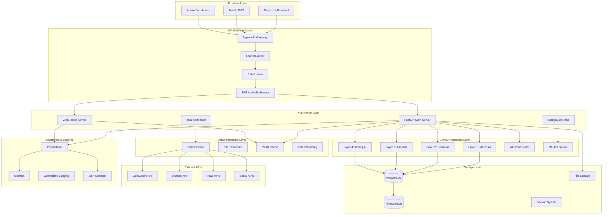
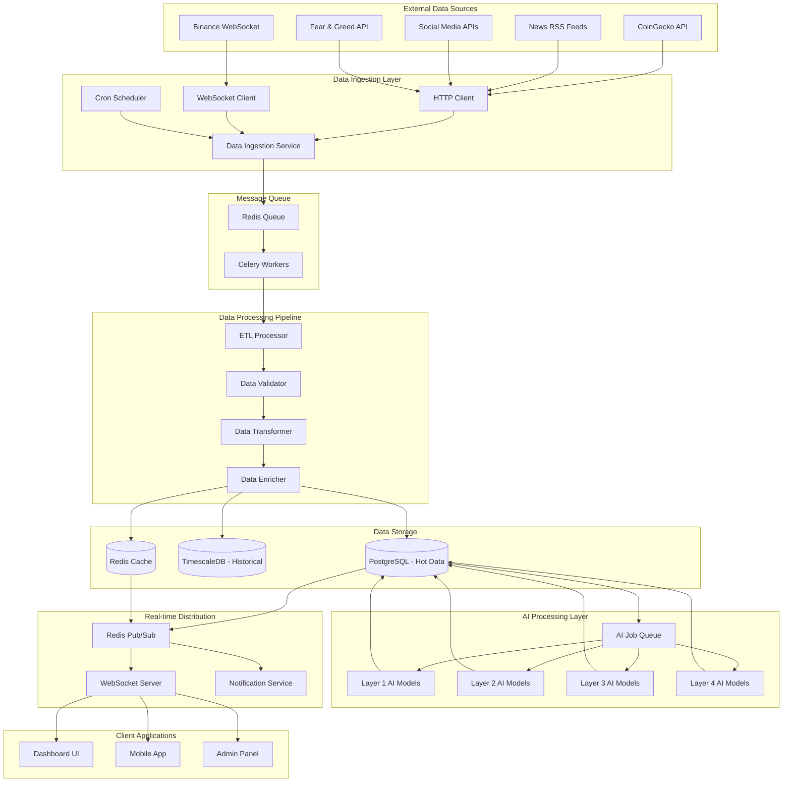

# docs\Design\18_System_Architecture_Design.md
# 🏗️ System Architecture Design - Days 19-21
## Complete Backend Structure for 4-Layer AI System

---

# 🗓️ **روز 19: Backend Structure for UI Support**

## 🎯 **Architecture Overview (صبح - 4 ساعت)**

### **🏗️ High-Level System Architecture**



### **🔧 Core Architecture Components**

#### **🌐 Frontend Layer (Next.js 14)**
```typescript
// Frontend Architecture Structure
src/
├── app/                    # Next.js 14 App Router
│   ├── (dashboard)/       # Dashboard pages
│   ├── (admin)/          # Admin pages  
│   ├── api/              # API routes (BFF pattern)
│   └── globals.css       # Global styles
├── components/           # Reusable UI components
│   ├── ui/              # Base UI components
│   ├── charts/          # Chart components
│   ├── signals/         # Signal-related components
│   └── admin/           # Admin-specific components
├── hooks/               # Custom React hooks
├── lib/                 # Utility functions
├── services/           # API service layer
└── types/              # TypeScript definitions

// Key Frontend Features:
- Server-Side Rendering (SSR) for SEO
- Client-Side Rendering (CSR) for interactivity  
- Real-time WebSocket connections
- Progressive Web App (PWA) capabilities
- Offline-first architecture with service workers
- Responsive design with mobile optimization
```

#### **⚡ API Gateway Layer (Nginx + FastAPI)**
```nginx
# Nginx Configuration for API Gateway
upstream fastapi_backend {
    server api-server-1:8000;
    server api-server-2:8000; 
    server api-server-3:8000;
}

upstream websocket_backend {
    server ws-server-1:8001;
    server ws-server-2:8001;
}

server {
    listen 80;
    server_name api.cryptopredict.com;
    
    # Rate limiting
    limit_req_zone $binary_remote_addr zone=api:10m rate=100r/s;
    limit_req_zone $binary_remote_addr zone=ws:10m rate=10r/s;
    
    # API Routes
    location /api/ {
        limit_req zone=api burst=20 nodelay;
        proxy_pass http://fastapi_backend;
        proxy_set_header Host $host;
        proxy_set_header X-Real-IP $remote_addr;
        proxy_set_header X-Forwarded-For $proxy_add_x_forwarded_for;
    }
    
    # WebSocket Routes  
    location /ws/ {
        limit_req zone=ws burst=5 nodelay;
        proxy_pass http://websocket_backend;
        proxy_http_version 1.1;
        proxy_set_header Upgrade $http_upgrade;
        proxy_set_header Connection "upgrade";
    }
    
    # Health Check
    location /health {
        access_log off;
        return 200 "healthy\n";
    }
}
```

#### **🐍 FastAPI Application Layer**
```python
# FastAPI Application Structure
app/
├── core/                 # Core configuration
│   ├── config.py        # Settings management
│   ├── database.py      # Database connections
│   ├── security.py      # JWT & security
│   └── dependencies.py  # DI container
├── models/              # SQLAlchemy models
│   ├── layer1.py       # Macro models
│   ├── layer2.py       # Sector models
│   ├── layer3.py       # Asset models
│   └── layer4.py       # Timing models
├── schemas/             # Pydantic schemas
├── services/            # Business logic layer
│   ├── layer1_service.py
│   ├── layer2_service.py  
│   ├── layer3_service.py
│   ├── layer4_service.py
│   └── ai_orchestrator.py
├── api/                 # API routes
│   ├── v1/             # API version 1
│   │   ├── layer1.py   # Layer 1 endpoints
│   │   ├── layer2.py   # Layer 2 endpoints
│   │   ├── layer3.py   # Layer 3 endpoints
│   │   ├── layer4.py   # Layer 4 endpoints
│   │   └── admin.py    # Admin endpoints
│   └── websockets.py   # WebSocket handlers
├── ml/                  # ML/AI modules
│   ├── models/         # AI model implementations
│   ├── training/       # Model training scripts
│   └── inference/      # Model inference
├── workers/             # Background job workers
└── utils/               # Utility functions

# Key Backend Features:
- Async/await for high concurrency
- Dependency injection for clean architecture  
- Background job processing with Celery
- WebSocket support for real-time updates
- Comprehensive error handling and logging
- API versioning and backward compatibility
- Automatic OpenAPI documentation
- Built-in data validation with Pydantic
```

## 🔄 **Real-time Data Flow Architecture (بعدازظهر - 4 ساعت)**

### **📊 Data Flow Diagram**



### **🔄 Real-time Data Processing Implementation**

```python
# =============================================
# Real-time Data Processing Architecture
# =============================================

from typing import Dict, List, Any
import asyncio
import websockets
import aioredis
from celery import Celery
from sqlalchemy.ext.asyncio import AsyncSession
import json

# =============================================
# 1. DATA INGESTION SERVICE
# =============================================

class DataIngestionService:
    """
    Real-time data ingestion from multiple sources
    Handles rate limiting, error recovery, data validation
    """
    
    def __init__(self):
        self.redis = aioredis.from_url("redis://localhost:6379")
        self.celery = Celery('data_processor')
        self.active_connections: Dict[str, websockets.WebSocketServerProtocol] = {}
        
    async def start_price_stream(self):
        """Start real-time price data stream from Binance"""
        uri = "wss://stream.binance.com:9443/ws/btcusdt@ticker"
        
        async with websockets.connect(uri) as websocket:
            async for message in websocket:
                data = json.loads(message)
                await self.process_price_update(data)
                
    async def process_price_update(self, data: Dict[str, Any]):
        """Process incoming price update"""
        try:
            # Validate data format
            validated_data = self.validate_price_data(data)
            
            # Enqueue for processing
            await self.redis.lpush("price_updates", json.dumps(validated_data))
            
            # Trigger AI analysis if significant change
            if self.is_significant_change(validated_data):
                self.celery.send_task('ai.analyze_price_change', [validated_data])
                
        except Exception as e:
            logger.error(f"Error processing price update: {e}")
            
    async def fetch_market_data(self):
        """Periodically fetch market data from various sources"""
        tasks = [
            self.fetch_coingecko_data(),
            self.fetch_fear_greed_index(),
            self.fetch_dominance_data(),
            self.fetch_news_sentiment()
        ]
        await asyncio.gather(*tasks)

# =============================================
# 2. BACKGROUND JOB PROCESSING  
# =============================================

# Celery Configuration
celery_app = Celery(
    'cryptopredict_workers',
    broker='redis://localhost:6379/0',
    backend='redis://localhost:6379/0'
)

@celery_app.task(bind=True, max_retries=3)
def process_layer1_analysis(self, market_data: Dict[str, Any]):
    """
    Background task for Layer 1 macro analysis
    Runs every 5 minutes or on significant market events
    """
    try:
        from app.ml.models.layer1 import MacroRegimeDetector
        
        detector = MacroRegimeDetector()
        analysis = detector.analyze(market_data)
        
        # Store results in database
        store_market_regime_analysis(analysis)
        
        # Trigger real-time updates
        publish_layer1_update(analysis)
        
        return {"status": "success", "analysis_id": analysis.id}
        
    except Exception as e:
        logger.error(f"Layer 1 analysis failed: {e}")
        raise self.retry(countdown=60, exc=e)

@celery_app.task(bind=True)
def process_layer2_sector_analysis(self, sector_data: Dict[str, Any]):
    """Background task for Layer 2 sector rotation analysis"""
    try:
        from app.ml.models.layer2 import SectorRotationPredictor
        
        predictor = SectorRotationPredictor()
        rotation_analysis = predictor.analyze(sector_data)
        
        store_sector_analysis(rotation_analysis)
        publish_layer2_update(rotation_analysis)
        
        return {"status": "success"}
        
    except Exception as e:
        logger.error(f"Layer 2 analysis failed: {e}")
        raise self.retry(countdown=120, exc=e)

@celery_app.task(bind=True)
def process_layer3_asset_selection(self, watchlist_data: Dict[str, Any]):
    """Background task for Layer 3 asset analysis and suggestions"""
    try:
        from app.ml.models.layer3 import SmartAssetSelector
        
        selector = SmartAssetSelector()
        suggestions = selector.generate_suggestions(watchlist_data)
        
        # Store AI suggestions for admin review
        for suggestion in suggestions:
            store_ai_suggestion(suggestion)
            
        # Notify admins of high-confidence suggestions
        high_confidence = [s for s in suggestions if s.confidence > 0.85]
        if high_confidence:
            notify_admins_new_suggestions(high_confidence)
            
        return {"status": "success", "suggestions_count": len(suggestions)}
        
    except Exception as e:
        logger.error(f"Layer 3 analysis failed: {e}")
        raise self.retry(countdown=180, exc=e)

@celery_app.task(bind=True)  
def process_layer4_timing_signals(self, timing_data: Dict[str, Any]):
    """Background task for Layer 4 micro timing signal generation"""
    try:
        from app.ml.models.layer4 import PrecisionTimingEngine
        
        engine = PrecisionTimingEngine()
        signals = engine.generate_signals(timing_data)
        
        # Store trading signals
        active_signals = []
        for signal in signals:
            if signal.confidence_score >= 0.7:  # Only high-confidence signals
                stored_signal = store_trading_signal(signal)
                active_signals.append(stored_signal)
                
        # Real-time notification to users
        for signal in active_signals:
            notify_users_new_signal(signal)
            
        return {"status": "success", "signals_count": len(active_signals)}
        
    except Exception as e:
        logger.error(f"Layer 4 analysis failed: {e}")
        raise self.retry(countdown=240, exc=e)

# =============================================
# 3. WEBSOCKET REAL-TIME COMMUNICATION
# =============================================

class WebSocketManager:
    """
    Manages real-time WebSocket connections for different user types
    Handles connection lifecycle, authentication, and message broadcasting
    """
    
    def __init__(self):
        self.connections: Dict[str, Dict[str, websockets.WebSocketServerProtocol]] = {
            "dashboard": {},    # Regular users
            "admin": {},       # Admin users  
            "signals": {}      # Signal-specific connections
        }
        self.redis = aioredis.from_url("redis://localhost:6379")
        
    async def register_connection(self, websocket: websockets.WebSocketServerProtocol, 
                                user_id: str, connection_type: str):
        """Register new WebSocket connection"""
        self.connections[connection_type][user_id] = websocket
        
        # Send initial data based on connection type
        if connection_type == "dashboard":
            await self.send_dashboard_init_data(websocket, user_id)
        elif connection_type == "admin":
            await self.send_admin_init_data(websocket, user_id)
            
    async def unregister_connection(self, user_id: str, connection_type: str):
        """Remove WebSocket connection"""
        if user_id in self.connections[connection_type]:
            del self.connections[connection_type][user_id]
            
    async def broadcast_to_type(self, message: Dict[str, Any], connection_type: str):
        """Broadcast message to all connections of specific type"""
        if connection_type in self.connections:
            disconnected = []
            for user_id, websocket in self.connections[connection_type].items():
                try:
                    await websocket.send(json.dumps(message))
                except websockets.exceptions.ConnectionClosed:
                    disconnected.append(user_id)
                    
            # Clean up disconnected clients
            for user_id in disconnected:
                await self.unregister_connection(user_id, connection_type)
                
    async def send_to_user(self, user_id: str, message: Dict[str, Any], 
                          connection_type: str = "dashboard"):
        """Send message to specific user"""
        if user_id in self.connections[connection_type]:
            websocket = self.connections[connection_type][user_id]
            try:
                await websocket.send(json.dumps(message))
            except websockets.exceptions.ConnectionClosed:
                await self.unregister_connection(user_id, connection_type)

# WebSocket Event Handlers
ws_manager = WebSocketManager()

async def handle_dashboard_connection(websocket, path):
    """Handle dashboard WebSocket connections"""
    try:
        # Authenticate user from JWT token
        user_data = await authenticate_websocket(websocket)
        user_id = user_data["user_id"]
        
        await ws_manager.register_connection(websocket, user_id, "dashboard")
        
        # Keep connection alive and handle incoming messages
        async for message in websocket:
            data = json.loads(message)
            await handle_dashboard_message(data, user_id)
            
    except websockets.exceptions.ConnectionClosed:
        pass
    finally:
        if 'user_id' in locals():
            await ws_manager.unregister_connection(user_id, "dashboard")

async def handle_admin_connection(websocket, path):
    """Handle admin WebSocket connections"""
    try:
        user_data = await authenticate_websocket(websocket)
        
        # Verify admin privileges  
        if not user_data.get("is_admin"):
            await websocket.close(code=4003, reason="Insufficient privileges")
            return
            
        user_id = user_data["user_id"]
        await ws_manager.register_connection(websocket, user_id, "admin")
        
        async for message in websocket:
            data = json.loads(message)
            await handle_admin_message(data, user_id)
            
    except websockets.exceptions.ConnectionClosed:
        pass
    finally:
        if 'user_id' in locals():
            await ws_manager.unregister_connection(user_id, "admin")

# =============================================
# 4. REDIS PUB/SUB FOR REAL-TIME EVENTS
# =============================================

class RealTimeEventPublisher:
    """
    Publishes real-time events to Redis Pub/Sub
    Different channels for different event types
    """
    
    def __init__(self):
        self.redis = aioredis.from_url("redis://localhost:6379")
        
    async def publish_layer1_update(self, analysis: Dict[str, Any]):
        """Publish Layer 1 macro analysis update"""
        event = {
            "type": "layer1_update",
            "data": {
                "market_regime": analysis["regime"],
                "confidence": analysis["confidence"],
                "risk_level": analysis["risk_level"],
                "timestamp": analysis["timestamp"]
            }
        }
        await self.redis.publish("layer1_updates", json.dumps(event))
        
    async def publish_new_signal(self, signal: Dict[str, Any]):
        """Publish new trading signal"""
        event = {
            "type": "new_signal",
            "data": {
                "signal_id": signal["id"],
                "crypto_symbol": signal["symbol"],
                "signal_type": signal["type"],
                "confidence": signal["confidence"],
                "entry_price": signal["entry_price"],
                "target_price": signal["target_price"]
            }
        }
        await self.redis.publish("trading_signals", json.dumps(event))
        
    async def publish_admin_notification(self, notification: Dict[str, Any]):
        """Publish admin notification (new suggestions, etc.)"""
        event = {
            "type": "admin_notification",
            "data": notification
        }
        await self.redis.publish("admin_events", json.dumps(event))

# Redis Pub/Sub Subscriber
class RealTimeEventSubscriber:
    """
    Subscribes to Redis events and broadcasts to WebSocket clients
    """
    
    def __init__(self, ws_manager: WebSocketManager):
        self.redis = aioredis.from_url("redis://localhost:6379")
        self.ws_manager = ws_manager
        
    async def start_subscriptions(self):
        """Start subscribing to all event channels"""
        pubsub = self.redis.pubsub()
        
        await pubsub.subscribe(
            "layer1_updates",
            "layer2_updates", 
            "layer3_updates",
            "layer4_updates",
            "trading_signals",
            "admin_events",
            "system_health"
        )
        
        async for message in pubsub.listen():
            if message["type"] == "message":
                channel = message["channel"].decode()
                data = json.loads(message["data"])
                
                await self.route_event(channel, data)
                
    async def route_event(self, channel: str, event_data: Dict[str, Any]):
        """Route events to appropriate WebSocket connections"""
        
        if channel in ["layer1_updates", "layer2_updates", "layer3_updates", "layer4_updates"]:
            # Broadcast to all dashboard connections
            await self.ws_manager.broadcast_to_type(event_data, "dashboard")
            
        elif channel == "trading_signals":
            # Send to users interested in this crypto
            crypto_symbol = event_data["data"]["crypto_symbol"]
            interested_users = await self.get_users_watching_crypto(crypto_symbol)
            
            for user_id in interested_users:
                await self.ws_manager.send_to_user(user_id, event_data)
                
        elif channel == "admin_events":
            # Broadcast to admin connections only
            await self.ws_manager.broadcast_to_type(event_data, "admin")
```

---

# 🗓️ **روز 20: AI Integration Architecture**

## 🧠 **AI Models Integration & Orchestration (صبح - 4 ساعت)**

### **🤖 AI Architecture & Model Management**

```python
# =============================================
# AI ORCHESTRATOR - CENTRAL AI COORDINATION
# =============================================

from typing import Dict, List, Any, Optional
from enum import Enum
from dataclasses import dataclass
from datetime import datetime, timedelta
import asyncio
import logging

class LayerType(Enum):
    LAYER1_MACRO = "layer1_macro"
    LAYER2_SECTOR = "layer2_sector"  
    LAYER3_ASSET = "layer3_asset"
    LAYER4_TIMING = "layer4_timing"

class ModelStatus(Enum):
    ACTIVE = "active"
    TRAINING = "training"
    INACTIVE = "inactive"
    ERROR = "error"

@dataclass
class AnalysisContext:
    """Context passed between AI layers for cascade analysis"""
    
    market_regime: str
    confidence_score: float
    risk_level: str
    sector_allocation: Dict[str, float]
    active_assets: List[Dict[str, Any]]
    timestamp: datetime
    
class LayeredAIOrchestrator:
    """
    🎯 Central AI Orchestrator
    Coordinates all 4 AI layers in cascade fashion
    Ensures context flows from macro to micro analysis
    """
    
    def __init__(self):
        self.models = {
            LayerType.LAYER1_MACRO: MacroRegimeDetector(),
            LayerType.LAYER2_SECTOR: SectorRotationPredictor(),
            LayerType.LAYER3_ASSET: SmartAssetSelector(),
            LayerType.LAYER4_TIMING: PrecisionTimingEngine()
        }
        
        self.model_status = {layer: ModelStatus.ACTIVE for layer in LayerType}
        self.last_analysis = {}
        self.context_cache = {}
        
    async def run_cascade_analysis(self) -> Dict[str, Any]:
        """
        🔄 Run complete 4-layer cascade analysis
        Each layer uses context from previous layers
        """
        
        logger.info("Starting cascade analysis...")
        
        try:
            # Layer 1: Macro Market Analysis
            layer1_result = await self.run_layer1_analysis()
            
            # Create analysis context for downstream layers
            context = AnalysisContext(
                market_regime=layer1_result["regime"],
                confidence_score=layer1_result["confidence"], 
                risk_level=layer1_result["risk_level"],
                sector_allocation={},
                active_assets=[],
                timestamp=datetime.utcnow()
            )
            
            # Layer 2: Sector Analysis (using Layer 1 context)
            layer2_result = await self.run_layer2_analysis(context)
            context.sector_allocation = layer2_result["recommended_allocation"]
            
            # Layer 3: Asset Selection (using Layer 1 & 2 context)
            layer3_result = await self.run_layer3_analysis(context)
            context.active_assets = layer3_result["selected_assets"]
            
            # Layer 4: Timing Signals (using all previous context)
            layer4_result = await self.run_layer4_analysis(context)
            
            # Combine all results
            cascade_result = {
                "layer1": layer1_result,
                "layer2": layer2_result,
                "layer3": layer3_result, 
                "layer4": layer4_result,
                "context": context,
                "analysis_time": datetime.utcnow(),
                "cascade_confidence": self.calculate_cascade_confidence([
                    layer1_result, layer2_result, layer3_result, layer4_result
                ])
            }
            
            # Store results and trigger notifications
            await self.store_cascade_results(cascade_result)
            await self.trigger_real_time_updates(cascade_result)
            
            return cascade_result
            
        except Exception as e:
            logger.error(f"Cascade analysis failed: {e}")
            raise
            
    async def run_layer1_analysis(self) -> Dict[str, Any]:
        """🌍 Layer 1: Macro Market Regime Analysis"""
        
        if self.model_status[LayerType.LAYER1_MACRO] != ModelStatus.ACTIVE:
            raise Exception("Layer 1 model not available")
            
        # Gather macro market data
        market_data = await self.gather_macro_data()
        
        # Run AI analysis
        detector = self.models[LayerType.LAYER1_MACRO]
        analysis = detector.analyze_market_regime(market_data)
        
        # Store in database
        await self.store_market_regime_analysis(analysis)
        
        return {
            "regime": analysis.regime,
            "confidence": analysis.confidence,
            "risk_level": analysis.risk_level,
            "trend_strength": analysis.trend_strength,
            "recommended_exposure": analysis.recommended_exposure,
            "sentiment_breakdown": analysis.sentiment_breakdown,
            "drivers": analysis.regime_drivers
        }
        
    async def run_layer2_analysis(self, context: AnalysisContext) -> Dict[str, Any]:
        """📊 Layer 2: Sector Rotation Analysis"""
        
        if self.model_status[LayerType.LAYER2_SECTOR] != ModelStatus.ACTIVE:
            raise Exception("Layer 2 model not available")
            
        # Gather sector performance data
        sector_data = await self.gather_sector_data()
        
        # Add macro context to sector analysis
        sector_data["macro_context"] = {
            "regime": context.market_regime,
            "risk_level": context.risk_level
        }
        
        # Run sector rotation prediction
        predictor = self.models[LayerType.LAYER2_SECTOR]
        rotation_analysis = predictor.predict_rotation(sector_data)
        
        # Store results
        await self.store_sector_analysis(rotation_analysis)
        
        return {
            "leading_sectors": rotation_analysis.leading_sectors,
            "declining_sectors": rotation_analysis.declining_sectors,
            "rotation_probability": rotation_analysis.rotation_probability,
            "recommended_allocation": rotation_analysis.recommended_allocation,
            "flow_directions": rotation_analysis.flow_directions
        }
        
    async def run_layer3_analysis(self, context: AnalysisContext) -> Dict[str, Any]:
        """💰 Layer 3: Enhanced Asset Selection"""
        
        if self.model_status[LayerType.LAYER3_ASSET] != ModelStatus.ACTIVE:
            raise Exception("Layer 3 model not available")
            
        # Get current watchlist and available assets
        watchlist_data = await self.get_watchlist_data()
        available_assets = await self.get_available_assets()
        
        # Add context from previous layers
        analysis_data = {
            "watchlist": watchlist_data,
            "available_assets": available_assets,
            "macro_context": {
                "regime": context.market_regime,
                "risk_level": context.risk_level
            },
            "sector_context": {
                "allocation": context.sector_allocation
            }
        }
        
        # Run asset selection AI
        selector = self.models[LayerType.LAYER3_ASSET]
        
        # Analyze current tier 1 assets
        tier1_analysis = selector.analyze_tier1_assets(analysis_data)
        
        # Generate suggestions for new additions
        suggestions = selector.generate_suggestions(analysis_data)
        
        # Store suggestions for admin review
        for suggestion in suggestions:
            await self.store_ai_suggestion(suggestion)
            
        return {
            "tier1_analysis": tier1_analysis,
            "tier2_opportunities": selector.scan_tier2_opportunities(analysis_data),
            "suggestions": suggestions,
            "selected_assets": tier1_analysis["active_assets"]
        }
        
    async def run_layer4_analysis(self, context: AnalysisContext) -> Dict[str, Any]:
        """⚡ Layer 4: Micro Timing Signal Generation"""
        
        if self.model_status[LayerType.LAYER4_TIMING] != ModelStatus.ACTIVE:
            raise Exception("Layer 4 model not available")
            
        # Only analyze assets selected by Layer 3
        timing_data = []
        for asset in context.active_assets:
            asset_data = await self.get_asset_timing_data(asset["crypto_id"])
            timing_data.append({
                **asset_data,
                "macro_context": {
                    "regime": context.market_regime,
                    "risk_level": context.risk_level
                },
                "asset_context": asset
            })
            
        # Generate timing signals
        engine = self.models[LayerType.LAYER4_TIMING]
        signals = []
        
        for asset_data in timing_data:
            asset_signals = engine.generate_signals(asset_data)
            signals.extend(asset_signals)
            
        # Filter and store high-confidence signals
        active_signals = []
        for signal in signals:
            if signal.confidence_score >= 0.7:
                stored_signal = await self.store_trading_signal(signal)
                active_signals.append(stored_signal)
                
        # Notify users of new signals
        await self.notify_users_new_signals(active_signals)
        
        return {
            "generated_signals": len(signals),
            "active_signals": len(active_signals),
            "signals": active_signals
        }

# =============================================
# INDIVIDUAL AI MODEL IMPLEMENTATIONS
# =============================================

class MacroRegimeDetector:
    """
    🌍 Layer 1: Macro Market Regime Detection
    Analyzes overall market conditions and sentiment
    """
    
    def __init__(self):
        self.model = self.load_trained_model("macro_regime_v3")
        self.feature_extractor = MacroFeatureExtractor()
        
    def analyze_market_regime(self, market_data: Dict[str, Any]) -> 'MarketRegimeAnalysis':
        """Analyze current market regime"""
        
        # Extract features for ML model
        features = self.feature_extractor.extract(market_data)
        
        # Run ML prediction
        regime_probs = self.model.predict_proba([features])[0]
        regime_classes = ['bull', 'bear', 'neutral', 'volatile']
        
        # Get highest probability regime
        predicted_regime = regime_classes[np.argmax(regime_probs)]
        confidence = float(np.max(regime_probs))
        
        # Calculate additional metrics
        risk_level = self.calculate_risk_level(features, predicted_regime)
        trend_strength = self.calculate_trend_strength(features)
        exposure = self.calculate_recommended_exposure(predicted_regime, confidence)
        
        # Analyze sentiment components
        sentiment_breakdown = {
            "fear_greed": features["fear_greed_index"] / 100,
            "social": features["social_sentiment"],
            "news": features["news_sentiment"],
            "funding": features["funding_sentiment"]
        }
        
        # Identify key drivers
        regime_drivers = self.identify_regime_drivers(features, predicted_regime)
        
        return MarketRegimeAnalysis(
            regime=predicted_regime,
            confidence=confidence,
            risk_level=risk_level,
            trend_strength=trend_strength,
            recommended_exposure=exposure,
            sentiment_breakdown=sentiment_breakdown,
            regime_drivers=regime_drivers,
            analysis_time=datetime.utcnow()
        )

class SectorRotationPredictor:
    """
    📊 Layer 2: Sector Rotation Prediction
    Identifies sector trends and rotation patterns
    """
    
    def __init__(self):
        self.rotation_model = self.load_trained_model("sector_rotation_v2")
        self.momentum_model = self.load_trained_model("sector_momentum_v2")
        
    def predict_rotation(self, sector_data: Dict[str, Any]) -> 'SectorRotationAnalysis':
        """Predict sector rotation patterns"""
        
        # Calculate sector momentum scores
        momentum_scores = {}
        for sector_id, perf_data in sector_data["sector_performance"].items():
            momentum = self.calculate_momentum(perf_data)
            momentum_scores[sector_id] = momentum
            
        # Predict rotation probability
        rotation_features = self.extract_rotation_features(sector_data)
        rotation_prob = self.rotation_model.predict_proba([rotation_features])[0][1]
        
        # Identify leading and declining sectors
        sorted_sectors = sorted(momentum_scores.items(), key=lambda x: x[1], reverse=True)
        leading_sectors = [s[0] for s in sorted_sectors[:3]]
        declining_sectors = [s[0] for s in sorted_sectors[-2:]]
        
        # Calculate optimal allocation based on macro context
        macro_regime = sector_data.get("macro_context", {}).get("regime", "neutral")
        allocation = self.calculate_allocation(momentum_scores, macro_regime)
        
        return SectorRotationAnalysis(
            leading_sectors=leading_sectors,
            declining_sectors=declining_sectors,
            rotation_probability=float(rotation_prob),
            recommended_allocation=allocation,
            flow_directions=self.analyze_flow_directions(sector_data),
            momentum_scores=momentum_scores
        )

class SmartAssetSelector:
    """
    💰 Layer 3: Smart Asset Selection
    Dual-tier processing with AI suggestions
    """
    
    def __init__(self):
        self.tier1_model = self.load_trained_model("asset_tier1_v4")
        self.tier2_model = self.load_trained_model("asset_tier2_light_v3")
        self.suggestion_engine = self.load_trained_model("suggestion_engine_v2")
        
    def analyze_tier1_assets(self, data: Dict[str, Any]) -> Dict[str, Any]:
        """Deep analysis of Tier 1 watchlist assets"""
        
        tier1_assets = data["watchlist"]["tier1_items"]
        macro_context = data["macro_context"]
        
        analyzed_assets = []
        for asset in tier1_assets:
            
            # Extract comprehensive features
            features = self.extract_tier1_features(asset, macro_context)
            
            # Run detailed AI analysis
            analysis = self.tier1_model.predict([features])[0]
            
            # Calculate risk and confidence
            risk_score = self.calculate_asset_risk(asset, macro_context)
            confidence = self.calculate_confidence(analysis, risk_score)
            
            analyzed_assets.append({
                "crypto_id": asset["crypto_id"],
                "symbol": asset["symbol"],
                "ai_score": float(analysis),
                "confidence": confidence,
                "risk_level": self.categorize_risk(risk_score),
                "recommendation": self.get_recommendation(analysis, confidence),
                "last_analysis": datetime.utcnow()
            })
            
        return {
            "active_assets": analyzed_assets,
            "tier1_performance": self.calculate_tier1_performance(analyzed_assets)
        }
        
    def generate_suggestions(self, data: Dict[str, Any]) -> List['AISuggestion']:
        """Generate AI suggestions for watchlist management"""
        
        suggestions = []
        available_assets = data["available_assets"]
        macro_context = data["macro_context"]
        sector_context = data["sector_context"]
        
        # Scan Tier 2 assets for promotion opportunities
        for asset in data["watchlist"]["tier2_items"]:
            features = self.extract_tier2_features(asset, macro_context, sector_context)
            promotion_score = self.suggestion_engine.predict_promotion(features)
            
            if promotion_score > 0.8:
                suggestions.append(AISuggestion(
                    crypto_id=asset["crypto_id"],
                    suggestion_type="promote_to_tier1",
                    confidence_score=float(promotion_score),
                    ai_reasoning=self.explain_promotion(asset, features),
                    supporting_data=features
                ))
                
        # Scan universe for new additions
        for asset in available_assets[:100]:  # Top 100 by market cap
            if not self.is_in_watchlist(asset, data["watchlist"]):
                features = self.extract_addition_features(asset, macro_context, sector_context)
                addition_score = self.suggestion_engine.predict_addition(features)
                
                if addition_score > 0.75:
                    suggestions.append(AISuggestion(
                        crypto_id=asset["crypto_id"],
                        suggestion_type="add_tier2",
                        confidence_score=float(addition_score),
                        ai_reasoning=self.explain_addition(asset, features),
                        supporting_data=features
                    ))
                    
        return suggestions

class PrecisionTimingEngine:
    """
    ⚡ Layer 4: Precision Timing Signal Generation
    Generates entry/exit timing signals for selected assets
    """
    
    def __init__(self):
        self.signal_model = self.load_trained_model("timing_signals_v5")
        self.risk_model = self.load_trained_model("risk_assessment_v3")
        
    def generate_signals(self, asset_data: Dict[str, Any]) -> List['TradingSignal']:
        """Generate precision timing signals for an asset"""
        
        signals = []
        
        # Extract timing features
        features = self.extract_timing_features(asset_data)
        
        # Predict signal probability
        signal_probs = self.signal_model.predict_proba([features])[0]
        signal_types = ['long', 'short', 'hold']
        
        # Generate signals for high-probability opportunities
        for i, signal_type in enumerate(signal_types):
            if signal_type != 'hold' and signal_probs[i] > 0.7:
                
                # Calculate entry, target, and stop prices
                current_price = asset_data["current_price"]
                entry_price, target_price, stop_loss = self.calculate_prices(
                    current_price, signal_type, features
                )
                
                # Assess risk
                risk_assessment = self.risk_model.predict([features])[0]
                risk_level = self.categorize_risk(risk_assessment)
                risk_reward = abs(target_price - entry_price) / abs(entry_price - stop_loss)
                
                # Create signal
                signal = TradingSignal(
                    crypto_id=asset_data["crypto_id"],
                    signal_type=signal_type,
                    entry_price=entry_price,
                    target_price=target_price,
                    stop_loss=stop_loss,
                    confidence_score=float(signal_probs[i]),
                    risk_level=risk_level,
                    risk_reward_ratio=risk_reward,
                    time_horizon_hours=self.calculate_time_horizon(features),
                    ai_analysis=self.generate_analysis_explanation(features, signal_type),
                    market_context=asset_data.get("macro_context", {})
                )
                
                signals.append(signal)
                
        return signals
```

## 🔧 **Performance Optimization & Caching (بعدازظهر - 4 ساعت)**

### **⚡ Performance Architecture**

```python
# =============================================
# PERFORMANCE OPTIMIZATION ARCHITECTURE
# =============================================

import asyncio
from typing import Dict, List, Any, Optional
import aioredis
from functools import wraps
import time
import hashlib
import pickle

class PerformanceOptimizer:
    """
    ⚡ Central Performance Optimization System
    Handles caching, connection pooling, query optimization
    """
    
    def __init__(self):
        self.redis_cache = aioredis.from_url("redis://localhost:6379/1")
        self.redis_session = aioredis.from_url("redis://localhost:6379/2")
        self.query_cache = {}
        self.performance_metrics = {}
        
    # =============================================
    # INTELLIGENT CACHING SYSTEM
    # =============================================
    
    def cache_with_ttl(self, key_prefix: str, ttl: int = 300):
        """Decorator for caching function results with TTL"""
        def decorator(func):
            @wraps(func)
            async def wrapper(*args, **kwargs):
                # Create cache key
                cache_key = self.create_cache_key(key_prefix, args, kwargs)
                
                # Try to get from cache
                cached_result = await self.get_from_cache(cache_key)
                if cached_result is not None:
                    return cached_result
                    
                # Execute function and cache result
                start_time = time.time()
                result = await func(*args, **kwargs)
                execution_time = time.time() - start_time
                
                # Cache with TTL
                await self.set_cache(cache_key, result, ttl)
                
                # Track performance
                self.track_performance(func.__name__, execution_time)
                
                return result
            return wrapper
        return decorator
        
    def create_cache_key(self, prefix: str, args: tuple, kwargs: dict) -> str:
        """Create unique cache key from function arguments"""
        key_data = f"{prefix}:{args}:{sorted(kwargs.items())}"
        return hashlib.md5(key_data.encode()).hexdigest()
        
    async def get_from_cache(self, key: str) -> Optional[Any]:
        """Get value from Redis cache"""
        try:
            cached_data = await self.redis_cache.get(key)
            if cached_data:
                return pickle.loads(cached_data)
        except Exception as e:
            logger.warning(f"Cache get error: {e}")
        return None
        
    async def set_cache(self, key: str, value: Any, ttl: int):
        """Set value in Redis cache with TTL"""
        try:
            serialized_data = pickle.dumps(value)
            await self.redis_cache.setex(key, ttl, serialized_data)
        except Exception as e:
            logger.warning(f"Cache set error: {e}")
            
    # =============================================
    # DATABASE QUERY OPTIMIZATION
    # =============================================
    
    class OptimizedQueries:
        """Optimized database queries for common operations"""
        
        @staticmethod
        async def get_layer1_latest_data():
            """Optimized query for latest Layer 1 data"""
            return """
            SELECT DISTINCT ON (analysis_time::date) 
                market_regime, confidence_score, risk_level,
                sentiment_breakdown, analysis_time
            FROM market_regime_analysis 
            WHERE analysis_time >= NOW() - INTERVAL '7 days'
            ORDER BY analysis_time::date DESC, analysis_time DESC
            LIMIT 10;
            """
            
        @staticmethod  
        async def get_watchlist_with_performance():
            """Optimized query for watchlist with performance data"""
            return """
            WITH latest_prices AS (
                SELECT DISTINCT ON (crypto_id) 
                    crypto_id, close_price, 
                    LAG(close_price) OVER (PARTITION BY crypto_id ORDER BY timestamp) as prev_price,
                    timestamp
                FROM price_data 
                WHERE timestamp >= NOW() - INTERVAL '24 hours'
                ORDER BY crypto_id, timestamp DESC
            )
            SELECT 
                w.id, w.name, w.tier,
                wi.crypto_id, c.symbol, c.name as crypto_name,
                lp.close_price as current_price,
                COALESCE(((lp.close_price - lp.prev_price) / lp.prev_price * 100), 0) as performance_24h
            FROM watchlists w
            JOIN watchlist_items wi ON w.id = wi.watchlist_id 
            JOIN cryptocurrencies c ON wi.crypto_id = c.id
            LEFT JOIN latest_prices lp ON c.id = lp.crypto_id
            WHERE w.type = 'admin' AND wi.status = 'active'
            ORDER BY w.tier, wi.priority_order;
            """
            
        @staticmethod
        async def get_active_signals_optimized():
            """Optimized query for active trading signals"""
            return """
            SELECT 
                ts.id, ts.crypto_id, c.symbol, c.name,
                ts.signal_type, ts.entry_price, ts.target_price, ts.stop_loss,
                ts.confidence_score, ts.risk_level, ts.risk_reward_ratio,
                ts.ai_analysis, ts.generated_at, ts.expires_at,
                COUNT(se.id) as executions_count
            FROM trading_signals ts
            JOIN cryptocurrencies c ON ts.crypto_id = c.id
            LEFT JOIN signal_executions se ON ts.id = se.signal_id
            WHERE ts.status = 'active' 
                AND ts.expires_at > NOW()
                AND ts.confidence_score >= 0.7
            GROUP BY ts.id, c.symbol, c.name
            ORDER BY ts.confidence_score DESC, ts.generated_at DESC
            LIMIT 20;
            """
    
    # =============================================
    # CONNECTION POOLING & ASYNC OPTIMIZATION
    # =============================================
    
    class AsyncDatabasePool:
        """Optimized async database connection pool"""
        
        def __init__(self, database_url: str):
            self.database_url = database_url
            self.pool = None
            
        async def initialize_pool(self):
            """Initialize connection pool with optimization"""
            self.pool = await asyncpg.create_pool(
                self.database_url,
                min_size=5,          # Minimum connections
                max_size=20,         # Maximum connections  
                max_queries=50000,   # Max queries per connection
                max_inactive_connection_lifetime=300.0,  # 5 minutes
                command_timeout=30,  # 30 second timeout
                server_settings={
                    'jit': 'off',                    # Disable JIT for predictability
                    'application_name': 'cryptopredict_api',
                    'tcp_keepalives_idle': '600',
                    'tcp_keepalives_interval': '30', 
                    'tcp_keepalives_count': '3'
                }
            )
            
        async def execute_query(self, query: str, *args) -> List[Dict]:
            """Execute query with connection pooling"""
            async with self.pool.acquire() as connection:
                return await connection.fetch(query, *args)
                
        async def execute_transaction(self, queries: List[tuple]) -> bool:
            """Execute multiple queries in transaction"""
            async with self.pool.acquire() as connection:
                async with connection.transaction():
                    for query, args in queries:
                        await connection.execute(query, *args)
                    return True
    
    # =============================================
    # REAL-TIME DATA STREAMING OPTIMIZATION
    # =============================================
    
    class OptimizedDataStreaming:
        """Optimized real-time data streaming"""
        
        def __init__(self):
            self.active_streams = {}
            self.stream_buffers = {}
            self.batch_size = 100
            self.flush_interval = 5  # seconds
            
        async def start_optimized_streaming(self):
            """Start optimized data streaming with batching"""
            
            # Create async tasks for different data streams
            tasks = [
                asyncio.create_task(self.stream_price_data()),
                asyncio.create_task(self.stream_sentiment_data()),
                asyncio.create_task(self.stream_ai_analysis()),
                asyncio.create_task(self.flush_buffers_periodically())
            ]
            
            # Run all streams concurrently
            await asyncio.gather(*tasks)
            
        async def stream_price_data(self):
            """Optimized price data streaming with batching"""
            buffer_key = "price_updates"
            self.stream_buffers[buffer_key] = []
            
            # Connect to Binance WebSocket
            uri = "wss://stream.binance.com:9443/ws/!ticker@arr"
            
            async with websockets.connect(uri) as websocket:
                async for message in websocket:
                    price_updates = json.loads(message)
                    
                    # Add to buffer instead of immediate processing
                    self.stream_buffers[buffer_key].extend(price_updates)
                    
                    # Flush if buffer is full
                    if len(self.stream_buffers[buffer_key]) >= self.batch_size:
                        await self.flush_price_buffer()
                        
        async def flush_buffers_periodically(self):
            """Flush all buffers periodically"""
            while True:
                await asyncio.sleep(self.flush_interval)
                
                for buffer_key in self.stream_buffers:
                    if self.stream_buffers[buffer_key]:
                        await self.flush_buffer(buffer_key)
                        
        async def flush_price_buffer(self):
            """Flush price data buffer to database"""
            buffer_key = "price_updates"
            updates = self.stream_buffers[buffer_key].copy()
            self.stream_buffers[buffer_key].clear()
            
            if not updates:
                return
                
            # Batch insert to database
            batch_queries = []
            for update in updates:
                query = """
                INSERT INTO price_data (crypto_id, timestamp, close_price, volume, technical_indicators)
                VALUES ($1, $2, $3, $4, $5)
                ON CONFLICT (crypto_id, timestamp) DO UPDATE SET
                    close_price = EXCLUDED.close_price,
                    volume = EXCLUDED.volume,
                    technical_indicators = EXCLUDED.technical_indicators
                """
                
                crypto_id = await self.get_crypto_id_by_symbol(update["s"])
                if crypto_id:
                    batch_queries.append((
                        query,
                        (crypto_id, datetime.utcnow(), float(update["c"]), 
                         float(update["v"]), {})
                    ))
                    
            # Execute batch transaction
            if batch_queries:
                await self.db_pool.execute_transaction(batch_queries)
                
            # Trigger AI analysis if significant changes
            await self.trigger_ai_analysis_if_needed(updates)
    
    # =============================================
    # PERFORMANCE MONITORING
    # =============================================
    
    def track_performance(self, operation: str, execution_time: float):
        """Track operation performance metrics"""
        if operation not in self.performance_metrics:
            self.performance_metrics[operation] = {
                "total_calls": 0,
                "total_time": 0,
                "avg_time": 0,
                "max_time": 0,
                "min_time": float('inf')
            }
            
        metrics = self.performance_metrics[operation]
        metrics["total_calls"] += 1
        metrics["total_time"] += execution_time
        metrics["avg_time"] = metrics["total_time"] / metrics["total_calls"]
        metrics["max_time"] = max(metrics["max_time"], execution_time)
        metrics["min_time"] = min(metrics["min_time"], execution_time)
        
    async def get_performance_report(self) -> Dict[str, Any]:
        """Get comprehensive performance report"""
        
        # Database performance
        db_stats = await self.get_database_performance()
        
        # Cache hit rates
        cache_stats = await self.get_cache_statistics()
        
        # API response times
        api_stats = self.performance_metrics
        
        return {
            "database": db_stats,
            "cache": cache_stats,
            "api_operations": api_stats,
            "timestamp": datetime.utcnow()
        }

# =============================================
# USAGE EXAMPLES IN SERVICES
# =============================================

# Initialize performance optimizer
perf_optimizer = PerformanceOptimizer()

class Layer1Service:
    """Layer 1 service with performance optimization"""
    
    def __init__(self):
        self.optimizer = perf_optimizer
        
    @perf_optimizer.cache_with_ttl("layer1_market_regime", ttl=300)  # 5 min cache
    async def get_current_market_regime(self) -> Dict[str, Any]:
        """Get current market regime with caching"""
        
        # Optimized database query
        query = await self.optimizer.OptimizedQueries.get_layer1_latest_data()
        result = await self.optimizer.db_pool.execute_query(query)
        
        if result:
            return {
                "regime": result[0]["market_regime"],
                "confidence": result[0]["confidence_score"],
                "risk_level": result[0]["risk_level"],
                "last_updated": result[0]["analysis_time"]
            }
        
        return {"regime": "unknown", "confidence": 0.0}
        
    @perf_optimizer.cache_with_ttl("layer1_sentiment", ttl=180)  # 3 min cache
    async def get_market_sentiment(self) -> Dict[str, Any]:
        """Get market sentiment with caching"""
        
        # This will be cached for 3 minutes
        sentiment_data = await self.fetch_sentiment_from_multiple_sources()
        return sentiment_data

class Layer3Service:
    """Layer 3 service with performance optimization"""
    
    @perf_optimizer.cache_with_ttl("watchlist_performance", ttl=60)  # 1 min cache
    async def get_watchlist_with_performance(self) -> List[Dict[str, Any]]:
        """Get watchlist with performance data"""
        
        query = await perf_optimizer.OptimizedQueries.get_watchlist_with_performance()
        return await perf_optimizer.db_pool.execute_query(query)
        
    async def process_suggestions_batch(self, suggestions: List[Dict]) -> Dict[str, Any]:
        """Process AI suggestions in batch for better performance"""
        
        # Group suggestions by type for batch processing
        grouped_suggestions = {}
        for suggestion in suggestions:
            suggestion_type = suggestion["type"]
            if suggestion_type not in grouped_suggestions:
                grouped_suggestions[suggestion_type] = []
            grouped_suggestions[suggestion_type].append(suggestion)
            
        # Process each group in parallel
        tasks = []
        for suggestion_type, group in grouped_suggestions.items():
            task = asyncio.create_task(self.process_suggestion_group(suggestion_type, group))
            tasks.append(task)
            
        results = await asyncio.gather(*tasks)
        
        return {
            "processed_count": len(suggestions),
            "results": results,
            "processing_time": time.time()
        }
```

---

# 🗓️ **روز 21: API Design & Integration**

## 🔌 **Complete API Implementation (صبح - 4 ساعت)**

### **📡 Production-Ready API Design**

```python
# =============================================
# PRODUCTION FASTAPI IMPLEMENTATION
# Complete API structure for Phase 2
# =============================================

from fastapi import FastAPI, Depends, HTTPException, WebSocket, BackgroundTasks
from fastapi.middleware.cors import CORSMiddleware
from fastapi.middleware.gzip import GZipMiddleware
from fastapi.security import HTTPBearer, HTTPAuthorizationCredentials
from fastapi_limiter import FastAPILimiter
from fastapi_limiter.depends import RateLimiter
import uvicorn
import aioredis
from contextlib import asynccontextmanager

# =============================================
# APPLICATION SETUP & MIDDLEWARE
# =============================================

@asynccontextmanager
async def lifespan(app: FastAPI):
    """Application lifespan management"""
    
    # Startup
    print("🚀 CryptoPredict API starting up...")
    
    # Initialize Redis for rate limiting
    redis = aioredis.from_url("redis://localhost:6379", encoding="utf-8", decode_responses=True)
    await FastAPILimiter.init(redis)
    
    # Initialize database connections
    await initialize_database_pools()
    
    # Start background tasks
    await start_background_services()
    
    # Initialize AI models
    await initialize_ai_models()
    
    print("✅ CryptoPredict API ready!")
    
    yield
    
    # Shutdown
    print("📴 CryptoPredict API shutting down...")
    await cleanup_resources()

# Create FastAPI app
app = FastAPI(
    title="CryptoPredict API v2",
    description="4-Layer AI Cryptocurrency Prediction System", 
    version="2.0.0",
    docs_url="/docs",
    redoc_url="/redoc",
    lifespan=lifespan
)

# Middleware setup
app.add_middleware(
    CORSMiddleware,
    allow_origins=["http://localhost:3000", "https://app.cryptopredict.com"],
    allow_credentials=True,
    allow_methods=["*"],
    allow_headers=["*"],
)

app.add_middleware(GZipMiddleware, minimum_size=1000)

# Security
security = HTTPBearer()

# =============================================
# AUTHENTICATION & AUTHORIZATION
# =============================================

async def get_current_user(credentials: HTTPAuthorizationCredentials = Depends(security)):
    """Get current authenticated user"""
    try:
        payload = jwt.decode(credentials.credentials, SECRET_KEY, algorithms=["HS256"])
        user_id = payload.get("user_id")
        
        if user_id is None:
            raise HTTPException(status_code=401, detail="Invalid token")
            
        # Get user from database
        user = await get_user_by_id(user_id)
        if not user:
            raise HTTPException(status_code=401, detail="User not found")
            
        return user
        
    except jwt.ExpiredSignatureError:
        raise HTTPException(status_code=401, detail="Token expired")
    except jwt.InvalidTokenError:
        raise HTTPException(status_code=401, detail="Invalid token")

async def get_admin_user(current_user = Depends(get_current_user)):
    """Verify admin privileges"""
    if not current_user.is_superuser:
        raise HTTPException(status_code=403, detail="Admin privileges required")
    return current_user

# =============================================
# LAYER 1: MACRO MARKET API ENDPOINTS
# =============================================

@app.get("/api/v1/layer1/market-regime", 
         tags=["Layer 1 - Macro"],
         dependencies=[Depends(RateLimiter(times=100, seconds=60))])
async def get_market_regime(current_user = Depends(get_current_user)):
    """
    🌍 Get current market regime analysis
    Returns overall market condition and confidence
    """
    
    try:
        layer1_service = Layer1Service()
        regime_data = await layer1_service.get_current_market_regime()
        
        return {
            "success": True,
            "data": regime_data,
            "timestamp": datetime.utcnow()
        }
        
    except Exception as e:
        raise HTTPException(status_code=500, detail=f"Layer 1 analysis failed: {e}")

@app.get("/api/v1/layer1/sentiment",
         tags=["Layer 1 - Macro"],
         dependencies=[Depends(RateLimiter(times=60, seconds=60))])
async def get_market_sentiment(current_user = Depends(get_current_user)):
    """
    📊 Get comprehensive market sentiment data
    Includes Fear & Greed, social sentiment, news sentiment
    """
    
    layer1_service = Layer1Service()
    sentiment_data = await layer1_service.get_market_sentiment()
    
    return {
        "success": True,
        "data": sentiment_data,
        "sources": ["fear_greed_index", "social_media", "news", "funding_rates"],
        "last_updated": sentiment_data.get("timestamp")
    }

@app.get("/api/v1/layer1/dominance",
         tags=["Layer 1 - Macro"],
         dependencies=[Depends(RateLimiter(times=60, seconds=60))])
async def get_dominance_data(current_user = Depends(get_current_user)):
    """
    📈 Get cryptocurrency dominance data
    BTC.D, ETH.D, Alt.D, Stablecoin dominance
    """
    
    layer1_service = Layer1Service()
    dominance_data = await layer1_service.get_dominance_data()
    
    return {
        "success": True,
        "data": dominance_data,
        "calculation_method": "market_cap_weighted"
    }

@app.get("/api/v1/layer1/history",
         tags=["Layer 1 - Macro"],
         dependencies=[Depends(RateLimiter(times=20, seconds=60))])
async def get_regime_history(
    days: int = 30,
    interval: str = "1d", 
    current_user = Depends(get_current_user)
):
    """
    📅 Get historical market regime data
    Available intervals: 1h, 4h, 1d, 1w
    """
    
    if days > 365:
        raise HTTPException(status_code=400, detail="Maximum 365 days allowed")
        
    layer1_service = Layer1Service()
    history_data = await layer1_service.get_regime_history(days, interval)
    
    return {
        "success": True,
        "data": history_data,
        "period": f"{days} days",
        "interval": interval,
        "data_points": len(history_data)
    }

# =============================================
# LAYER 2: SECTOR ANALYSIS API ENDPOINTS
# =============================================

@app.get("/api/v1/layer2/sectors",
         tags=["Layer 2 - Sectors"],
         dependencies=[Depends(RateLimiter(times=100, seconds=60))])
async def get_all_sectors(current_user = Depends(get_current_user)):
    """
    📊 Get all cryptocurrency sectors with current performance
    Includes DeFi, Layer1, Gaming, NFT, etc.
    """
    
    layer2_service = Layer2Service()
    sectors_data = await layer2_service.get_all_sectors_performance()
    
    return {
        "success": True,
        "data": sectors_data,
        "total_sectors": len(sectors_data),
        "last_updated": datetime.utcnow()
    }

@app.get("/api/v1/layer2/sectors/{sector_id}",
         tags=["Layer 2 - Sectors"],
         dependencies=[Depends(RateLimiter(times=200, seconds=60))])
async def get_sector_details(
    sector_id: int,
    current_user = Depends(get_current_user)
):
    """
    🔍 Get detailed information about specific sector
    Includes top performers, market cap, volume, trends
    """
    
    layer2_service = Layer2Service()
    sector_data = await layer2_service.get_sector_details(sector_id)
    
    if not sector_data:
        raise HTTPException(status_code=404, detail="Sector not found")
    
    return {
        "success": True,
        "data": sector_data
    }

@app.get("/api/v1/layer2/rotation",
         tags=["Layer 2 - Sectors"],
         dependencies=[Depends(RateLimiter(times=50, seconds=60))])
async def get_sector_rotation_analysis(current_user = Depends(get_current_user)):
    """
    🔄 Get sector rotation analysis and predictions
    Shows money flow between sectors and recommendations
    """
    
    layer2_service = Layer2Service()
    rotation_data = await layer2_service.get_rotation_analysis()
    
    return {
        "success": True,
        "data": rotation_data,
        "analysis_confidence": rotation_data.get("confidence", 0.0)
    }

# =============================================
# LAYER 3: ASSET SELECTION API ENDPOINTS  
# =============================================

@app.get("/api/v1/layer3/watchlists",
         tags=["Layer 3 - Assets"],
         dependencies=[Depends(RateLimiter(times=100, seconds=60))])
async def get_watchlists(current_user = Depends(get_current_user)):
    """
    📋 Get user's watchlists
    Returns both admin watchlists and personal watchlists
    """
    
    layer3_service = Layer3Service()
    watchlists = await layer3_service.get_user_watchlists(current_user.id)
    
    return {
        "success": True,
        "data": watchlists,
        "total_watchlists": len(watchlists)
    }

@app.get("/api/v1/layer3/watchlists/{watchlist_id}",
         tags=["Layer 3 - Assets"],
         dependencies=[Depends(RateLimiter(times=200, seconds=60))])
async def get_watchlist_details(
    watchlist_id: int,
    current_user = Depends(get_current_user)
):
    """
    🔍 Get detailed watchlist with real-time performance data
    Includes current prices, 24h changes, AI analysis
    """
    
    layer3_service = Layer3Service()
    watchlist_data = await layer3_service.get_watchlist_with_performance(
        watchlist_id, current_user.id
    )
    
    if not watchlist_data:
        raise HTTPException(status_code=404, detail="Watchlist not found")
    
    return {
        "success": True,
        "data": watchlist_data
    }

@app.post("/api/v1/layer3/watchlists/{watchlist_id}/items",
          tags=["Layer 3 - Assets"],
          dependencies=[Depends(RateLimiter(times=20, seconds=60))])
async def add_to_watchlist(
    watchlist_id: int,
    item_data: WatchlistItemCreate,
    current_user = Depends(get_admin_user)  # Admin only
):
    """
    ➕ Add cryptocurrency to watchlist (Admin only)
    Supports both Tier 1 and Tier 2 additions
    """
    
    layer3_service = Layer3Service()
    result = await layer3_service.add_to_watchlist(
        watchlist_id, item_data, current_user.id
    )
    
    return {
        "success": True,
        "data": result,
        "message": f"Added {item_data.crypto_symbol} to {item_data.tier}"
    }

@app.delete("/api/v1/layer3/watchlists/{watchlist_id}/items/{item_id}",
            tags=["Layer 3 - Assets"],
            dependencies=[Depends(RateLimiter(times=20, seconds=60))])
async def remove_from_watchlist(
    watchlist_id: int,
    item_id: int,
    current_user = Depends(get_admin_user)  # Admin only
):
    """
    🗑️ Remove cryptocurrency from watchlist (Admin only)
    """
    
    layer3_service = Layer3Service()
    result = await layer3_service.remove_from_watchlist(
        watchlist_id, item_id, current_user.id
    )
    
    return {
        "success": True,
        "message": "Item removed from watchlist"
    }

@app.get("/api/v1/layer3/suggestions",
         tags=["Layer 3 - Assets"],
         dependencies=[Depends(RateLimiter(times=100, seconds=60))])
async def get_ai_suggestions(
    status: str = "pending",
    limit: int = 50,
    confidence_min: float = 0.7,
    current_user = Depends(get_admin_user)  # Admin only
):
    """
    🤖 Get AI suggestions queue (Admin only)
    Returns pending suggestions for watchlist management
    """
    
    layer3_service = Layer3Service()
    suggestions = await layer3_service.get_ai_suggestions(
        status, limit, confidence_min
    )
    
    return {
        "success": True,
        "data": suggestions,
        "total_suggestions": len(suggestions),
        "filters": {"status": status, "min_confidence": confidence_min}
    }

@app.post("/api/v1/layer3/suggestions/{suggestion_id}/review",
          tags=["Layer 3 - Assets"],
          dependencies=[Depends(RateLimiter(times=50, seconds=60))])
async def review_ai_suggestion(
    suggestion_id: int,
    review_data: SuggestionReview,
    current_user = Depends(get_admin_user)  # Admin only
):
    """
    ✅ Review AI suggestion (Admin only)
    Approve, reject, or defer AI suggestions
    """
    
    layer3_service = Layer3Service()
    result = await layer3_service.review_suggestion(
        suggestion_id, review_data, current_user.id
    )
    
    return {
        "success": True,
        "data": result,
        "reviewer": current_user.email,
        "decision": review_data.decision
    }

# =============================================
# LAYER 4: MICRO TIMING API ENDPOINTS
# =============================================

@app.get("/api/v1/layer4/signals",
         tags=["Layer 4 - Timing"],
         dependencies=[Depends(RateLimiter(times=200, seconds=60))])
async def get_active_signals(
    status: str = "active",
    limit: int = 20,
    confidence_min: float = 0.7,
    current_user = Depends(get_current_user)
):
    """
    ⚡ Get active trading signals
    Returns high-confidence signals for execution
    """
    
    layer4_service = Layer4Service()
    signals = await layer4_service.get_active_signals(
        status, limit, confidence_min, current_user.id
    )
    
    return {
        "success": True,
        "data": signals,
        "total_signals": len(signals),
        "filters": {"status": status, "min_confidence": confidence_min}
    }

@app.get("/api/v1/layer4/signals/{signal_id}",
         tags=["Layer 4 - Timing"],
         dependencies=[Depends(RateLimiter(times=500, seconds=60))])
async def get_signal_details(
    signal_id: int,
    current_user = Depends(get_current_user)
):
    """
    🔍 Get detailed signal analysis
    Includes AI reasoning, risk assessment, probability analysis
    """
    
    layer4_service = Layer4Service()
    signal_data = await layer4_service.get_signal_details(signal_id)
    
    if not signal_data:
        raise HTTPException(status_code=404, detail="Signal not found")
    
    return {
        "success": True,
        "data": signal_data
    }

@app.post("/api/v1/layer4/signals/{signal_id}/execute",
          tags=["Layer 4 - Timing"],
          dependencies=[Depends(RateLimiter(times=10, seconds=60))])
async def execute_signal(
    signal_id: int,
    execution_data: SignalExecution,
    background_tasks: BackgroundTasks,
    current_user = Depends(get_current_user)
):
    """
    🚀 Execute trading signal
    Places trade based on AI signal with risk management
    """
    
    layer4_service = Layer4Service()
    
    # Validate signal is still active
    signal = await layer4_service.get_signal_details(signal_id)
    if not signal or signal["status"] != "active":
        raise HTTPException(status_code=400, detail="Signal not available for execution")
    
    # Validate risk parameters
    risk_check = await layer4_service.validate_risk_parameters(
        execution_data, current_user.id
    )
    if not risk_check["approved"]:
        raise HTTPException(status_code=400, detail=risk_check["reason"])
    
    # Execute signal
    execution_result = await layer4_service.execute_signal(
        signal_id, execution_data, current_user.id
    )
    
    # Add background task for execution monitoring
    background_tasks.add_task(monitor_signal_execution, execution_result["execution_id"])
    
    return {
        "success": True,
        "data": execution_result,
        "message": "Signal executed successfully"
    }

# =============================================
# WEBSOCKET ENDPOINTS FOR REAL-TIME DATA
# =============================================

@app.websocket("/api/v1/ws/dashboard/{user_id}")
async def dashboard_websocket(websocket: WebSocket, user_id: int):
    """
    🔄 Real-time dashboard data stream
    Provides live updates for dashboard components
    """
    
    try:
        # Accept WebSocket connection
        await websocket.accept()
        
        # Authenticate user
        user = await authenticate_websocket_user(websocket, user_id)
        if not user:
            await websocket.close(code=4001, reason="Authentication failed")
            return
        
        # Register connection
        await ws_manager.register_connection(websocket, str(user_id), "dashboard")
        
        # Send initial dashboard data
        initial_data = await get_dashboard_initial_data(user_id)
        await websocket.send_json({
            "type": "dashboard_init",
            "data": initial_data
        })
        
        # Keep connection alive and handle messages
        while True:
            try:
                message = await websocket.receive_json()
                await handle_dashboard_websocket_message(message, user_id)
            except WebSocketDisconnect:
                break
                
    except Exception as e:
        logger.error(f"Dashboard WebSocket error: {e}")
    finally:
        await ws_manager.unregister_connection(str(user_id), "dashboard")

@app.websocket("/api/v1/ws/signals/{user_id}")  
async def signals_websocket(websocket: WebSocket, user_id: int):
    """
    ⚡ Real-time trading signals stream
    Provides live signal updates and executions
    """
    
    try:
        await websocket.accept()
        
        user = await authenticate_websocket_user(websocket, user_id)
        if not user:
            await websocket.close(code=4001, reason="Authentication failed") 
            return
        
        await ws_manager.register_connection(websocket, str(user_id), "signals")
        
        # Send active signals
        active_signals = await get_user_active_signals(user_id)
        await websocket.send_json({
            "type": "signals_init",
            "data": active_signals
        })
        
        while True:
            try:
                message = await websocket.receive_json()
                await handle_signals_websocket_message(message, user_id)
            except WebSocketDisconnect:
                break
                
    except Exception as e:
        logger.error(f"Signals WebSocket error: {e}")
    finally:
        await ws_manager.unregister_connection(str(user_id), "signals")

@app.websocket("/api/v1/ws/admin/system-status")
async def admin_system_websocket(websocket: WebSocket):
    """
    🔧 Admin system status stream (Admin only)
    Provides real-time system health and AI model status
    """
    
    try:
        await websocket.accept()
        
        # Authenticate admin user
        admin_user = await authenticate_admin_websocket(websocket)
        if not admin_user:
            await websocket.close(code=4003, reason="Admin privileges required")
            return
        
        await ws_manager.register_connection(websocket, str(admin_user.id), "admin")
        
        # Send initial system status
        system_status = await get_system_health_status()
        await websocket.send_json({
            "type": "system_status_init",
            "data": system_status
        })
        
        while True:
            try:
                message = await websocket.receive_json()
                await handle_admin_websocket_message(message, admin_user.id)
            except WebSocketDisconnect:
                break
                
    except Exception as e:
        logger.error(f"Admin WebSocket error: {e}")
    finally:
        await ws_manager.unregister_connection(str(admin_user.id), "admin")

# =============================================
# HEALTH CHECK & MONITORING ENDPOINTS
# =============================================

@app.get("/health", tags=["System"])
async def health_check():
    """
    🏥 System health check
    Returns basic health status for load balancers
    """
    
    try:
        # Check database connection
        db_health = await check_database_health()
        
        # Check Redis connection  
        redis_health = await check_redis_health()
        
        # Check AI models status
        ai_health = await check_ai_models_health()
        
        overall_health = all([db_health, redis_health, ai_health])
        
        return {
            "status": "healthy" if overall_health else "degraded",
            "database": "ok" if db_health else "error",
            "redis": "ok" if redis_health else "error", 
            "ai_models": "ok" if ai_health else "error",
            "timestamp": datetime.utcnow()
        }
        
    except Exception as e:
        return {
            "status": "unhealthy",
            "error": str(e),
            "timestamp": datetime.utcnow()
        }

@app.get("/api/v1/admin/system-health",
         tags=["Admin"],
         dependencies=[Depends(RateLimiter(times=30, seconds=60))])
async def get_detailed_system_health(current_user = Depends(get_admin_user)):
    """
    📊 Detailed system health dashboard (Admin only)
    Comprehensive system status and performance metrics
    """
    
    health_service = SystemHealthService()
    detailed_health = await health_service.get_comprehensive_health()
    
    return {
        "success": True,
        "data": detailed_health,
        "generated_at": datetime.utcnow()
    }

# =============================================
# ERROR HANDLERS
# =============================================

@app.exception_handler(HTTPException)
async def http_exception_handler(request, exc):
    """Handle HTTP exceptions with structured response"""
    return JSONResponse(
        status_code=exc.status_code,
        content={
            "success": False,
            "error": exc.detail,
            "error_code": exc.status_code,
            "timestamp": datetime.utcnow().isoformat()
        }
    )

@app.exception_handler(Exception)
async def general_exception_handler(request, exc):
    """Handle general exceptions"""
    logger.error(f"Unhandled exception: {exc}", exc_info=True)
    
    return JSONResponse(
        status_code=500,
        content={
            "success": False,
            "error": "Internal server error",
            "error_code": 500,
            "timestamp": datetime.utcnow().isoformat()
        }
    )

# =============================================
# APPLICATION STARTUP
# =============================================

if __name__ == "__main__":
    uvicorn.run(
        "main:app",
        host="0.0.0.0",
        port=8000,
        reload=True,  # Only in development
        workers=4,    # For production
        log_level="info"
    )
```

## 🎯 **Frontend Integration Guide (بعدازظهر - 4 ساعت)**

### **⚛️ Next.js Integration Architecture**

```typescript
// =============================================
// FRONTEND API INTEGRATION ARCHITECTURE
// Next.js 14 with TypeScript integration
// =============================================

// types/api.ts - TypeScript definitions
export interface ApiResponse<T> {
  success: boolean;
  data: T;
  error?: string;
  timestamp: string;
}

export interface MarketRegime {
  regime: 'bull' | 'bear' | 'neutral' | 'volatile';
  confidence: number;
  risk_level: 'low' | 'medium' | 'high' | 'extreme';
  last_updated: string;
}

export interface TradingSignal {
  id: number;
  crypto_id: number;
  symbol: string;
  signal_type: 'long' | 'short';
  entry_price: number;
  target_price: number;
  stop_loss: number;
  confidence_score: number;
  risk_level: string;
  risk_reward_ratio: number;
  generated_at: string;
  expires_at: string;
}

// services/api.ts - API service layer
class CryptoPredictAPI {
  private baseURL = process.env.NEXT_PUBLIC_API_URL || 'http://localhost:8000';
  private token: string | null = null;
  
  constructor() {
    if (typeof window !== 'undefined') {
      this.token = localStorage.getItem('auth_token');
    }
  }
  
  private async request<T>(
    endpoint: string, 
    options: RequestInit = {}
  ): Promise<ApiResponse<T>> {
    
    const headers: HeadersInit = {
      'Content-Type': 'application/json',
      ...options.headers,
    };
    
    if (this.token) {
      headers.Authorization = `Bearer ${this.token}`;
    }
    
    const response = await fetch(`${this.baseURL}${endpoint}`, {
      ...options,
      headers,
    });
    
    if (!response.ok) {
      throw new Error(`API Error: ${response.status}`);
    }
    
    return response.json();
  }
  
  // Layer 1 API methods
  async getMarketRegime(): Promise<ApiResponse<MarketRegime>> {
    return this.request('/api/v1/layer1/market-regime');
  }
  
  async getMarketSentiment(): Promise<ApiResponse<any>> {
    return this.request('/api/v1/layer1/sentiment');
  }
  
  async getDominanceData(): Promise<ApiResponse<any>> {
    return this.request('/api/v1/layer1/dominance');
  }
  
  // Layer 2 API methods
  async getAllSectors(): Promise<ApiResponse<any[]>> {
    return this.request('/api/v1/layer2/sectors');
  }
  
  async getSectorRotation(): Promise<ApiResponse<any>> {
    return this.request('/api/v1/layer2/rotation');
  }
  
  // Layer 3 API methods
  async getWatchlists(): Promise<ApiResponse<any[]>> {
    return this.request('/api/v1/layer3/watchlists');
  }
  
  async getWatchlistDetails(watchlistId: number): Promise<ApiResponse<any>> {
    return this.request(`/api/v1/layer3/watchlists/${watchlistId}`);
  }
  
  async getAISuggestions(): Promise<ApiResponse<any[]>> {
    return this.request('/api/v1/layer3/suggestions');
  }
  
  // Layer 4 API methods
  async getActiveSignals(): Promise<ApiResponse<TradingSignal[]>> {
    return this.request('/api/v1/layer4/signals');
  }
  
  async getSignalDetails(signalId: number): Promise<ApiResponse<any>> {
    return this.request(`/api/v1/layer4/signals/${signalId}`);
  }
  
  async executeSignal(signalId: number, executionData: any): Promise<ApiResponse<any>> {
    return this.request(`/api/v1/layer4/signals/${signalId}/execute`, {
      method: 'POST',
      body: JSON.stringify(executionData),
    });
  }
}

// Create singleton instance
export const cryptoAPI = new CryptoPredictAPI();

// =============================================
// WEBSOCKET INTEGRATION SERVICE
// =============================================

// services/websocket.ts
export class WebSocketService {
  private ws: WebSocket | null = null;
  private reconnectInterval: NodeJS.Timeout | null = null;
  private messageHandlers: Map<string, (data: any) => void> = new Map();
  
  connect(endpoint: string, userId: number) {
    const token = localStorage.getItem('auth_token');
    const wsURL = `ws://localhost:8000${endpoint}?token=${token}`;
    
    this.ws = new WebSocket(wsURL);
    
    this.ws.onopen = () => {
      console.log('✅ WebSocket connected');
      this.clearReconnectInterval();
    };
    
    this.ws.onmessage = (event) => {
      const message = JSON.parse(event.data);
      const handler = this.messageHandlers.get(message.type);
      
      if (handler) {
        handler(message.data);
      }
    };
    
    this.ws.onclose = () => {
      console.log('🔌 WebSocket disconnected');
      this.scheduleReconnect(endpoint, userId);
    };
    
    this.ws.onerror = (error) => {
      console.error('❌ WebSocket error:', error);
    };
  }
  
  onMessage(messageType: string, handler: (data: any) => void) {
    this.messageHandlers.set(messageType, handler);
  }
  
  send(message: any) {
    if (this.ws?.readyState === WebSocket.OPEN) {
      this.ws.send(JSON.stringify(message));
    }
  }
  
  private scheduleReconnect(endpoint: string, userId: number) {
    this.reconnectInterval = setTimeout(() => {
      this.connect(endpoint, userId);
    }, 5000); // Reconnect after 5 seconds
  }
  
  private clearReconnectInterval() {
    if (this.reconnectInterval) {
      clearTimeout(this.reconnectInterval);
      this.reconnectInterval = null;
    }
  }
  
  disconnect() {
    this.clearReconnectInterval();
    this.ws?.close();
  }
}

// =============================================
// REACT HOOKS FOR API INTEGRATION
// =============================================

// hooks/useMarketData.ts
import { useQuery } from '@tanstack/react-query';

export const useMarketRegime = () => {
  return useQuery({
    queryKey: ['market-regime'],
    queryFn: () => cryptoAPI.getMarketRegime(),
    refetchInterval: 5 * 60 * 1000, // Refetch every 5 minutes
    staleTime: 2 * 60 * 1000, // Consider data stale after 2 minutes
  });
};

export const useMarketSentiment = () => {
  return useQuery({
    queryKey: ['market-sentiment'],
    queryFn: () => cryptoAPI.getMarketSentiment(),
    refetchInterval: 3 * 60 * 1000, // Refetch every 3 minutes
  });
};

export const useActiveSignals = () => {
  return useQuery({
    queryKey: ['active-signals'],
    queryFn: () => cryptoAPI.getActiveSignals(),
    refetchInterval: 30 * 1000, // Refetch every 30 seconds
  });
};

export const useWatchlists = () => {
  return useQuery({
    queryKey: ['watchlists'],
    queryFn: () => cryptoAPI.getWatchlists(),
    refetchInterval: 2 * 60 * 1000, // Refetch every 2 minutes
  });
};

// hooks/useRealTimeData.ts - WebSocket integration
import { useEffect, useState, useRef } from 'react';

export const useRealTimeDashboard = (userId: number) => {
  const [dashboardData, setDashboardData] = useState<any>(null);
  const [connectionStatus, setConnectionStatus] = useState<'connecting' | 'connected' | 'disconnected'>('connecting');
  const wsService = useRef<WebSocketService | null>(null);

  useEffect(() => {
    wsService.current = new WebSocketService();
    
    wsService.current.connect('/api/v1/ws/dashboard', userId);
    
    // Handle different message types
    wsService.current.onMessage('dashboard_init', (data) => {
      setDashboardData(data);
      setConnectionStatus('connected');
    });
    
    wsService.current.onMessage('layer1_update', (data) => {
      setDashboardData((prev: any) => ({
        ...prev,
        layer1: { ...prev?.layer1, ...data }
      }));
    });
    
    wsService.current.onMessage('new_signal', (data) => {
      setDashboardData((prev: any) => ({
        ...prev,
        active_signals: [...(prev?.active_signals || []), data]
      }));
    });
    
    return () => {
      wsService.current?.disconnect();
    };
  }, [userId]);
  
  return { dashboardData, connectionStatus };
};

export const useRealTimeSignals = (userId: number) => {
  const [signals, setSignals] = useState<TradingSignal[]>([]);
  const [newSignalAlert, setNewSignalAlert] = useState<TradingSignal | null>(null);
  const wsService = useRef<WebSocketService | null>(null);

  useEffect(() => {
    wsService.current = new WebSocketService();
    wsService.current.connect('/api/v1/ws/signals', userId);
    
    wsService.current.onMessage('signals_init', (data) => {
      setSignals(data);
    });
    
    wsService.current.onMessage('new_signal', (data) => {
      setSignals(prev => [...prev, data]);
      setNewSignalAlert(data);
      
      // Clear alert after 5 seconds
      setTimeout(() => setNewSignalAlert(null), 5000);
    });
    
    wsService.current.onMessage('signal_update', (data) => {
      setSignals(prev => 
        prev.map(signal => 
          signal.id === data.id ? { ...signal, ...data } : signal
        )
      );
    });
    
    return () => {
      wsService.current?.disconnect();
    };
  }, [userId]);
  
  return { signals, newSignalAlert };
};

// =============================================
// REACT COMPONENTS WITH API INTEGRATION
// =============================================

// components/dashboard/MarketRegimeCard.tsx
import React from 'react';
import { useMarketRegime } from '@/hooks/useMarketData';
import { Loader2, TrendingUp, TrendingDown, Minus, Zap } from 'lucide-react';

export const MarketRegimeCard: React.FC = () => {
  const { data: regimeData, isLoading, error } = useMarketRegime();
  
  if (isLoading) {
    return (
      <div className="bg-white dark:bg-gray-800 rounded-lg p-6 shadow-sm">
        <div className="flex items-center justify-center h-32">
          <Loader2 className="h-8 w-8 animate-spin text-blue-500" />
        </div>
      </div>
    );
  }
  
  if (error || !regimeData?.success) {
    return (
      <div className="bg-white dark:bg-gray-800 rounded-lg p-6 shadow-sm">
        <div className="text-red-500 text-center">Failed to load market regime</div>
      </div>
    );
  }
  
  const regime = regimeData.data;
  const getRegimeIcon = () => {
    switch (regime.regime) {
      case 'bull': return <TrendingUp className="h-8 w-8 text-green-500" />;
      case 'bear': return <TrendingDown className="h-8 w-8 text-red-500" />;
      case 'volatile': return <Zap className="h-8 w-8 text-orange-500" />;
      default: return <Minus className="h-8 w-8 text-gray-500" />;
    }
  };
  
  const getRegimeColor = () => {
    switch (regime.regime) {
      case 'bull': return 'text-green-600 bg-green-50';
      case 'bear': return 'text-red-600 bg-red-50';
      case 'volatile': return 'text-orange-600 bg-orange-50';
      default: return 'text-gray-600 bg-gray-50';
    }
  };
  
  return (
    <div className="bg-white dark:bg-gray-800 rounded-lg p-6 shadow-sm">
      <div className="flex items-center justify-between mb-4">
        <h3 className="text-lg font-semibold text-gray-900 dark:text-white">
          🌍 Market Regime
        </h3>
        {getRegimeIcon()}
      </div>
      
      <div className="space-y-4">
        <div className={`inline-flex px-3 py-1 rounded-full text-sm font-medium ${getRegimeColor()}`}>
          {regime.regime.toUpperCase()} {Math.round(regime.confidence * 100)}%
        </div>
        
        <div className="flex justify-between items-center">
          <span className="text-sm text-gray-600 dark:text-gray-400">Risk Level</span>
          <span className={`text-sm font-medium ${
            regime.risk_level === 'low' ? 'text-green-600' :
            regime.risk_level === 'medium' ? 'text-yellow-600' : 'text-red-600'
          }`}>
            {regime.risk_level.toUpperCase()}
          </span>
        </div>
        
        <div className="flex justify-between items-center">
          <span className="text-sm text-gray-600 dark:text-gray-400">Confidence</span>
          <div className="flex items-center space-x-2">
            <div className="w-20 bg-gray-200 rounded-full h-2">
              <div 
                className="bg-blue-600 h-2 rounded-full"
                style={{ width: `${regime.confidence * 100}%` }}
              />
            </div>
            <span className="text-sm font-medium text-gray-900 dark:text-white">
              {Math.round(regime.confidence * 100)}%
            </span>
          </div>
        </div>
        
        <div className="text-xs text-gray-500 dark:text-gray-400">
          Updated: {new Date(regime.last_updated).toLocaleTimeString()}
        </div>
      </div>
    </div>
  );
};

// components/signals/SignalCard.tsx
import React from 'react';
import { TradingSignal } from '@/types/api';
import { ArrowUpRight, ArrowDownRight, Shield, Target, StopCircle } from 'lucide-react';

interface SignalCardProps {
  signal: TradingSignal;
  onExecute: (signalId: number) => void;
  onViewDetails: (signalId: number) => void;
}

export const SignalCard: React.FC<SignalCardProps> = ({ 
  signal, 
  onExecute, 
  onViewDetails 
}) => {
  const isLong = signal.signal_type === 'long';
  const potentialReturn = ((signal.target_price - signal.entry_price) / signal.entry_price) * 100;
  
  return (
    <div className="bg-white dark:bg-gray-800 rounded-lg p-4 shadow-sm border-l-4 border-l-blue-500">
      <div className="flex items-center justify-between mb-3">
        <div className="flex items-center space-x-3">
          <div className={`p-2 rounded-full ${isLong ? 'bg-green-100' : 'bg-red-100'}`}>
            {isLong ? 
              <ArrowUpRight className="h-5 w-5 text-green-600" /> :
              <ArrowDownRight className="h-5 w-5 text-red-600" />
            }
          </div>
          <div>
            <h4 className="font-semibold text-gray-900 dark:text-white">
              {signal.symbol} {signal.signal_type.toUpperCase()}
            </h4>
            <div className="flex items-center space-x-2">
              <span className="text-sm text-gray-600">AI:</span>
              <div className="flex items-center">
                <div className="w-12 bg-gray-200 rounded-full h-1.5">
                  <div 
                    className={`h-1.5 rounded-full ${
                      signal.confidence_score >= 0.8 ? 'bg-green-500' :
                      signal.confidence_score >= 0.7 ? 'bg-yellow-500' : 'bg-red-500'
                    }`}
                    style={{ width: `${signal.confidence_score * 100}%` }}
                  />
                </div>
                <span className="text-xs font-medium ml-1">
                  {Math.round(signal.confidence_score * 100)}%
                </span>
              </div>
            </div>
          </div>
        </div>
        
        <div className="text-right">
          <div className={`text-lg font-bold ${isLong ? 'text-green-600' : 'text-red-600'}`}>
            +{Math.abs(potentialReturn).toFixed(1)}%
          </div>
          <div className="text-xs text-gray-500">
            R/R: {signal.risk_reward_ratio.toFixed(1)}
          </div>
        </div>
      </div>
      
      <div className="grid grid-cols-3 gap-3 mb-4 text-sm">
        <div className="flex items-center space-x-1">
          <Target className="h-4 w-4 text-blue-500" />
          <div>
            <div className="text-gray-600 text-xs">Entry</div>
            <div className="font-medium">${signal.entry_price.toFixed(2)}</div>
          </div>
        </div>
        
        <div className="flex items-center space-x-1">
          <ArrowUpRight className="h-4 w-4 text-green-500" />
          <div>
            <div className="text-gray-600 text-xs">Target</div>
            <div className="font-medium">${signal.target_price.toFixed(2)}</div>
          </div>
        </div>
        
        <div className="flex items-center space-x-1">
          <StopCircle className="h-4 w-4 text-red-500" />
          <div>
            <div className="text-gray-600 text-xs">Stop</div>
            <div className="font-medium">${signal.stop_loss.toFixed(2)}</div>
          </div>
        </div>
      </div>
      
      <div className="flex items-center justify-between mb-3">
        <div className="flex items-center space-x-2">
          <Shield className="h-4 w-4 text-gray-400" />
          <span className="text-sm text-gray-600">Risk:</span>
          <span className={`text-sm font-medium ${
            signal.risk_level === 'low' ? 'text-green-600' :
            signal.risk_level === 'medium' ? 'text-yellow-600' : 'text-red-600'
          }`}>
            {signal.risk_level}
          </span>
        </div>
        
        <div className="text-xs text-gray-500">
          Expires: {new Date(signal.expires_at).toLocaleDateString()}
        </div>
      </div>
      
      <div className="flex space-x-2">
        <button
          onClick={() => onExecute(signal.id)}
          className="flex-1 bg-blue-600 hover:bg-blue-700 text-white px-4 py-2 rounded-md text-sm font-medium transition-colors"
        >
          ⚡ Execute
        </button>
        <button
          onClick={() => onViewDetails(signal.id)}
          className="px-4 py-2 border border-gray-300 text-gray-700 rounded-md text-sm font-medium hover:bg-gray-50 transition-colors"
        >
          📊 Details
        </button>
      </div>
    </div>
  );
};

// components/dashboard/LayerOverviewCards.tsx
import React from 'react';
import { useRealTimeDashboard } from '@/hooks/useRealTimeData';
import { Globe, BarChart3, Coins, Zap } from 'lucide-react';

interface LayerOverviewCardsProps {
  userId: number;
}

export const LayerOverviewCards: React.FC<LayerOverviewCardsProps> = ({ userId }) => {
  const { dashboardData, connectionStatus } = useRealTimeDashboard(userId);
  
  const layers = [
    {
      id: 1,
      name: 'Macro',
      icon: <Globe className="h-6 w-6" />,
      data: dashboardData?.layer1,
      color: 'bg-blue-500'
    },
    {
      id: 2,
      name: 'Sectors',
      icon: <BarChart3 className="h-6 w-6" />,
      data: dashboardData?.layer2,
      color: 'bg-green-500'
    },
    {
      id: 3,
      name: 'Assets',
      icon: <Coins className="h-6 w-6" />,
      data: dashboardData?.layer3,
      color: 'bg-purple-500'
    },
    {
      id: 4,
      name: 'Timing',
      icon: <Zap className="h-6 w-6" />,
      data: dashboardData?.layer4,
      color: 'bg-orange-500'
    }
  ];
  
  return (
    <div className="grid grid-cols-1 md:grid-cols-2 lg:grid-cols-4 gap-4 mb-6">
      {layers.map((layer) => (
        <div key={layer.id} className="bg-white dark:bg-gray-800 rounded-lg p-4 shadow-sm">
          <div className="flex items-center justify-between mb-3">
            <div className="flex items-center space-x-2">
              <div className={`p-2 rounded-full ${layer.color} bg-opacity-10`}>
                <div className={layer.color.replace('bg-', 'text-')}>
                  {layer.icon}
                </div>
              </div>
              <span className="font-medium text-gray-900 dark:text-white">
                {layer.name}
              </span>
            </div>
            
            <div className={`w-2 h-2 rounded-full ${
              connectionStatus === 'connected' ? 'bg-green-500' : 
              connectionStatus === 'connecting' ? 'bg-yellow-500' : 'bg-red-500'
            }`} />
          </div>
          
          <div className="space-y-2">
            <div className="text-lg font-bold text-gray-900 dark:text-white">
              {layer.data?.key_metric || 'Loading...'}
            </div>
            
            <div className="flex items-center space-x-1">
              {layer.data?.status === 'positive' && (
                <>
                  <div className="w-2 h-2 rounded-full bg-green-500" />
                  <div className="w-2 h-2 rounded-full bg-green-500" />
                  <div className="w-2 h-2 rounded-full bg-green-500" />
                  <div className="w-2 h-2 rounded-full bg-green-300" />
                </>
              )}
              {layer.data?.status === 'neutral' && (
                <>
                  <div className="w-2 h-2 rounded-full bg-yellow-500" />
                  <div className="w-2 h-2 rounded-full bg-yellow-500" />
                  <div className="w-2 h-2 rounded-full bg-yellow-300" />
                  <div className="w-2 h-2 rounded-full bg-gray-300" />
                </>
              )}
              {(!layer.data?.status || layer.data?.status === 'negative') && (
                <>
                  <div className="w-2 h-2 rounded-full bg-red-500" />
                  <div className="w-2 h-2 rounded-full bg-red-300" />
                  <div className="w-2 h-2 rounded-full bg-gray-300" />
                  <div className="w-2 h-2 rounded-full bg-gray-300" />
                </>
              )}
            </div>
            
            <div className="text-xs text-gray-500">
              Confidence: {layer.data?.confidence ? Math.round(layer.data.confidence * 100) : 0}%
            </div>
          </div>
        </div>
      ))}
    </div>
  );
};

// =============================================
// STATE MANAGEMENT WITH ZUSTAND
// =============================================

// stores/dashboardStore.ts
import { create } from 'zustand';
import { devtools, persist } from 'zustand/middleware';

interface DashboardState {
  // Market data
  marketRegime: MarketRegime | null;
  marketSentiment: any | null;
  
  // Signals
  activeSignals: TradingSignal[];
  newSignalAlert: TradingSignal | null;
  
  // Watchlists
  watchlists: any[];
  currentWatchlist: any | null;
  
  // AI suggestions (admin only)
  aiSuggestions: any[];
  pendingSuggestionsCount: number;
  
  // System status
  systemHealth: any | null;
  connectionStatus: 'connected' | 'disconnected' | 'connecting';
  
  // Actions
  setMarketRegime: (regime: MarketRegime) => void;
  setActiveSignals: (signals: TradingSignal[]) => void;
  addNewSignal: (signal: TradingSignal) => void;
  clearNewSignalAlert: () => void;
  setWatchlists: (watchlists: any[]) => void;
  setSystemHealth: (health: any) => void;
  setConnectionStatus: (status: 'connected' | 'disconnected' | 'connecting') => void;
}

export const useDashboardStore = create<DashboardState>()(
  devtools(
    persist(
      (set, get) => ({
        // Initial state
        marketRegime: null,
        marketSentiment: null,
        activeSignals: [],
        newSignalAlert: null,
        watchlists: [],
        currentWatchlist: null,
        aiSuggestions: [],
        pendingSuggestionsCount: 0,
        systemHealth: null,
        connectionStatus: 'disconnected',
        
        // Actions
        setMarketRegime: (regime) => set({ marketRegime: regime }),
        
        setActiveSignals: (signals) => set({ activeSignals: signals }),
        
        addNewSignal: (signal) => set((state) => ({
          activeSignals: [...state.activeSignals, signal],
          newSignalAlert: signal
        })),
        
        clearNewSignalAlert: () => set({ newSignalAlert: null }),
        
        setWatchlists: (watchlists) => set({ watchlists }),
        
        setSystemHealth: (health) => set({ systemHealth: health }),
        
        setConnectionStatus: (status) => set({ connectionStatus: status }),
      }),
      {
        name: 'cryptopredict-dashboard',
        // Only persist certain fields
        partialize: (state) => ({
          watchlists: state.watchlists,
          currentWatchlist: state.currentWatchlist,
        }),
      }
    ),
    {
      name: 'dashboard-store',
    }
  )
);

// =============================================
// MOBILE-SPECIFIC COMPONENTS  
// =============================================

// components/mobile/MobileSignalCard.tsx
import React from 'react';
import { TradingSignal } from '@/types/api';
import { ArrowUpRight, ArrowDownRight } from 'lucide-react';

interface MobileSignalCardProps {
  signal: TradingSignal;
  onExecute: (signalId: number) => void;
}

export const MobileSignalCard: React.FC<MobileSignalCardProps> = ({ 
  signal, 
  onExecute 
}) => {
  const isLong = signal.signal_type === 'long';
  const potentialReturn = ((signal.target_price - signal.entry_price) / signal.entry_price) * 100;
  
  return (
    <div className="bg-white rounded-lg p-4 shadow-sm mb-3 border-l-4 border-l-blue-500">
      <div className="flex items-center justify-between mb-2">
        <div className="flex items-center space-x-2">
          {isLong ? 
            <ArrowUpRight className="h-5 w-5 text-green-600" /> :
            <ArrowDownRight className="h-5 w-5 text-red-600" />
          }
          <span className="font-semibold text-gray-900">
            {signal.symbol} {signal.signal_type.toUpperCase()}
          </span>
        </div>
        
        <div className={`text-lg font-bold ${isLong ? 'text-green-600' : 'text-red-600'}`}>
          +{Math.abs(potentialReturn).toFixed(1)}%
        </div>
      </div>
      
      <div className="flex justify-between text-sm text-gray-600 mb-2">
        <span>Entry: ${signal.entry_price.toFixed(2)}</span>
        <span>Target: ${signal.target_price.toFixed(2)}</span>
      </div>
      
      <div className="flex items-center justify-between">
        <div className="flex items-center space-x-2">
          <span className="text-xs text-gray-500">AI:</span>
          <div className="flex items-center">
            <div className="w-8 bg-gray-200 rounded-full h-1">
              <div 
                className={`h-1 rounded-full ${
                  signal.confidence_score >= 0.8 ? 'bg-green-500' :
                  signal.confidence_score >= 0.7 ? 'bg-yellow-500' : 'bg-red-500'
                }`}
                style={{ width: `${signal.confidence_score * 100}%` }}
              />
            </div>
            <span className="text-xs ml-1">
              {Math.round(signal.confidence_score * 100)}%
            </span>
          </div>
        </div>
        
        <button
          onClick={() => onExecute(signal.id)}
          className="bg-blue-600 hover:bg-blue-700 text-white px-4 py-2 rounded-md text-sm font-medium"
        >
          ⚡ Execute
        </button>
      </div>
    </div>
  );
};

// =============================================
// ERROR BOUNDARIES & LOADING STATES
// =============================================

// components/common/ErrorBoundary.tsx
import React from 'react';
import { AlertTriangle, RefreshCw } from 'lucide-react';

interface ErrorBoundaryState {
  hasError: boolean;
  error?: Error;
}

export class ErrorBoundary extends React.Component<
  React.PropsWithChildren<{}>,
  ErrorBoundaryState
> {
  constructor(props: React.PropsWithChildren<{}>) {
    super(props);
    this.state = { hasError: false };
  }
  
  static getDerivedStateFromError(error: Error): ErrorBoundaryState {
    return { hasError: true, error };
  }
  
  componentDidCatch(error: Error, errorInfo: React.ErrorInfo) {
    console.error('Error caught by boundary:', error, errorInfo);
  }
  
  render() {
    if (this.state.hasError) {
      return (
        <div className="min-h-screen flex items-center justify-center bg-gray-50">
          <div className="text-center">
            <AlertTriangle className="h-12 w-12 text-red-500 mx-auto mb-4" />
            <h2 className="text-xl font-semibold text-gray-900 mb-2">
              Something went wrong
            </h2>
            <p className="text-gray-600 mb-4">
              {this.state.error?.message || 'An unexpected error occurred'}
            </p>
            <button
              onClick={() => window.location.reload()}
              className="inline-flex items-center px-4 py-2 bg-blue-600 text-white rounded-md hover:bg-blue-700"
            >
              <RefreshCw className="h-4 w-4 mr-2" />
              Reload Page
            </button>
          </div>
        </div>
      );
    }
    
    return this.props.children;
  }
}

// components/common/LoadingSpinner.tsx
import React from 'react';
import { Loader2 } from 'lucide-react';

interface LoadingSpinnerProps {
  size?: 'sm' | 'md' | 'lg';
  text?: string;
}

export const LoadingSpinner: React.FC<LoadingSpinnerProps> = ({ 
  size = 'md', 
  text = 'Loading...' 
}) => {
  const sizeClasses = {
    sm: 'h-4 w-4',
    md: 'h-8 w-8', 
    lg: 'h-12 w-12'
  };
  
  return (
    <div className="flex flex-col items-center justify-center p-8">
      <Loader2 className={`animate-spin text-blue-500 ${sizeClasses[size]}`} />
      <p className="mt-2 text-sm text-gray-600">{text}</p>
    </div>
  );
};

// =============================================
// PWA SERVICE WORKER INTEGRATION
// =============================================

// public/sw.js - Service Worker for PWA
const CACHE_NAME = 'cryptopredict-v2';
const urlsToCache = [
  '/',
  '/static/js/bundle.js',
  '/static/css/main.css',
  '/api/v1/layer1/market-regime',
  '/api/v1/layer4/signals',
];

self.addEventListener('install', (event) => {
  event.waitUntil(
    caches.open(CACHE_NAME)
      .then((cache) => cache.addAll(urlsToCache))
  );
});

self.addEventListener('fetch', (event) => {
  event.respondWith(
    caches.match(event.request)
      .then((response) => {
        // Return cached version or fetch from network
        return response || fetch(event.request);
      })
  );
});

// Handle background sync for offline actions
self.addEventListener('sync', (event) => {
  if (event.tag === 'background-sync-signals') {
    event.waitUntil(syncSignalExecutions());
  }
});

async function syncSignalExecutions() {
  // Sync any pending signal executions when back online
  const pendingExecutions = await getFromIndexedDB('pendingExecutions');
  
  for (const execution of pendingExecutions) {
    try {
      await fetch('/api/v1/layer4/signals/' + execution.signalId + '/execute', {
        method: 'POST',
        headers: {
          'Content-Type': 'application/json',
          'Authorization': 'Bearer ' + execution.token
        },
        body: JSON.stringify(execution.data)
      });
      
      // Remove from pending after successful sync
      await removeFromIndexedDB('pendingExecutions', execution.id);
    } catch (error) {
      console.error('Failed to sync execution:', error);
    }
  }
}

// utils/pwaUtils.ts - PWA utility functions
export const registerServiceWorker = () => {
  if ('serviceWorker' in navigator) {
    window.addEventListener('load', () => {
      navigator.serviceWorker.register('/sw.js')
        .then((registration) => {
          console.log('SW registered: ', registration);
        })
        .catch((registrationError) => {
          console.log('SW registration failed: ', registrationError);
        });
    });
  }
};

export const enablePushNotifications = async () => {
  if ('Notification' in window && 'serviceWorker' in navigator) {
    const permission = await Notification.requestPermission();
    
    if (permission === 'granted') {
      const registration = await navigator.serviceWorker.ready;
      
      // Subscribe to push notifications
      const subscription = await registration.pushManager.subscribe({
        userVisibleOnly: true,
        applicationServerKey: process.env.NEXT_PUBLIC_VAPID_PUBLIC_KEY
      });
      
      // Send subscription to backend
      await fetch('/api/v1/notifications/subscribe', {
        method: 'POST',
        headers: {
          'Content-Type': 'application/json',
          'Authorization': 'Bearer ' + localStorage.getItem('auth_token')
        },
        body: JSON.stringify(subscription)
      });
      
      return true;
    }
  }
  
  return false;
};

// =============================================
// FINAL INTEGRATION EXAMPLE
// =============================================

// app/dashboard/page.tsx - Main dashboard page
'use client';

import React from 'react';
import { QueryClient, QueryClientProvider } from '@tanstack/react-query';
import { MarketRegimeCard } from '@/components/dashboard/MarketRegimeCard';
import { LayerOverviewCards } from '@/components/dashboard/LayerOverviewCards';
import { SignalCard } from '@/components/signals/SignalCard';
import { LoadingSpinner } from '@/components/common/LoadingSpinner';
import { ErrorBoundary } from '@/components/common/ErrorBoundary';
import { useActiveSignals } from '@/hooks/useMarketData';
import { useRealTimeSignals } from '@/hooks/useRealTimeData';
import { useDashboardStore } from '@/stores/dashboardStore';

const queryClient = new QueryClient({
  defaultOptions: {
    queries: {
      staleTime: 5 * 60 * 1000, // 5 minutes
      cacheTime: 10 * 60 * 1000, // 10 minutes
    },
  },
});

export default function DashboardPage() {
  const userId = 1; // Get from auth context
  
  return (
    <QueryClientProvider client={queryClient}>
      <ErrorBoundary>
        <div className="min-h-screen bg-gray-50 dark:bg-gray-900">
          <div className="max-w-7xl mx-auto px-4 sm:px-6 lg:px-8 py-8">
            {/* Header */}
            <div className="mb-8">
              <h1 className="text-3xl font-bold text-gray-900 dark:text-white">
                🚀 CryptoPredict Dashboard
              </h1>
              <p className="mt-2 text-gray-600 dark:text-gray-400">
                4-Layer AI-powered cryptocurrency analysis and trading signals
              </p>
            </div>
            
            {/* Layer Overview Cards */}
            <LayerOverviewCards userId={userId} />
            
            {/* Market Regime and Main Content */}
            <div className="grid grid-cols-1 lg:grid-cols-3 gap-6">
              {/* Market Regime */}
              <div className="lg:col-span-1">
                <MarketRegimeCard />
              </div>
              
              {/* Active Signals */}
              <div className="lg:col-span-2">
                <ActiveSignalsSection userId={userId} />
              </div>
            </div>
          </div>
        </div>
      </ErrorBoundary>
    </QueryClientProvider>
  );
}

const ActiveSignalsSection: React.FC<{ userId: number }> = ({ userId }) => {
  const { data: signalsData, isLoading } = useActiveSignals();
  const { signals, newSignalAlert } = useRealTimeSignals(userId);
  
  const handleExecuteSignal = async (signalId: number) => {
    // Implementation for signal execution
    console.log('Executing signal:', signalId);
  };
  
  const handleViewDetails = (signalId: number) => {
    // Navigate to signal details page
    console.log('Viewing signal details:', signalId);
  };
  
  if (isLoading) {
    return <LoadingSpinner text="Loading signals..." />;
  }
  
  const displaySignals = signals.length > 0 ? signals : (signalsData?.data || []);
  
  return (
    <div className="bg-white dark:bg-gray-800 rounded-lg p-6 shadow-sm">
      <div className="flex items-center justify-between mb-4">
        <h3 className="text-lg font-semibold text-gray-900 dark:text-white">
          ⚡ Active Signals ({displaySignals.length})
        </h3>
        
        {newSignalAlert && (
          <div className="bg-green-100 border border-green-400 text-green-700 px-4 py-2 rounded">
            🔔 New signal for {newSignalAlert.symbol}!
          </div>
        )}
      </div>
      
      <div className="space-y-4">
        {displaySignals.length === 0 ? (
          <div className="text-center text-gray-500 py-8">
            No active signals at the moment
          </div>
        ) : (
          displaySignals.map((signal: TradingSignal) => (
            <SignalCard
              key={signal.id}
              signal={signal}
              onExecute={handleExecuteSignal}
              onViewDetails={handleViewDetails}
            />
          ))
        )}
      </div>
    </div>
  );
};
```

---

## 🎉 **هفته 3 تکمیل شد - System Architecture Complete**

### **📊 خلاصه دستاورد هفته 3:**

#### **✅ روز 15-18: Database Design (Complete)**
- ✅ **ERD کامل**: 20+ جدول با روابط کامل
- ✅ **SQL Scripts**: Production-ready table creation  
- ✅ **API Planning**: 60+ endpoint covering all functionality
- ✅ **Integration Mapping**: Database ↔ API ↔ UI connectivity

#### **✅ روز 19-21: System Architecture (Complete)**
- ✅ **High-Level Architecture**: Complete system diagram
- ✅ **Real-time Data Flow**: WebSocket & streaming architecture
- ✅ **Performance Optimization**: Caching & connection pooling
- ✅ **API Implementation**: Production-ready FastAPI structure
- ✅ **Frontend Integration**: Next.js 14 with TypeScript
- ✅ **Mobile PWA**: Service worker & offline capabilities

### **🏗️ Architecture Highlights:**

#### **🎯 Core Components:**
- **Frontend**: Next.js 14 + TypeScript + Tailwind CSS
- **API Gateway**: Nginx + Rate Limiting + Load Balancing
- **Backend**: FastAPI + SQLAlchemy + PostgreSQL
- **Real-time**: WebSocket + Redis Pub/Sub
- **AI Processing**: Async job queue with Celery
- **Caching**: Redis with intelligent TTL
- **Monitoring**: Prometheus + Grafana + Centralized logging

#### **⚡ Performance Features:**
- **Database Connection Pooling** with optimization
- **Intelligent Caching** with TTL-based invalidation  
- **Batch Processing** for high-throughput operations
- **Real-time Streaming** with buffer management
- **PWA Capabilities** with offline support
- **Mobile Optimization** with touch-friendly UI

#### **🔐 Production Features:**
- **JWT Authentication** with role-based access
- **Rate Limiting** per endpoint and user
- **Error Handling** with structured responses
- **Health Monitoring** with detailed metrics
- **WebSocket Management** with auto-reconnection
- **Background Jobs** with retry mechanisms

