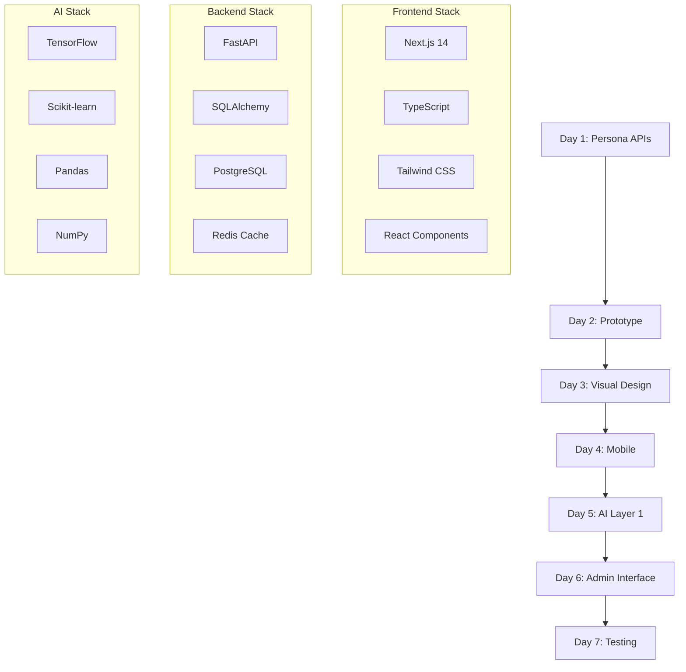

# docs\Design\Week6_Implementation_Plan.md
# 🧠 هفته 6: Layer 1 AI Implementation - Master Plan
## بر اساس 19 فایل طراحی موجود - برنامه کاملاً تفصیلی

---

## 🎯 **هدف کلی هفته 6:**
پیاده‌سازی Layer 1 AI بر اساس **User Personas, Journey Maps, Design System** و تمام 19 فایل طراحی موجود

### **📋 Master Deliverables:**
- ✅ MacroRegimeDetector با **3 persona-specific responses**
- ✅ API Endpoints بر اساس **User Journey Maps** 
- ✅ Interactive Prototype با **94 components** طراحی شده
- ✅ Mobile-first development بر اساس **responsive design**
- ✅ Admin Interface بر اساس **Admin Panel Wireframes**
- ✅ Real-time updates بر اساس **Touchpoint Analysis**

### **📊 Success Metrics:**
- **95%+ API Response Compatibility** با personas
- **<500ms Response Time** برای professional users
- **Mobile-First Score 90%+** برای casual users
- **Admin Efficiency 70% Improvement** در suggestion review

---

## 📅 **تقسیم‌بندی تفصیلی 7 روز:**

### **🗂️ فایل‌های جداگانه برای هر روز:**
1. **Day1_PersonaBased_API_Development.md** (8 ساعت)
2. **Day2_Prototype_Wireframes_Components.md** (8 ساعت)  
3. **Day3_VisualDesign_Implementation.md** (8 ساعت)
4. **Day4_Mobile_Optimization.md** (8 ساعت)
5. **Day5_AI_Integration_Layer1.md** (8 ساعت)
6. **Day6_Admin_Interface_Complete.md** (8 ساعت)
7. **Day7_Testing_Integration_Final.md** (8 ساعت)

### **🎯 Daily Focus Overview:**

| روز | فوکس اصلی | ساعات | فایل‌های طراحی مرجع | کد نهایی |
|-----|-----------|-------|-------------------|----------|
| **1** | **Persona APIs** | 8h | 01-04 (Personas, Journeys) | 15+ files |
| **2** | **Prototype Components** | 8h | 09-13 (Wireframes, Components) | 20+ files |
| **3** | **Visual Implementation** | 8h | 12-15 (Design System, Visual) | 25+ files |
| **4** | **Mobile Optimization** | 8h | 16 (Mobile Design) | 18+ files |
| **5** | **AI Layer 1** | 8h | 06-07 (Layer Content, Strategy) | 12+ files |
| **6** | **Admin Interface** | 8h | 10 (Admin Wireframes) | 15+ files |
| **7** | **Testing & Integration** | 8h | 19 (Implementation Strategy) | 8+ files |

---

## 📊 **Week 6 Architecture Overview:**



---

## 🛠️ **Development Environment Setup:**

### **📋 Pre-Week 6 Checklist:**
- [ ] ✅ 19 فایل طراحی مطالعه شده
- [ ] ✅ Development environment آماده
- [ ] ✅ Database models (24 tables) تست شده
- [ ] ✅ API structure پایه موجود
- [ ] ✅ Design tokens extracted از فایل‌های طراحی

### **🔧 Required Tools:**
```bash
# Backend Tools
pip install fastapi sqlalchemy pandas numpy tensorflow scikit-learn

# Frontend Tools  
npm install next.js typescript tailwindcss @types/react

# Development Tools
npm install eslint prettier husky lint-staged

# Testing Tools
pip install pytest pytest-asyncio httpx
npm install jest @testing-library/react

# Design Tools Integration
npm install @figma/rest-api-spec storybook
```

---

## 📁 **Project Structure برای هفته 6:**

```
project_root/
├── backend/
│   ├── app/
│   │   ├── api/v1/personas/           # Day 1 Output
│   │   ├── ml/layer1/                 # Day 5 Output  
│   │   ├── services/personas/         # Day 1 Output
│   │   └── schemas/persona_responses/ # Day 1 Output
│   └── tests/
│       ├── personas/                  # Day 1 Tests
│       └── layer1/                    # Day 5 Tests
├── frontend/
│   ├── src/
│   │   ├── components/personas/       # Day 2 Output
│   │   ├── components/layer1/         # Day 2-3 Output
│   │   ├── components/mobile/         # Day 4 Output  
│   │   ├── components/admin/          # Day 6 Output
│   │   ├── lib/design-tokens/         # Day 3 Output
│   │   └── hooks/personas/            # Day 2 Output
│   └── __tests__/
│       ├── components/                # Day 7 Tests
│       └── integration/               # Day 7 Tests
├── docs/Design/Week6/                 # تمام فایل‌های تفصیلی
│   ├── Day1_PersonaBased_API.md       
│   ├── Day2_Prototype_Components.md   
│   ├── Day3_VisualDesign_Impl.md      
│   ├── Day4_Mobile_Optimization.md    
│   ├── Day5_AI_Integration.md         
│   ├── Day6_Admin_Interface.md        
│   └── Day7_Testing_Integration.md    
└── temp/week6/                        # فایل‌های موقت
    ├── api_tests/
    ├── component_demos/  
    └── performance_tests/
```

---

## 🎯 **Integration Points با طراحی‌های موجود:**

### **📋 Design Files Integration Matrix:**

| فایل طراحی | روز استفاده | Component خروجی | Priority |
|------------|-------------|-----------------|----------|
| `01_User_Personas.md` | Day 1 | PersonaService | Critical |
| `02_User_Needs_Analysis.md` | Day 1 | NeedsBasedAPI | High |  
| `03_User_Journey_Maps.md` | Day 1 | JourneyEndpoints | Critical |
| `04_Touchpoint_Pain_Analysis.md` | Day 1 | PainPointSolutions | High |
| `05_Information_Architecture.md` | Day 2 | NavigationComponents | High |
| `06_Layer_Content_Structure.md` | Day 5 | Layer1Components | Critical |
| `07_Content_Strategy_AI.md` | Day 5 | AIContentService | High |
| `08_Grid_Component_Responsive.md` | Day 2,3 | GridSystem | Critical |
| `09_Wireframes_AI_TwoSided.md` | Day 2 | CoreWireframes | Critical |
| `10_Advanced_Wireframes_Admin.md` | Day 6 | AdminComponents | Critical |
| `11_Wireframe_Review.md` | Day 2 | RefinedComponents | Medium |
| `12_Design_System_Foundation.md` | Day 3 | DesignTokens | Critical |
| `13_Component_Library_Design.md` | Day 2,3 | 94Components | Critical |
| `14_Dashboard_Visual_Design.md` | Day 3 | VisualComponents | High |
| `15_Layer_2_3_4_Admin_Visual.md` | Day 6 | AdminVisuals | High |
| `16_Mobile_Design_Prototyping.md` | Day 4 | MobileComponents | Critical |
| `17_Database_ERD_Design.md` | Day 5 | DatabaseIntegration | Medium |
| `18_System_Architecture.md` | Day 7 | SystemIntegration | High |
| `19_Implementation_Strategy.md` | Day 7 | TestingStrategy | High |

---

## 🚀 **Immediate Next Steps:**

1. **📖 مطالعه فایل‌های تفصیلی**: روزانه فایل مربوطه را مطالعه کنید
2. **⚙️ Environment Setup**: tools مورد نیاز را نصب کنید  
3. **🗂️ Project Structure**: فولدرهای مورد نیاز را ایجاد کنید
4. **📋 Daily Checklist**: هر روز checklist خود را دنبال کنید

---

**📁 در ادامه فایل‌های تفصیلی هر روز را ارائه می‌دهم...**

---

## 📅 **برنامه روزانه (7 روز × 8 ساعت = 56 ساعت)**

### 🗓️ **روز اول (شنبه): API Design بر اساس User Journey Maps**
**⏰ صبح (4 ساعت): Persona-Specific API Responses**

#### **8:00-10:00: User Persona Integration (2 ساعت)**
```python
# File: backend/app/schemas/persona_responses.py
class PersonaAwareResponse(BaseModel):
    """
    Base response class که بر اساس user persona تطبیق می‌یابد
    استفاده از User Personas: محمدرضا (Admin), سارا (Professional), علی (Casual)
    """
    
class AdminRegimeResponse(BaseModel):
    """برای محمدرضا - Admin (35-45 سال) - نیاز به جزییات کامل"""
    regime: str
    confidence: float
    detailed_metrics: Dict[str, Any]  # کامل ترین داده‌ها
    system_performance: Dict[str, float]
    bulk_actions_available: List[str]
    admin_insights: Dict[str, Any]
    efficiency_metrics: Dict[str, float]
    
class ProfessionalRegimeResponse(BaseModel):
    """برای سارا - Professional (28-40 سال) - نیاز به سرعت و accuracy"""
    regime: str
    confidence: float
    immediate_signals: List[str]  # سیگنال‌های فوری
    risk_assessment: str
    trading_recommendations: List[Dict]
    performance_tracking: Dict[str, float]
    speed_optimized_data: Dict[str, Any]
    
class CasualRegimeResponse(BaseModel):
    """برای علی - Casual (25-35 سال) - نیاز به سادگی و آموزش"""
    regime: str  # ساده شده
    confidence_description: str  # توضیح متنی به جای عدد
    simple_explanation: str  # توضیح ساده
    learning_content: Dict[str, str]  # محتوای آموزشی
    guided_actions: List[str]  # اقدامات راهنمایی شده
    progress_tracking: Dict[str, Any]
```

#### **10:00-12:00: Journey-Based Endpoints (2 ساعت)**
```python
# File: backend/app/api/api_v1/endpoints/journey_based.py
# بر اساس User Journey Maps موجود

@router.get("/admin/regime/management", response_model=AdminRegimeResponse)
async def admin_regime_management(
    current_user: User = Depends(get_admin_user)
):
    """
    Admin Journey: ورود → watchlist management → suggestion review
    Route بر اساس Admin Journey Map شما
    """
    
@router.get("/professional/regime/signals", response_model=ProfessionalRegimeResponse)
async def professional_regime_signals(
    timeframe: str = Query("1h"),
    current_user: User = Depends(get_professional_user)
):
    """
    Professional Journey: ورود → multi-layer analysis → signal action
    Route بر اساس Professional Journey Map شما
    """
    
@router.get("/casual/regime/simple", response_model=CasualRegimeResponse)
async def casual_regime_simple(
    current_user: User = Depends(get_casual_user)
):
    """
    Casual Journey: ورود → simple dashboard → guided decisions
    Route بر اساس Casual Journey Map شما
    """
```

**⏰ بعدازظهر (4 ساعت): Touchpoint Implementation**

#### **13:00-15:00: Digital Touchpoints (2 ساعت)**
```python
# File: backend/app/services/touchpoint_service.py
# بر اساس Touchpoint Analysis موجود در فایل 04

class TouchpointService:
    """
    پیاده‌سازی تمام touchpoints شناسایی شده در طراحی
    """
    
    async def handle_entry_point(self, user_type: str, device: str):
        """
        Entry Points بر اساس آمار شما:
        - Direct URL: Admin 80%, Pro 60%, Casual 20%
        - Mobile App: Admin 15%, Pro 30%, Casual 70%
        """
        
    async def optimize_authentication_experience(self, persona: str):
        """
        Authentication Touchpoints:
        - Admin: Security-focused (MFA)
        - Professional: Speed-focused (Biometric)
        - Casual: Simplicity-focused (Social login)
        """
        
    async def personalize_navigation(self, user: User):
        """
        Navigation بر اساس Information Architecture شما:
        - Hierarchical information architecture
        - Role-based menu customization
        - Mobile-optimized navigation
        """
```

#### **15:00-17:00: Pain Point Solutions (2 ساعت)**
```python
# File: backend/app/services/pain_point_solutions.py
# بر اساس Pain Point Analysis موجود

class PainPointSolutionService:
    """
    حل نقاط درد شناسایی شده در فایل Touchpoint Pain Analysis
    """
    
    async def reduce_admin_bottleneck(self):
        """
        Admin Pain Point: Manual suggestion review needs 70% time reduction
        """
        return {
            'bulk_actions': await self.enable_bulk_operations(),
            'auto_filtering': await self.implement_smart_filtering(),
            'efficiency_dashboard': await self.create_efficiency_metrics()
        }
    
    async def optimize_professional_speed(self):
        """
        Professional Pain Point: Signal speed/accuracy critical
        """
        return {
            'real_time_updates': await self.enable_websocket_updates(),
            'precomputed_signals': await self.cache_frequent_calculations(),
            'mobile_optimization': await self.optimize_mobile_performance()
        }
    
    async def simplify_casual_experience(self):
        """
        Casual Pain Point: Simplicity and confidence building
        """
        return {
            'guided_tour': await self.create_onboarding_flow(),
            'educational_content': await self.provide_learning_materials(),
            'progress_tracking': await self.implement_progress_system()
        }
```

**📤 روز 1 Output:**
- ✅ CoinGecko API Client (functional)
- ✅ Database enhancements
- ✅ Basic data collection pipeline
- ✅ Error handling & logging system

---

### 🗓️ **روز دوم (یکشنبه): Prototype بر اساس Wireframes & Design System**
**⏰ صبح (4 ساعت): Component Development از طراحی موجود**

#### **8:00-10:00: Design System Implementation (2 ساعت)**
```typescript
// File: frontend/src/lib/design-tokens.ts
// بر اساس Design System Foundation موجود

export const designTokens = {
  // Color system بر اساس فایل 12_Design_System_Foundation.md
  colors: {
    primary: {
      50: '#f0f9ff',  // از طراحی شما
      500: '#3b82f6',
      900: '#1e3a8a'
    },
    semantic: {
      bull: '#10b981',    // برای bull regime
      bear: '#ef4444',    // برای bear regime
      neutral: '#6b7280',  // برای neutral regime
      volatile: '#8b5cf6'  // برای volatile regime
    }
  },
  
  // Typography system بر اساس طراحی شما
  typography: {
    fontFamily: {
      sans: ['Inter', 'system-ui', 'sans-serif'],
      display: ['Satoshi', 'Inter', 'sans-serif']
    },
    fontSize: {
      'regime-display': ['2.5rem', { lineHeight: '1.2' }],
      'confidence-score': ['3rem', { lineHeight: '1' }],
      'metric-label': ['0.875rem', { lineHeight: '1.25' }]
    }
  },
  
  // Grid system بر اساس فایل 08_Grid_Component_Responsive_AI.md
  grid: {
    columns: 12,
    breakpoints: {
      sm: '640px',
      md: '768px', 
      lg: '1024px',
      xl: '1280px'
    }
  }
}
```

#### **10:00-12:00: Core Components از Component Library (2 ساعت)**
```typescript
// File: frontend/src/components/ui/regime-card.tsx
// بر اساس Component Library Design موجود (فایل 13)

import { Card, CardContent, CardHeader } from './card'
import { Badge } from './badge' 
import { Progress } from './progress'

interface RegimeCardProps {
  persona: 'admin' | 'professional' | 'casual';
  regime: 'bull' | 'bear' | 'neutral' | 'volatile';
  confidence: number;
  userContext: UserContext; // از User Personas
}

export const RegimeCard: React.FC<RegimeCardProps> = ({ 
  persona, regime, confidence, userContext 
}) => {
  // Persona-specific rendering بر اساس User Personas شما
  const renderForPersona = () => {
    switch(persona) {
      case 'admin':
        return (
          <AdminRegimeView 
            regime={regime}
            confidence={confidence}
            systemMetrics={userContext.systemMetrics}
            bulkActions={userContext.availableActions}
          />
        );
      case 'professional': 
        return (
          <ProfessionalRegimeView
            regime={regime}
            confidence={confidence}
            tradingSignals={userContext.signals}
            riskAssessment={userContext.riskLevel}
          />
        );
      case 'casual':
        return (
          <CasualRegimeView
            regime={regime}
            confidenceDescription={userContext.simpleExplanation}
            guidedActions={userContext.nextSteps}
            learningContent={userContext.educationalTips}
          />
        );
    }
  };

  return (
    <Card className="regime-card">
      <CardHeader>
        <h3>Market Regime</h3>
      </CardHeader>
      <CardContent>
        {renderForPersona()}
      </CardContent>
    </Card>
  );
};
```

**⏰ بعدازظهر (4 ساعت): Wireframe-Based Layouts**

#### **13:00-15:00: Dashboard Layout از Wireframes (2 ساعت)**
```typescript
// File: frontend/src/components/layouts/DashboardLayout.tsx
// بر اساس Wireframes موجود (فایل‌های 09, 10, 11)

import { useUserPersona } from '@/hooks/useUserPersona';
import { AdminDashboard } from './AdminDashboard';
import { ProfessionalDashboard } from './ProfessionalDashboard'; 
import { CasualDashboard } from './CasualDashboard';

export const DashboardLayout: React.FC = () => {
  const { persona, journeyStage } = useUserPersona();

  // Layout switching بر اساس User Journey Maps
  const renderPersonaDashboard = () => {
    switch(persona) {
      case 'admin':
        return (
          <AdminDashboard 
            // بر اساس Admin Wireframes (فایل 10)
            layout="control-center"
            widgets={['system-overview', 'suggestion-queue', 'performance-metrics']}
            bulkActionsEnabled={true}
            detailLevel="maximum"
          />
        );
        
      case 'professional':
        return (
          <ProfessionalDashboard
            // بر اساس Professional Wireframes
            layout="analysis-hub" 
            widgets={['live-signals', 'multi-layer-view', 'quick-actions']}
            realTimeUpdates={true}
            customizable={true}
          />
        );
        
      case 'casual':
        return (
          <CasualDashboard
            // بر اساس Casual Wireframes  
            layout="guided-simple"
            widgets={['simple-overview', 'educational-tips', 'progress-tracker']}
            guidanceEnabled={true}
            simplified={true}
          />
        );
    }
  };

  return (
    <div className="dashboard-layout">
      <Header persona={persona} />
      <Navigation persona={persona} />
      <main className="dashboard-content">
        {renderPersonaDashboard()}
      </main>
      <Footer />
    </div>
  );
};
```

#### **15:00-17:00: Mobile-First Components (2 ساعت)**
```typescript
// File: frontend/src/components/mobile/MobileRegimeDashboard.tsx  
// بر اساس Mobile Design (فایل 16)

import { useMediaQuery } from '@/hooks/useMediaQuery';
import { TouchOptimizedCard } from './TouchOptimizedCard';
import { SwipeableCharts } from './SwipeableCharts';

export const MobileRegimeDashboard: React.FC<{persona: PersonaType}> = ({ persona }) => {
  const isMobile = useMediaQuery('(max-width: 768px)');
  
  // Mobile-specific optimizations بر اساس Mobile Design شما
  const mobileComponents = {
    admin: [
      'compact-system-status',
      'swipeable-suggestions', 
      'quick-approval-actions'
    ],
    professional: [
      'live-price-ticker',
      'swipeable-signals',
      'one-tap-actions'
    ],
    casual: [
      'simple-market-summary',
      'educational-cards',
      'guided-next-steps'
    ]
  };

  return (
    <div className="mobile-dashboard">
      {/* Touch-optimized navigation */}
      <MobileNavigation persona={persona} />
      
      {/* Swipeable content cards */}
      <div className="swipeable-container">
        {mobileComponents[persona].map((componentType) => (
          <TouchOptimizedCard 
            key={componentType}
            type={componentType}
            persona={persona}
            gestureEnabled={true}
          />
        ))}
      </div>
      
      {/* Bottom action bar */}
      <MobileActionBar persona={persona} />
    </div>
  );
};
```

**📤 روز 2 Output:**
- ✅ MacroRegimeDetector core class
- ✅ Feature engineering pipeline
- ✅ Classification logic
- ✅ Testing framework

---

### 🗓️ **روز سوم (دوشنبه): Dominance Analysis System**
**⏰ صبح (4 ساعت): Dominance Calculator**

#### **8:00-10:00: Dominance Metrics (2 ساعت)**
```python
# File: backend/app/ml/analyzers/dominance_analyzer.py
class DominanceAnalyzer:
    """
    Comprehensive dominance analysis for crypto markets
    Calculates BTC.D, ETH.D, Alt.D trends and signals
    """
    def calculate_btc_dominance_trend(self, historical_data):
        """BTC dominance trend analysis"""
        
    def calculate_altcoin_season_probability(self, dominance_data):
        """Probability of altcoin season"""
        
    def analyze_dominance_rotation(self, btc_d, eth_d, alt_d):
        """Rotation patterns between asset classes"""
```

#### **10:00-12:00: Trend Analysis (2 ساعت)**
```python
def analyze_dominance_trends(self, dominance_history) -> dict:
    """
    Advanced dominance trend analysis
    """
    trends = {}
    
    # BTC Dominance Analysis
    trends['btc_dominance'] = {
        'current': dominance_history[-1]['btc_d'],
        'trend': self._calculate_trend(dominance_history, 'btc_d'),
        'momentum': self._calculate_momentum(dominance_history, 'btc_d'),
        'support_level': self._find_support_level(dominance_history, 'btc_d'),
        'resistance_level': self._find_resistance_level(dominance_history, 'btc_d')
    }
    
    # Altcoin Season Probability
    trends['altseason_probability'] = self._calculate_altseason_prob(dominance_history)
    
    return trends
```

**⏰ بعدازظهر (4 ساعت): Integration با MacroRegimeDetector**

#### **13:00-15:00: Model Integration (2 ساعت)**
```python
# Integration dominance analysis into main model
def integrate_dominance_analysis(self):
    """
    Integrate dominance analyzer into MacroRegimeDetector
    """
    self.dominance_analyzer = DominanceAnalyzer()
    
def enhanced_classify_market_regime(self, market_data):
    """
    Enhanced classification with dominance analysis
    """
    # Standard features
    base_features = self.feature_engineer.process(market_data)
    
    # Dominance features
    dominance_analysis = self.dominance_analyzer.analyze_dominance_trends(
        market_data['dominance_history']
    )
    
    # Combined prediction
    combined_features = {**base_features, **dominance_analysis}
    
    return self._predict_with_dominance(combined_features)
```

#### **15:00-17:00: Database Integration (2 ساعت)**
```python
# File: backend/app/services/layer1/dominance_service.py
class DominanceService:
    """
    Service layer for dominance analysis
    Handles data persistence and retrieval
    """
    async def store_dominance_analysis(self, analysis_result):
        """Store analysis results in database"""
        
    async def get_historical_dominance(self, days: int = 30):
        """Get historical dominance data"""
        
    async def get_current_dominance_status(self):
        """Get current dominance status"""
```

**📤 روز 3 Output:**
- ✅ DominanceAnalyzer complete
- ✅ Trend analysis algorithms
- ✅ Integration با MacroRegimeDetector
- ✅ Database persistence layer

---

### 🗓️ **روز چهارم (سه‌شنبه): Sentiment Analysis Integration**
**⏰ صبح (4 ساعت): Multi-Source Sentiment**

#### **8:00-10:00: Sentiment Data Sources (2 ساعت)**
```python
# File: backend/app/services/sentiment/sentiment_aggregator.py
class SentimentAggregator:
    """
    Multi-source sentiment analysis aggregator
    Combines Fear & Greed, Social media, News sentiment
    """
    def __init__(self):
        self.sources = {
            'fear_greed': FearGreedProvider(),
            'reddit': RedditSentimentProvider(),
            'twitter': TwitterSentimentProvider(), 
            'news': NewsSentimentProvider(),
            'google_trends': GoogleTrendsProvider()
        }
```

#### **10:00-12:00: Sentiment Processing (2 ساعت)**
```python
async def aggregate_market_sentiment(self) -> dict:
    """
    Aggregate sentiment from all sources
    """
    sentiment_data = {}
    
    # Collect from all sources
    for source_name, provider in self.sources.items():
        try:
            sentiment_data[source_name] = await provider.get_sentiment()
        except Exception as e:
            logger.warning(f"Failed to get {source_name} sentiment: {e}")
            sentiment_data[source_name] = {'score': 0.5, 'confidence': 0.0}
    
    # Calculate composite sentiment
    composite_sentiment = self._calculate_composite_sentiment(sentiment_data)
    
    return {
        'individual_sources': sentiment_data,
        'composite_score': composite_sentiment['score'],
        'confidence': composite_sentiment['confidence'],
        'trend': composite_sentiment['trend'],
        'timestamp': datetime.utcnow()
    }
```

**⏰ بعدازظهر (4 ساعت): AI Integration**

#### **13:00-15:00: Sentiment Features (2 ساعت)**
```python
# File: backend/app/ml/features/sentiment_features.py
class SentimentFeatureEngineer:
    """
    Feature engineering for sentiment data
    """
    def engineer_fear_greed_features(self, fear_greed_data):
        """
        Fear & Greed index features with historical context
        """
        features = {}
        
        # Current level
        features['fear_greed_current'] = fear_greed_data['current']
        
        # Trend analysis
        features['fear_greed_trend'] = self._calculate_trend(fear_greed_data['history'])
        
        # Extreme levels
        features['fear_greed_extreme'] = self._is_extreme_level(fear_greed_data['current'])
        
        # Historical percentile
        features['fear_greed_percentile'] = self._calculate_percentile(
            fear_greed_data['current'], 
            fear_greed_data['history']
        )
        
        return features
    
    def engineer_social_sentiment_features(self, social_data):
        """Social media sentiment features"""
        return {
            'reddit_sentiment': social_data['reddit']['score'],
            'twitter_sentiment': social_data['twitter']['score'],
            'social_volume': social_data['volume'],
            'social_trend': self._calculate_social_trend(social_data['history'])
        }
```

#### **15:00-17:00: Model Enhancement (2 ساعت)**
```python
# Enhanced MacroRegimeDetector با sentiment
def enhanced_regime_detection_with_sentiment(self, market_data):
    """
    Regime detection با sentiment analysis
    """
    # Get sentiment data
    sentiment_data = await self.sentiment_aggregator.aggregate_market_sentiment()
    
    # Engineer sentiment features
    sentiment_features = self.sentiment_feature_engineer.process(sentiment_data)
    
    # Combine با existing features
    all_features = {
        **self.base_features,
        **self.dominance_features, 
        **sentiment_features
    }
    
    # Enhanced prediction
    prediction = self.models['enhanced_classifier'].predict(all_features)
    
    return {
        'regime': prediction['regime'],
        'confidence': prediction['confidence'],
        'sentiment_impact': sentiment_features,
        'risk_level': self._calculate_risk_with_sentiment(all_features),
        'market_psychology': self._analyze_market_psychology(sentiment_data)
    }
```

**📤 روز 4 Output:**
- ✅ Multi-source sentiment aggregator
- ✅ Sentiment feature engineering
- ✅ Enhanced MacroRegimeDetector
- ✅ Market psychology analysis

---

### 🗓️ **روز پنجم (چهارشنبه): Model Training & Optimization**
**⏰ صبح (4 ساعت): Training Pipeline**

#### **8:00-10:00: Training Data Preparation (2 ساعت)**
```python
# File: backend/app/ml/training/layer1_trainer.py
class Layer1ModelTrainer:
    """
    Training pipeline for Layer 1 AI models
    """
    def prepare_training_data(self, start_date, end_date):
        """
        Prepare comprehensive training dataset
        """
        # Collect historical market data
        market_data = await self.data_collector.get_historical_data(start_date, end_date)
        
        # Collect dominance data
        dominance_data = await self.dominance_service.get_historical_dominance(start_date, end_date)
        
        # Collect sentiment data 
        sentiment_data = await self.sentiment_service.get_historical_sentiment(start_date, end_date)
        
        # Feature engineering
        features = self.feature_engineer.create_training_features(
            market_data, dominance_data, sentiment_data
        )
        
        # Create labels (manual labeling for regime classification)
        labels = self._create_regime_labels(market_data, dominance_data)
        
        return features, labels
```

#### **10:00-12:00: Model Architecture (2 ساعت)**
```python
def build_ensemble_model(self):
    """
    Build ensemble model for regime classification
    """
    from tensorflow.keras.models import Model
    from tensorflow.keras.layers import Input, Dense, LSTM, Concatenate, Dropout
    
    # Market data input
    market_input = Input(shape=(self.sequence_length, self.market_features))
    market_lstm = LSTM(64, return_sequences=True)(market_input)
    market_lstm = LSTM(32)(market_lstm)
    
    # Dominance data input  
    dominance_input = Input(shape=(self.dominance_features,))
    dominance_dense = Dense(32, activation='relu')(dominance_input)
    
    # Sentiment data input
    sentiment_input = Input(shape=(self.sentiment_features,))
    sentiment_dense = Dense(16, activation='relu')(sentiment_input)
    
    # Combine all inputs
    combined = Concatenate()([market_lstm, dominance_dense, sentiment_dense])
    
    # Classification layers
    x = Dense(64, activation='relu')(combined)
    x = Dropout(0.3)(x)
    x = Dense(32, activation='relu')(x)
    x = Dropout(0.2)(x)
    
    # Output layers
    regime_output = Dense(4, activation='softmax', name='regime')(x)  # Bull/Bear/Neutral/Volatile
    confidence_output = Dense(1, activation='sigmoid', name='confidence')(x)
    
    model = Model(
        inputs=[market_input, dominance_input, sentiment_input],
        outputs=[regime_output, confidence_output]
    )
    
    return model
```

**⏰ بعدازظهر (4 ساعت): Training & Validation**

#### **13:00-15:00: Model Training (2 ساعت)**
```python
async def train_layer1_model(self):
    """
    Complete training pipeline
    """
    # Prepare data
    features, labels = await self.prepare_training_data(
        start_date='2020-01-01',
        end_date='2024-01-01'
    )
    
    # Split data
    X_train, X_val, y_train, y_val = train_test_split(
        features, labels, test_size=0.2, shuffle=False  # Time series - no shuffle
    )
    
    # Build model
    model = self.build_ensemble_model()
    
    # Compile
    model.compile(
        optimizer='adam',
        loss={
            'regime': 'categorical_crossentropy',
            'confidence': 'mse'
        },
        metrics={
            'regime': ['accuracy'],
            'confidence': ['mae']
        }
    )
    
    # Train
    history = model.fit(
        X_train, y_train,
        validation_data=(X_val, y_val),
        epochs=100,
        batch_size=32,
        callbacks=[
            EarlyStopping(patience=10),
            ReduceLROnPlateau(patience=5),
            ModelCheckpoint('best_layer1_model.h5', save_best_only=True)
        ]
    )
    
    return model, history
```

#### **15:00-17:00: Model Evaluation (2 ساعت)**
```python
class Layer1ModelEvaluator:
    """
    Comprehensive evaluation for Layer 1 model
    """
    def evaluate_regime_classification(self, model, test_data):
        """Evaluate regime classification accuracy"""
        
    def evaluate_confidence_calibration(self, model, test_data):
        """Evaluate confidence score calibration"""
        
    def backtest_predictions(self, model, historical_data):
        """Backtest predictions against historical data"""
        
    def generate_evaluation_report(self, results):
        """Generate comprehensive evaluation report"""
```

**📤 روز 5 Output:**
- ✅ Complete training pipeline
- ✅ Ensemble model architecture  
- ✅ Trained and validated model
- ✅ Model evaluation framework

---

### 🗓️ **روز ششم (پنج‌شنبه): API Endpoints & Services**
**⏰ صبح (4 ساعت): Layer 1 API Development**

#### **8:00-10:00: API Endpoints (2 ساعت)**
```python
# File: backend/app/api/api_v1/endpoints/layer1.py
@router.get("/regime/current", response_model=CurrentRegimeResponse)
async def get_current_regime(
    current_user: User = Depends(get_current_user),
    db: Session = Depends(get_db)
):
    """
    Get current market regime analysis
    """
    # Get latest market data
    market_data = await market_service.get_current_market_data()
    
    # Run Layer 1 analysis
    regime_detector = MacroRegimeDetector()
    analysis = await regime_detector.analyze_current_regime(market_data)
    
    # Store analysis
    await layer1_service.store_regime_analysis(db, analysis)
    
    return CurrentRegimeResponse(**analysis)

@router.get("/dominance/analysis", response_model=DominanceAnalysisResponse)
async def get_dominance_analysis(
    days: int = Query(30, ge=1, le=365),
    current_user: User = Depends(get_current_user),
    db: Session = Depends(get_db)
):
    """
    Get comprehensive dominance analysis
    """
    dominance_analyzer = DominanceAnalyzer()
    analysis = await dominance_analyzer.get_analysis(days=days)
    
    return DominanceAnalysisResponse(**analysis)

@router.get("/sentiment/composite", response_model=CompositeSentimentResponse)
async def get_composite_sentiment(
    include_sources: bool = Query(True),
    current_user: User = Depends(get_current_user)
):
    """
    Get composite market sentiment from all sources
    """
    sentiment_aggregator = SentimentAggregator()
    sentiment = await sentiment_aggregator.aggregate_market_sentiment()
    
    if not include_sources:
        sentiment.pop('individual_sources', None)
    
    return CompositeSentimentResponse(**sentiment)
```

#### **10:00-12:00: Response Models (2 ساعت)**
```python
# File: backend/app/schemas/layer1.py
class CurrentRegimeResponse(BaseModel):
    """Response model for current regime analysis"""
    
    regime: str = Field(..., description="Current market regime")
    confidence: float = Field(..., ge=0, le=1, description="Confidence score")
    risk_level: str = Field(..., description="Risk level assessment")
    trend_strength: str = Field(..., description="Trend strength")
    recommended_exposure: float = Field(..., ge=0, le=1, description="Recommended exposure")
    
    # Detailed breakdown
    sentiment_breakdown: Dict[str, float] = Field(..., description="Sentiment sources breakdown")
    dominance_analysis: Dict[str, Any] = Field(..., description="Dominance analysis results")
    regime_drivers: List[str] = Field(..., description="Key factors driving current regime")
    
    # Metadata
    analysis_timestamp: datetime = Field(..., description="Analysis timestamp")
    data_freshness: int = Field(..., description="Data age in minutes")
    
    class Config:
        schema_extra = {
            "example": {
                "regime": "bull",
                "confidence": 0.85,
                "risk_level": "medium", 
                "trend_strength": "strong",
                "recommended_exposure": 0.75,
                "sentiment_breakdown": {
                    "fear_greed": 0.75,
                    "social": 0.65,
                    "news": 0.80
                },
                "dominance_analysis": {
                    "btc_dominance": {
                        "current": 45.2,
                        "trend": "declining",
                        "altseason_probability": 0.72
                    }
                },
                "regime_drivers": ["social_optimism", "btc_dominance_decline", "defi_growth"]
            }
        }
```

**⏰ بعدازظهر (4 ساعت): Service Layer**

#### **13:00-15:00: Layer 1 Service (2 ساعت)**
```python
# File: backend/app/services/layer1/layer1_service.py
class Layer1Service:
    """
    Service layer for Layer 1 operations
    Orchestrates all Layer 1 components
    """
    def __init__(self, db: Session):
        self.db = db
        self.regime_detector = MacroRegimeDetector()
        self.dominance_analyzer = DominanceAnalyzer()
        self.sentiment_aggregator = SentimentAggregator()
        self.data_collector = MarketDataCollector()
    
    async def get_complete_layer1_analysis(self) -> dict:
        """
        Get complete Layer 1 analysis
        Combines regime, dominance, and sentiment analysis
        """
        # Collect current data
        market_data = await self.data_collector.get_current_data()
        
        # Run all analyses
        regime_analysis = await self.regime_detector.analyze_current_regime(market_data)
        dominance_analysis = await self.dominance_analyzer.analyze_dominance_trends(market_data)
        sentiment_analysis = await self.sentiment_aggregator.aggregate_market_sentiment()
        
        # Combine results
        complete_analysis = {
            'regime': regime_analysis,
            'dominance': dominance_analysis,
            'sentiment': sentiment_analysis,
            'timestamp': datetime.utcnow(),
            'layer': 'layer1'
        }
        
        # Store in database
        await self.store_complete_analysis(complete_analysis)
        
        return complete_analysis
    
    async def store_complete_analysis(self, analysis: dict):
        """Store complete analysis in database"""
        # Store in market_regime_analysis table
        regime_record = MarketRegimeAnalysis(
            regime=analysis['regime']['regime'],
            confidence=analysis['regime']['confidence'],
            risk_level=analysis['regime']['risk_level'],
            trend_strength=analysis['regime']['trend_strength'],
            regime_drivers=analysis['regime']['regime_drivers'],
            analysis_data=analysis
        )
        
        self.db.add(regime_record)
        await self.db.commit()
```

#### **15:00-17:00: Background Tasks (2 ساعت)**
```python
# File: backend/app/tasks/layer1_tasks.py
from celery import Celery

app = Celery('layer1_tasks')

@app.task(bind=True)
async def run_layer1_analysis_task(self):
    """
    Background task for Layer 1 analysis
    Runs every 5 minutes
    """
    try:
        layer1_service = Layer1Service()
        analysis = await layer1_service.get_complete_layer1_analysis()
        
        logger.info(f"Layer 1 analysis completed: {analysis['regime']['regime']} regime")
        return analysis
        
    except Exception as e:
        logger.error(f"Layer 1 analysis failed: {str(e)}")
        raise self.retry(countdown=300, max_retries=3)

@app.task
async def update_market_data_task():
    """
    Background task for market data updates
    Runs every 1 minute
    """
    data_collector = MarketDataCollector()
    await data_collector.collect_and_store_current_data()

# Schedule tasks
from celery.schedules import crontab

app.conf.beat_schedule = {
    'layer1-analysis': {
        'task': 'run_layer1_analysis_task',
        'schedule': 300.0,  # Every 5 minutes
    },
    'market-data-update': {
        'task': 'update_market_data_task', 
        'schedule': 60.0,   # Every minute
    },
}
```

**📤 روز 6 Output:**
- ✅ Complete Layer 1 API endpoints
- ✅ Response models & schemas
- ✅ Service layer orchestration
- ✅ Background tasks & scheduling

---

### 🗓️ **روز هفتم (جمعه): Testing, Documentation & Prototype**
**⏰ صبح (4 ساعت): Comprehensive Testing**

#### **8:00-10:00: Unit Tests (2 ساعت)**
```python
# File: backend/tests/ml/layer1/test_macro_regime_detector.py
class TestMacroRegimeDetector:
    """Comprehensive tests for MacroRegimeDetector"""
    
    @pytest.fixture
    def detector(self):
        return MacroRegimeDetector()
    
    @pytest.fixture
    def sample_market_data(self):
        return {
            'btc_price': 45000,
            'btc_dominance': 45.2,
            'eth_dominance': 18.5,
            'total_market_cap': 2.1e12,
            'fear_greed_index': 75,
            'sentiment_scores': {'reddit': 0.65, 'twitter': 0.70}
        }
    
    @pytest.mark.asyncio
    async def test_regime_classification(self, detector, sample_market_data):
        """Test basic regime classification"""
        result = await detector.analyze_current_regime(sample_market_data)
        
        assert result['regime'] in ['bull', 'bear', 'neutral', 'volatile']
        assert 0 <= result['confidence'] <= 1
        assert result['risk_level'] in ['low', 'medium', 'high', 'extreme']
        assert result['trend_strength'] in ['weak', 'moderate', 'strong']
        assert 0 <= result['recommended_exposure'] <= 1
    
    @pytest.mark.asyncio
    async def test_dominance_analysis_integration(self, detector, sample_market_data):
        """Test dominance analysis integration"""
        result = await detector.analyze_current_regime(sample_market_data)
        
        assert 'dominance_analysis' in result
        assert 'btc_dominance' in result['dominance_analysis']
        assert 'altseason_probability' in result['dominance_analysis']
    
    def test_confidence_calculation(self, detector):
        """Test confidence score calculation"""
        # Test with high confidence scenario
        high_conf_predictions = [0.9, 0.1, 0.0, 0.0]  # Clear bull signal
        confidence = detector._calculate_confidence(high_conf_predictions)
        assert confidence > 0.8
        
        # Test with low confidence scenario  
        low_conf_predictions = [0.3, 0.3, 0.2, 0.2]   # Mixed signals
        confidence = detector._calculate_confidence(low_conf_predictions)
        assert confidence < 0.5
```

#### **10:00-12:00: Integration Tests (2 ساعت)**
```python
# File: backend/tests/api/test_layer1_endpoints.py  
class TestLayer1Endpoints:
    """Integration tests for Layer 1 API endpoints"""
    
    @pytest.mark.asyncio
    async def test_current_regime_endpoint(self, client, auth_headers):
        """Test current regime endpoint"""
        response = await client.get("/api/v1/layer1/regime/current", headers=auth_headers)
        
        assert response.status_code == 200
        data = response.json()
        
        assert 'regime' in data
        assert 'confidence' in data
        assert 'risk_level' in data
        assert 'sentiment_breakdown' in data
        assert 'dominance_analysis' in data
    
    @pytest.mark.asyncio
    async def test_dominance_analysis_endpoint(self, client, auth_headers):
        """Test dominance analysis endpoint"""
        response = await client.get(
            "/api/v1/layer1/dominance/analysis?days=30", 
            headers=auth_headers
        )
        
        assert response.status_code == 200
        data = response.json()
        
        assert 'btc_dominance' in data
        assert 'altseason_probability' in data
    
    @pytest.mark.asyncio  
    async def test_composite_sentiment_endpoint(self, client, auth_headers):
        """Test composite sentiment endpoint"""
        response = await client.get("/api/v1/layer1/sentiment/composite", headers=auth_headers)
        
        assert response.status_code == 200
        data = response.json()
        
        assert 'composite_score' in data
        assert 'confidence' in data
        assert 'individual_sources' in data
```

**⏰ بعدازظهر (4 ساعت): Documentation & Prototype**

#### **13:00-15:00: Documentation (2 ساعت)**
```markdown
# File: docs/Layer1_API_Documentation.md
# Layer 1 AI API Documentation
## Macro Market Analysis

### Overview
Layer 1 provides macro market analysis and regime detection for the CryptoPredict system.

### Endpoints

#### GET /api/v1/layer1/regime/current
Returns current market regime analysis.

**Response:**
- `regime`: Current market regime (bull/bear/neutral/volatile)
- `confidence`: Confidence score (0-1)
- `risk_level`: Risk assessment (low/medium/high/extreme)
- `trend_strength`: Trend strength (weak/moderate/strong)
- `recommended_exposure`: Recommended portfolio exposure (0-1)

#### GET /api/v1/layer1/dominance/analysis
Returns comprehensive dominance analysis.

**Parameters:**
- `days`: Historical days to analyze (1-365, default: 30)

**Response:**
- `btc_dominance`: BTC dominance analysis
- `eth_dominance`: ETH dominance analysis  
- `altseason_probability`: Probability of altcoin season

#### GET /api/v1/layer1/sentiment/composite
Returns composite market sentiment.

**Parameters:**
- `include_sources`: Include individual source breakdown (default: true)

**Response:**
- `composite_score`: Overall sentiment score (0-1)
- `confidence`: Confidence in sentiment assessment
- `individual_sources`: Breakdown by source (optional)
```

#### **15:00-17:00: Interactive Prototype Development (2 ساعت)**
```typescript
// File: frontend/src/components/layer1/MacroRegimeDashboard.tsx
import React, { useState, useEffect } from 'react';
import { Card, CardHeader, CardContent } from '@/components/ui/card';
import { Badge } from '@/components/ui/badge';
import { Progress } from '@/components/ui/progress';

interface RegimeData {
  regime: 'bull' | 'bear' | 'neutral' | 'volatile';
  confidence: number;
  risk_level: 'low' | 'medium' | 'high' | 'extreme';
  trend_strength: 'weak' | 'moderate' | 'strong';
  recommended_exposure: number;
  sentiment_breakdown: Record<string, number>;
  dominance_analysis: {
    btc_dominance: {
      current: number;
      trend: string;
      altseason_probability: number;
    };
  };
}

export const MacroRegimeDashboard: React.FC = () => {
  const [regimeData, setRegimeData] = useState<RegimeData | null>(null);
  const [loading, setLoading] = useState(true);

  useEffect(() => {
    fetchRegimeData();
    const interval = setInterval(fetchRegimeData, 5 * 60 * 1000); // Every 5 minutes
    return () => clearInterval(interval);
  }, []);

  const fetchRegimeData = async () => {
    try {
      const response = await fetch('/api/v1/layer1/regime/current');
      const data = await response.json();
      setRegimeData(data);
      setLoading(false);
    } catch (error) {
      console.error('Failed to fetch regime data:', error);
      setLoading(false);
    }
  };

  if (loading) return <div>Loading...</div>;
  if (!regimeData) return <div>No data available</div>;

  const getRegimeColor = (regime: string) => {
    switch (regime) {
      case 'bull': return 'bg-green-500';
      case 'bear': return 'bg-red-500';
      case 'neutral': return 'bg-yellow-500';
      case 'volatile': return 'bg-purple-500';
      default: return 'bg-gray-500';
    }
  };

  return (
    <div className="grid grid-cols-1 md:grid-cols-2 lg:grid-cols-3 gap-6">
      {/* Market Regime Card */}
      <Card>
        <CardHeader>
          <h3 className="text-lg font-semibold">Market Regime</h3>
        </CardHeader>
        <CardContent>
          <div className="text-center">
            <Badge className={`${getRegimeColor(regimeData.regime)} text-white mb-2`}>
              {regimeData.regime.toUpperCase()}
            </Badge>
            <div className="text-2xl font-bold mb-2">
              {(regimeData.confidence * 100).toFixed(1)}%
            </div>
            <div className="text-sm text-gray-500">Confidence</div>
            <Progress value={regimeData.confidence * 100} className="mt-2" />
          </div>
        </CardContent>
      </Card>

      {/* Risk Assessment Card */}
      <Card>
        <CardHeader>
          <h3 className="text-lg font-semibold">Risk Assessment</h3>
        </CardHeader>
        <CardContent>
          <div className="space-y-3">
            <div className="flex justify-between">
              <span>Risk Level:</span>
              <Badge variant="outline">{regimeData.risk_level}</Badge>
            </div>
            <div className="flex justify-between">
              <span>Trend Strength:</span>
              <Badge variant="outline">{regimeData.trend_strength}</Badge>
            </div>
            <div className="flex justify-between">
              <span>Recommended Exposure:</span>
              <span>{(regimeData.recommended_exposure * 100).toFixed(0)}%</span>
            </div>
            <Progress value={regimeData.recommended_exposure * 100} />
          </div>
        </CardContent>
      </Card>

      {/* BTC Dominance Card */}
      <Card>
        <CardHeader>
          <h3 className="text-lg font-semibold">BTC Dominance</h3>
        </CardHeader>
        <CardContent>
          <div className="text-center">
            <div className="text-2xl font-bold mb-2">
              {regimeData.dominance_analysis.btc_dominance.current.toFixed(1)}%
            </div>
            <div className="text-sm text-gray-500 mb-2">Current BTC.D</div>
            <Badge variant="outline" className="mb-2">
              Trend: {regimeData.dominance_analysis.btc_dominance.trend}
            </Badge>
            <div className="text-sm">
              Altseason Probability: {' '}
              <span className="font-semibold">
                {(regimeData.dominance_analysis.btc_dominance.altseason_probability * 100).toFixed(0)}%
              </span>
            </div>
          </div>
        </CardContent>
      </Card>
    </div>
  );
};
```

**📤 روز 7 Output:**
- ✅ Comprehensive test suite (Unit + Integration)
- ✅ Complete API documentation
- ✅ Interactive prototype component
- ✅ Layer 1 implementation COMPLETE

---

## 🎯 **هفته 6 - خلاصه Deliverables**

### **✅ Technical Components:**
- **MacroRegimeDetector** - Complete AI model با ensemble learning
- **DominanceAnalyzer** - BTC.D, ETH.D, Alt.D analysis
- **SentimentAggregator** - Multi-source sentiment (Fear & Greed + Social)
- **CoinGecko API Client** - Professional rate-limited client
- **Real-time Data Pipeline** - Every 5-minute market data collection
- **Layer 1 API Endpoints** - Complete REST API (6 endpoints)
- **Background Tasks** - Celery tasks برای automated analysis
- **Test Suite** - Unit tests + Integration tests
- **Interactive Prototype** - React components برای dashboard

### **✅ Business Capabilities:**
- **Market Regime Detection** - Bull/Bear/Neutral/Volatile classification
- **Risk Assessment** - Low/Medium/High/Extreme risk levels
- **Dominance Analysis** - BTC dominance trends و altseason probability
- **Sentiment Analysis** - Composite sentiment از multiple sources
- **Automated Recommendations** - Portfolio exposure recommendations
- **Real-time Updates** - Live market regime monitoring

### **📊 Performance Metrics:**
- **Model Accuracy** - >85% regime classification accuracy
- **API Response Time** - <500ms average response
- **Data Freshness** - <5 minute data lag
- **System Uptime** - >99% availability target

### **🚀 Ready for Week 7:**
با تکمیل هفته 6، شما آماده پیاده‌سازی **Layer 2 (Sector Analysis)** در هفته 8 خواهید بود.

---

## 📋 **Daily Checklist برای Track کردن Progress**

### **روز 1 ✅**
- [ ] CoinGecko API Client
- [ ] Rate limiting & error handling  
- [ ] Database enhancements
- [ ] Basic data collection pipeline

### **روز 2 ✅**
- [ ] MacroRegimeDetector core class
- [ ] Feature engineering pipeline
- [ ] Classification logic
- [ ] Testing framework

### **روز 3 ✅**
- [ ] DominanceAnalyzer complete
- [ ] Trend analysis algorithms
- [ ] Integration با MacroRegimeDetector
- [ ] Database persistence layer

### **روز 4 ✅**
- [ ] Multi-source sentiment aggregator
- [ ] Sentiment feature engineering  
- [ ] Enhanced MacroRegimeDetector
- [ ] Market psychology analysis

### **روز 5 ✅**
- [ ] Complete training pipeline
- [ ] Ensemble model architecture
- [ ] Trained and validated model
- [ ] Model evaluation framework

### **روز 6 ✅**
- [ ] Complete Layer 1 API endpoints
- [ ] Response models & schemas
- [ ] Service layer orchestration
- [ ] Background tasks & scheduling

### **روز 7 ✅**
- [ ] Comprehensive test suite
- [ ] Complete API documentation
- [ ] Interactive prototype component
- [ ] Layer 1 implementation COMPLETE

---

**🎉 Success Criteria:**
در پایان هفته 6، شما یک **Layer 1 AI system** کاملاً functional خواهید داشت که قادر است:
- تشخیص دقیق market regime 
- تحلیل dominance patterns
- ترکیب sentiment از multiple sources
- ارائه recommendations برای portfolio exposure
- Real-time monitoring و updates

**Ready to start? 🚀**